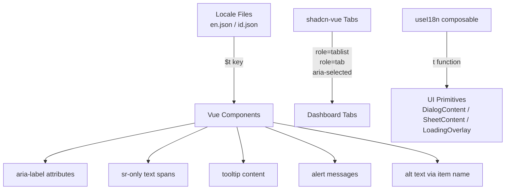

# Design Document: Accessibility & i18n Compliance

## Overview

This design addresses accessibility (a11y) and internationalization (i18n) compliance gaps across the toko-roti-gambang Vue.js + Laravel application. The changes span three categories:

1. **ARIA attribute additions** — Adding `aria-label`, `aria-pressed`, `aria-selected`, `role`, and `aria-controls` attributes to interactive elements that currently lack accessible names or semantic roles.
2. **i18n string replacements** — Replacing hardcoded English/Indonesian text with `$t()` / `t()` calls backed by keys in both `en.json` and `id.json`.
3. **Structural HTML fixes** — Associating `<label>` elements with inputs via `for`/`id`, setting descriptive `alt` text on images, and migrating the dashboard tabs to the shadcn-vue `Tabs` component for built-in WAI-ARIA compliance.

The design prioritizes minimal invasiveness: each component receives targeted attribute additions or string replacements without restructuring unrelated logic. The existing `SmDeleteComponent.vue` pattern (`:aria-label="$t('button.delete')"` + matching tooltip) serves as the reference implementation for all icon button fixes.

## Architecture

### High-Level Approach



### Change Scope by Component Layer

| Layer | Components Affected | Change Type |
|-------|-------------------|-------------|
| UI Primitives | `DialogContent.vue`, `SheetContent.vue`, `LoadingOverlay.vue` | Add `useI18n`, replace hardcoded sr-only text |
| Admin Buttons | `SmIconDeleteComponent`, `SmIconViewComponent`, `SmIconQrCodeComponent`, `SmTimeSloteDeleteComponent`, `SmIconSidebarModalEditComponent`, `SmIconModalEditComponent` | Add `:aria-label` attribute |
| Admin Dashboard | `DashboardComponentShadcn.vue` | Migrate tabs to shadcn-vue `Tabs`, i18n empty states & metric descriptions |
| POS | `PosCartPanelShadcn.vue`, `PosCatalogPanelShadcn.vue`, `PosComponentShadcn.vue`, `ItemBulkStockComponent.vue` | Add aria-labels, i18n alerts & sr-only text |
| Backend Layout | `BackendNavbarComponent.vue` | i18n sr-only text, title attributes |
| Frontend | `AddressComponentShadcn.vue`, `SearchItemComponentShadcn.vue`, `ContactUsFormComponent`, `SignupRegisterComponent`, `CouponComponent` | aria-labels, for/id associations, aria-pressed |
| Locale Files | `en.json`, `id.json` | Add ~60-80 new keys |

## Components and Interfaces

### 1. Icon Button Accessible Name Pattern

All icon-only button components follow the established `SmDeleteComponent` pattern:

```vue
<Button
    type="button"
    variant="ghost"
    size="icon"
    :aria-label="$t('button.<action>')"
    @click="$emit('click', $event)"
>
    <IconComponent class="h-4 w-4" />
    <span class="pointer-events-none invisible absolute ...">
        {{ $t('button.<action>') }}
    </span>
</Button>
```

**Key decisions:**
- The `aria-label` and tooltip text share the same translation key (single source of truth).
- Components without a tooltip wrapper still receive `:aria-label` — the tooltip span serves as a CSS-only hover label.
- Fallback: if `$t()` returns the raw key (vue-i18n default behavior for missing keys), the button still has *some* accessible name rather than none.

**Affected components:**
- `SmIconDeleteComponent.vue` — add `:aria-label="$t('button.delete')"`
- `SmIconViewComponent.vue` — add `:aria-label="$t('button.view')"`
- `SmIconQrCodeComponent.vue` — add `:aria-label="$t('button.qr_code')"`
- `SmTimeSloteDeleteComponent.vue` — add `:aria-label="$t('button.delete')"`
- `SmIconSidebarModalEditComponent.vue` — add `:aria-label="$t('button.edit')"`
- `SmIconModalEditComponent.vue` — add `:aria-label="$t('button.edit')"`

### 2. Cart Quantity Input Accessible Name

The `PosCartPanelShadcn.vue` quantity input receives a dynamic `aria-label` that includes the cart item name:

```vue
<input
    type="number"
    :value="cart.quantity"
    :aria-label="cart.name ? $t('label.quantity_for_item', { item: cart.name }) : $t('label.quantity')"
    ...
>
```

This ensures screen readers announce "Quantity for Test Item" rather than just reading the number value.

### 3. Dashboard Tabs Migration to shadcn-vue Tabs

The current dashboard uses plain `<button>` elements styled as tabs but lacking ARIA semantics. The fix migrates to the shadcn-vue `Tabs` / `TabsList` / `TabsTrigger` / `TabsContent` components which are built on Radix Vue and provide:

- `role="tablist"` on the container
- `role="tab"` + `aria-selected` + unique `id` on each trigger
- `role="tabpanel"` + `aria-labelledby` on content panels
- Arrow key navigation between tabs
- `disabled` prop → `aria-disabled="true"`

```vue
<Tabs default-value="overview">
    <TabsList>
        <TabsTrigger value="overview">{{ $t('menu.overview') }}</TabsTrigger>
        <TabsTrigger value="analytics">{{ $t('menu.analytics') }}</TabsTrigger>
        <TabsTrigger value="reports" disabled>{{ $t('menu.reports') }}</TabsTrigger>
        <TabsTrigger value="notification" disabled>{{ $t('label.notification') }}</TabsTrigger>
    </TabsList>
    <TabsContent value="overview">
        <!-- existing overview content -->
    </TabsContent>
</Tabs>
```

**Rationale:** Using the existing shadcn-vue Tabs primitive avoids reimplementing WAI-ARIA Tabs pattern manually and ensures keyboard navigation works correctly out of the box.

### 4. UI Primitive sr-only Text i18n

`DialogContent.vue`, `SheetContent.vue`, and `LoadingOverlay.vue` are `<script setup>` components. They will import `useI18n` from `vue-i18n` to access the `t()` function:

```vue
<script setup lang="ts">
import { useI18n } from "vue-i18n";
const { t } = useI18n();
</script>

<template>
    <!-- ... -->
    <span class="sr-only">{{ t('button.close') }}</span>
</template>
```

This makes sr-only text reactive to locale changes without page reload.

### 5. Address Button Contextual aria-label

`AddressComponentShadcn.vue` edit/delete buttons receive contextual aria-labels that combine the action with the address label:

```vue
<Button
    :aria-label="addr.label ? $t('button.edit') + ' ' + addr.label : $t('button.edit')"
    @click="edit(addr)"
>
```

This ensures screen reader users can distinguish "Edit Home" from "Edit Work" when multiple address cards are present.

### 6. Search Toggle aria-pressed Pattern

`SearchItemComponentShadcn.vue` list/grid toggle buttons receive `aria-label` and `aria-pressed` attributes:

```vue
<Button
    :aria-label="$t('label.list_view')"
    :aria-pressed="String(itemProps.design === itemDesignEnum.LIST)"
    @click="itemProps.design = itemDesignEnum.LIST"
>
```

### 7. Image Alt Text Strategy

| Context | Alt Text Source | Fallback |
|---------|---------------|----------|
| Product/addon image with visible name | `item.name` | `$t('label.product_image')` |
| Customer avatar with visible name | `customer.name` | `$t('label.customer_avatar')` |
| Decorative images (logos, backgrounds, category thumbs next to name) | `""` (empty) | N/A |

### 8. Form Input Label Association

For `ContactUsFormComponent` and `SignupRegisterComponent`, each `<label>` gets a `for` attribute matching a unique `id` on its input:

```vue
<label :for="`contact-${field}`">{{ $t(`label.${field}`) }}</label>
<input :id="`contact-${field}`" ... />
```

For inputs without visible labels (coupon code, discount), `aria-label` is used instead:

```vue
<input :aria-label="$t('label.coupon_code')" ... />
```

## Data Models

### New Translation Keys Structure

All new keys follow the existing nested structure in `en.json` / `id.json`:

```json
{
    "button": {
        "qr_code": "QR Code",
        "fullscreen": "Fullscreen",
        "apply": "Apply"
    },
    "label": {
        "dine_in": "Dine In",
        "light_mode": "Light mode",
        "dark_mode": "Dark mode",
        "list_view": "List view",
        "grid_view": "Grid view",
        "quantity": "Quantity",
        "quantity_for_item": "Quantity for {item}",
        "product_image": "Product image",
        "customer_avatar": "Customer avatar",
        "coupon_code": "Coupon code",
        "discount_amount": "Discount amount",
        "decrease_quantity": "Decrease quantity",
        "increase_quantity": "Increase quantity",
        "clear_search": "Clear search",
        "toggle_theme": "Toggle theme"
    },
    "dashboard": {
        "no_sales_activity": "No sales activity",
        "sales_range_description": "Sales for the selected range will appear here.",
        "no_order_volume": "No order volume",
        "order_range_description": "Order breakdowns will appear once this range has activity.",
        "no_customer_activity": "No customer activity",
        "customer_range_description": "Customer activity for the selected range will appear here.",
        "stock_looks_healthy": "Stock looks healthy",
        "low_stock_description": "Low-stock items will appear here.",
        "featured_items_description": "Featured items will appear here.",
        "popular_items_description": "Popular items will appear here.",
        "top_customers_description": "Top customers will appear here after orders are placed.",
        "sales_growth": "+20.1% from last month",
        "orders_growth": "+180.1% from last month",
        "customers_growth": "+19% from last month",
        "menu_items_growth": "+201 since last hour"
    },
    "message": {
        "requested_quantity_exceeds_stock": "Requested quantity exceeds available stock",
        "offline_sync_success": "{count} order(s) synced successfully",
        "offline_sync_failure": "{count} order(s) failed to sync",
        "bulk_stock_update_success": "{count} item(s) stock updated successfully"
    }
}
```

Indonesian translations (`id.json`) will mirror the same key paths with Indonesian values.

### Key Naming Conventions

- `button.*` — Action verbs for buttons (existing pattern)
- `label.*` — UI labels, field names, toggle states
- `dashboard.*` — Dashboard-specific empty states and metric descriptions
- `message.*` — Alert/notification messages (existing pattern)
- `sr.*` — Screen-reader-only text (new namespace for clarity, or reuse existing `button.*`/`label.*` where appropriate)

## Correctness Properties

*A property is a characteristic or behavior that should hold true across all valid executions of a system — essentially, a formal statement about what the system should do. Properties serve as the bridge between human-readable specifications and machine-verifiable correctness guarantees.*

### Property 1: Icon button aria-label is non-empty

*For any* icon-only button component rendered with a valid locale, the `aria-label` attribute SHALL be a non-empty string of at least 2 characters after trimming whitespace.

**Validates: Requirements 1.1**

### Property 2: Icon button tooltip matches aria-label

*For any* icon-only button component that has a visible tooltip element, the tooltip text content SHALL equal the `aria-label` attribute value.

**Validates: Requirements 1.2**

### Property 3: Cart quantity input aria-label includes item name

*For any* cart item with a non-empty `name` property, the corresponding quantity `<input>` element's `aria-label` attribute SHALL contain the item name string.

**Validates: Requirements 2.1, 9.5**

### Property 4: Exactly one tab selected at any time

*For any* tab activation event on the dashboard tab widget, exactly one tab SHALL have `aria-selected="true"` and all other tabs SHALL have `aria-selected="false"`.

**Validates: Requirements 3.3**

### Property 5: SR-only text updates reactively on locale switch

*For any* component containing sr-only text backed by the Translation_System, switching the active locale SHALL cause the sr-only text content to update to the new locale's value without requiring a page reload.

**Validates: Requirements 7.7**

### Property 6: Image alt text equals associated entity name

*For any* product, addon, or customer image rendered alongside a visible entity name, the `alt` attribute SHALL equal the entity's name value. If the name is empty, the `alt` SHALL be a non-empty generic descriptive string.

**Validates: Requirements 8.1, 8.2, 8.4**

### Property 7: Toggle buttons have mutually exclusive aria-pressed

*For any* state of the list/grid view toggle in SearchItemComponentShadcn, exactly one toggle button SHALL have `aria-pressed="true"` and the other SHALL have `aria-pressed="false"`.

**Validates: Requirements 10.3, 10.4**

### Property 8: Address action button aria-label combines action and label

*For any* address card with a non-empty `addr.label` value, the edit button's `aria-label` SHALL contain both the translated edit action text and the `addr.label` value, and the delete button's `aria-label` SHALL contain both the translated delete action text and the `addr.label` value.

**Validates: Requirements 11.1, 11.2**

## Error Handling

### Translation Key Missing

- **Behavior:** vue-i18n returns the raw key string (e.g., `"label.quantity_for_item"`) when a key is missing. This is the existing fallback behavior.
- **Mitigation:** A locale key sync validation script (see Testing Strategy) will catch missing keys before deployment.
- **Icon buttons:** Even with a missing key, the button still has *some* aria-label (the raw key string), which is better than no accessible name at all.

### Empty Item Names

- **Cart quantity:** Falls back to generic `$t('label.quantity')` when `cart.name` is falsy.
- **Image alt:** Falls back to `$t('label.product_image')` or `$t('label.customer_avatar')` when the entity name is empty.
- **Address buttons:** Falls back to action-only label (e.g., just "Edit") when `addr.label` is empty.

### UI Primitive i18n Initialization

- `DialogContent`, `SheetContent`, and `LoadingOverlay` use `useI18n()` which inherits the global i18n instance. If the global instance is not yet initialized (edge case during SSR or testing), the `t()` function returns the key string, maintaining functionality.

## Testing Strategy

### Property-Based Tests (Vitest + fast-check)

Property-based testing is appropriate for this feature because several requirements express universal properties over varying inputs (item names, address labels, locale states). The `fast-check` library will be used with Vitest.

**Configuration:**
- Minimum 100 iterations per property test
- Each test tagged with: `Feature: accessibility-i18n-compliance, Property {N}: {description}`

**Properties to test:**
1. Generate random non-empty item names → verify cart quantity input aria-label contains the name
2. Generate random address labels → verify edit/delete button aria-labels contain the label
3. Generate random icon button action keys → verify aria-label length ≥ 2
4. Toggle between LIST/GRID states → verify exactly one aria-pressed="true"
5. Generate random entity names → verify image alt equals name

### Unit Tests (Vitest + Vue Test Utils)

- Dashboard tabs: verify `role="tablist"`, `role="tab"`, `aria-selected` toggling, `aria-disabled` on disabled tabs, arrow key navigation
- SR-only text: verify each component renders translated sr-only text
- Alert messages: verify `$t()` calls with interpolation produce correct strings
- Form labels: verify `for`/`id` matching in ContactUs and Signup forms
- Empty states: verify all 6 dashboard empty states use `$t()` props

### Locale Key Sync Validation

A script (`scripts/validate-locale-keys.js`) will:
1. Parse both `en.json` and `id.json`
2. Flatten all keys
3. Report any key present in one file but missing from the other
4. Verify no values are empty strings or whitespace-only
5. Exit with non-zero code on failure (integrable into CI)

### Integration Tests

- Render full dashboard component with mocked API data → verify all ARIA attributes present
- Render POS cart with multiple items → verify each quantity input has unique aria-label
- Switch locale from `en` to `id` → verify all visible and sr-only text updates

### Accessibility Audit

- Run `axe-core` via `vitest-axe` on rendered component snapshots to catch remaining WCAG violations
- Manual testing with VoiceOver/NVDA for keyboard navigation and announcement quality (not automatable)
