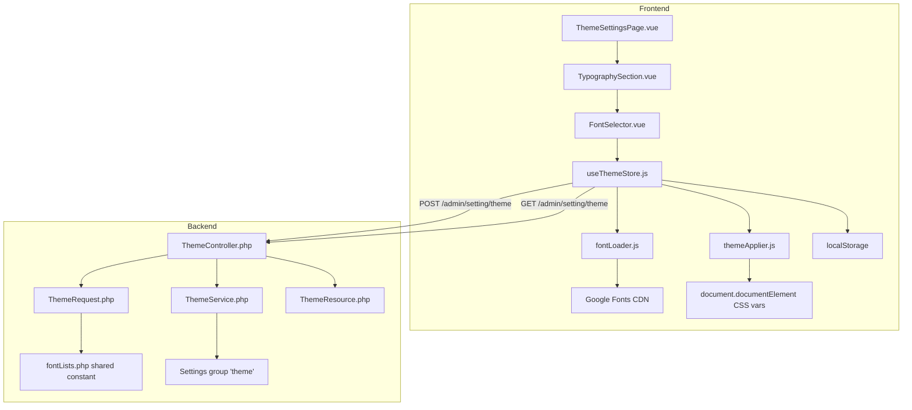

# Design Document: Admin Font Customization

## Overview

This feature extends the existing Theme Settings page to allow administrators to customize application typography by selecting from curated Google Fonts lists. The system currently manages `--font-sans` (body/UI) and `--font-heading` CSS variables via the `useThemeStore` Pinia store and `themeApplier.js` utility. This design adds:

1. **Curated font lists** (sans-serif and monospace) as shared constants
2. **Font selector UI** with live preview rendered in each font's own typeface
3. **Dynamic Google Fonts CDN loading** with fallback handling
4. **CSS variable application** for `--font-sans`, `--font-mono`, and related variables
5. **Backend persistence** with whitelist validation
6. **Theme Settings page refactor** to decomposed shadcn-vue sub-components

The existing `font_heading` and `font_body` fields are replaced by the new `font_sans` and `font_mono` fields, which provide clearer semantics and expand coverage to monospace contexts.

## Architecture



### Data Flow

1. **Page Load**: `useThemeStore.fetchLists()` → API returns saved `font_sans` / `font_mono` → `fontLoader` injects CDN `<link>` → `themeApplier` sets CSS variables → localStorage caches values
2. **Font Selection**: User picks font → `FontSelector` emits value → `TypographySection` updates preview → live preview renders in selected font
3. **Save**: User clicks save → store POSTs to API → backend validates against whitelist → persists via Settings group → store applies fonts globally
4. **Cross-tab Sync**: `storage` event fires → store reads new values → re-applies CSS variables and CDN links

## Components and Interfaces

### Frontend Components

#### 1. `resources/js/constants/fontLists.js` (NEW)

Shared constant defining both font lists, importable by frontend components and utilities.

```javascript
/**
 * @typedef {Object} FontEntry
 * @property {string} name - Human-readable font family name
 * @property {string} value - Google Fonts family identifier (or sentinel for system default)
 */

export const SYSTEM_DEFAULT_SENTINEL = '__system_default__';

/** @type {FontEntry[]} */
export const FONT_SANS_LIST = [
  { name: 'System Default', value: SYSTEM_DEFAULT_SENTINEL },
  { name: 'DM Sans', value: 'DM Sans' },
  { name: 'Inter', value: 'Inter' },
  { name: 'Lato', value: 'Lato' },
  { name: 'Manrope', value: 'Manrope' },
  { name: 'Montserrat', value: 'Montserrat' },
  { name: 'Nunito', value: 'Nunito' },
  { name: 'Open Sans', value: 'Open Sans' },
  { name: 'Outfit', value: 'Outfit' },
  { name: 'Plus Jakarta Sans', value: 'Plus Jakarta Sans' },
  { name: 'Poppins', value: 'Poppins' },
  { name: 'Public Sans', value: 'Public Sans' },
  { name: 'Raleway', value: 'Raleway' },
  { name: 'Roboto', value: 'Roboto' },
  { name: 'Rubik', value: 'Rubik' },
  { name: 'Source Sans 3', value: 'Source Sans 3' },
  { name: 'Work Sans', value: 'Work Sans' },
];

/** @type {FontEntry[]} */
export const FONT_MONO_LIST = [
  { name: 'System Default', value: SYSTEM_DEFAULT_SENTINEL },
  { name: 'Fira Code', value: 'Fira Code' },
  { name: 'IBM Plex Mono', value: 'IBM Plex Mono' },
  { name: 'Inconsolata', value: 'Inconsolata' },
  { name: 'JetBrains Mono', value: 'JetBrains Mono' },
  { name: 'Noto Sans Mono', value: 'Noto Sans Mono' },
  { name: 'Overpass Mono', value: 'Overpass Mono' },
  { name: 'Roboto Mono', value: 'Roboto Mono' },
  { name: 'Source Code Pro', value: 'Source Code Pro' },
  { name: 'Space Mono', value: 'Space Mono' },
  { name: 'Ubuntu Mono', value: 'Ubuntu Mono' },
];

/** Font weights requested from Google Fonts CDN */
export const FONT_WEIGHTS = [400, 500, 600, 700];
```

#### 2. `resources/js/utils/fontLoader.js` (NEW)

Handles dynamic Google Fonts CDN `<link>` injection and removal.

```javascript
/**
 * @param {string} fontFamily - Google Fonts family name
 * @param {number[]} weights - Array of font weights to load
 * @returns {string} Google Fonts CSS URL
 */
export function buildGoogleFontsUrl(fontFamily, weights) { ... }

/**
 * Injects a <link> for the given font, removing any previous Google Fonts link.
 * No-op if the font is already loaded.
 * @param {string} fontFamily
 * @param {'sans'|'mono'} slot - Which font slot (to track separate links)
 * @returns {Promise<void>} Resolves when font loads, rejects on timeout (5s)
 */
export function loadGoogleFont(fontFamily, slot) { ... }

/**
 * Removes the Google Fonts <link> for the given slot.
 * @param {'sans'|'mono'} slot
 */
export function removeGoogleFont(slot) { ... }

/**
 * Preloads a font for preview purposes with a 3-second timeout.
 * @param {string} fontFamily
 * @returns {Promise<boolean>} true if loaded, false if timed out
 */
export function preloadFontForPreview(fontFamily) { ... }
```

#### 3. `resources/js/components/admin/settings/Theme/TypographySection.vue` (NEW)

Sub-component for the Typography settings section.

```vue
<script setup>
// Props: fontSans, fontMono (v-model pattern)
// Emits: update:fontSans, update:fontMono
// Uses: FontSelector component, FONT_SANS_LIST, FONT_MONO_LIST
// Renders: Two FontSelector controls with live preview text
</script>
```

#### 4. `resources/js/components/admin/settings/Theme/FontSelector.vue` (NEW)

Reusable font selector dropdown with preview rendering.

```vue
<script setup>
// Props: modelValue, fontList, label, id, ariaLabel
// Emits: update:modelValue
// Uses: Select, SelectTrigger, SelectContent, SelectItem from shadcn-vue
// Each SelectItem renders font name in its own typeface via inline style
// Handles font preview loading with 3-second timeout fallback
</script>
```

#### 5. Updated `resources/js/stores/useThemeStore.js`

New actions and state:

```javascript
// New state
fontSans: null,   // Current sans font value (or SYSTEM_DEFAULT_SENTINEL)
fontMono: null,   // Current mono font value (or SYSTEM_DEFAULT_SENTINEL)

// New actions
applyFontSans(fontValue) { ... }   // Load CDN + set CSS vars + persist
applyFontMono(fontValue) { ... }   // Load CDN + set CSS vars + persist
initializeFonts(themeData) { ... } // Called on app init, replaces setThemeFonts
```

#### 6. Updated `resources/js/utils/themeApplier.js`

Extended to handle mono fonts and the new `font_sans`/`font_mono` field names:

```javascript
export function applyFontSansStack(fontName) { ... }
// Sets: --font-sans, --font-body, --font-heading, --font-admin, --font-client

export function applyFontMonoStack(fontName) { ... }
// Sets: --font-mono
```

#### 7. Theme Settings Page Decomposition

The existing `ThemeComponent.vue` (850+ lines) will be decomposed:

```
ThemeSettingsPage.vue (orchestrator)
├── ColorSection.vue
├── TypographySection.vue
│   └── FontSelector.vue (×2)
├── ShapeSection.vue
├── BrandAssetsSection.vue
└── DarkModeSection.vue
```

### Backend Components

#### 1. `config/fontLists.php` (NEW)

Shared PHP constant for backend validation:

```php
<?php
return [
    'sans' => [
        'System Default', 'DM Sans', 'Inter', 'Lato', 'Manrope',
        'Montserrat', 'Nunito', 'Open Sans', 'Outfit',
        'Plus Jakarta Sans', 'Poppins', 'Public Sans', 'Raleway',
        'Roboto', 'Rubik', 'Source Sans 3', 'Work Sans',
    ],
    'mono' => [
        'System Default', 'Fira Code', 'IBM Plex Mono', 'Inconsolata',
        'JetBrains Mono', 'Noto Sans Mono', 'Overpass Mono',
        'Roboto Mono', 'Source Code Pro', 'Space Mono', 'Ubuntu Mono',
    ],
];
```

#### 2. Updated `ThemeRequest.php`

```php
'font_sans' => ['nullable', 'string', 'max:100', Rule::in(config('fontLists.sans'))],
'font_mono' => ['nullable', 'string', 'max:100', Rule::in(config('fontLists.mono'))],
```

#### 3. Updated `ThemeResource.php`

```php
'font_sans' => $this->info['font_sans'] ?? 'System Default',
'font_mono' => $this->info['font_mono'] ?? 'System Default',
```

## Data Models

### Settings Group: `theme`

Existing fields remain unchanged. New fields added:

| Key | Type | Default | Description |
|-----|------|---------|-------------|
| `font_sans` | string (max 100) | `'System Default'` | Selected sans-serif font family name |
| `font_mono` | string (max 100) | `'System Default'` | Selected monospace font family name |

The existing `font_heading` and `font_body` fields are deprecated but retained for backward compatibility during migration. The new `font_sans` field replaces both `font_heading` and `font_body` (they always resolve to the same value in the current implementation).

### localStorage Keys

| Key | Value | Purpose |
|-----|-------|---------|
| `theme_font_sans` | Font family name or `'System Default'` | Fast font application before API responds |
| `theme_font_mono` | Font family name or `'System Default'` | Fast font application before API responds |

### FontEntry Interface (Frontend)

```typescript
interface FontEntry {
  name: string;   // Display name (e.g., "Inter", "System Default")
  value: string;  // Google Fonts identifier or SYSTEM_DEFAULT_SENTINEL
}
```

### Google Fonts CDN Link Management

The `fontLoader.js` utility manages `<link>` elements with a `data-font-slot` attribute:

```html
<link rel="stylesheet" href="https://fonts.googleapis.com/css2?family=Inter:wght@400;500;600;700&display=swap" data-font-slot="sans" />
<link rel="stylesheet" href="https://fonts.googleapis.com/css2?family=Fira+Code:wght@400;500;600;700&display=swap" data-font-slot="mono" />
```

At most one link per slot exists at any time.

## Correctness Properties

*A property is a characteristic or behavior that should hold true across all valid executions of a system — essentially, a formal statement about what the system should do. Properties serve as the bridge between human-readable specifications and machine-verifiable correctness guarantees.*

### Property 1: Font list entries have valid structure

*For any* entry in FONT_SANS_LIST or FONT_MONO_LIST, the entry SHALL have a non-empty `name` string property and a non-empty `value` string property. The first entry in each list SHALL have `value` equal to the SYSTEM_DEFAULT_SENTINEL.

**Validates: Requirements 2.5, 1.2, 2.2**

### Property 2: CSS variable application for sans fonts

*For any* font name string (non-empty, non-whitespace), calling `applyFontSansStack(fontName)` SHALL set the CSS custom properties `--font-sans`, `--font-body`, `--font-heading`, `--font-admin`, and `--font-client` on `document.documentElement` to the value `'<fontName>', system-ui, sans-serif`.

**Validates: Requirements 5.1, 5.2**

### Property 3: CSS variable application for mono fonts

*For any* font name string (non-empty, non-whitespace), calling `applyFontMonoStack(fontName)` SHALL set the CSS custom property `--font-mono` on `document.documentElement` to the value `'<fontName>', ui-monospace, monospace`.

**Validates: Requirements 5.3**

### Property 4: Google Fonts link management invariant

*For any* sequence of font load operations on a given slot ('sans' or 'mono'), at most one `<link>` element with `data-font-slot` equal to that slot SHALL exist in the document `<head>` at any time. Applying the same font twice SHALL NOT create a duplicate link.

**Validates: Requirements 4.1, 4.6**

### Property 5: Google Fonts URL contains specified weights

*For any* font family name from the curated lists (excluding "System Default"), the URL produced by `buildGoogleFontsUrl(fontFamily, FONT_WEIGHTS)` SHALL contain the weight values 400, 500, 600, and 700 in the query parameters.

**Validates: Requirements 4.4**

### Property 6: Font selection localStorage round-trip

*For any* font name string, saving it to localStorage under `theme_font_sans` (or `theme_font_mono`) and then reading it back SHALL return the identical string value.

**Validates: Requirements 5.4**

### Property 7: Backend validation accepts only allowed sans fonts

*For any* string value, the `font_sans` validation rule SHALL pass if and only if the value equals "System Default" or is present in the `config('fontLists.sans')` array.

**Validates: Requirements 6.2, 6.4**

### Property 8: Backend validation accepts only allowed mono fonts

*For any* string value, the `font_mono` validation rule SHALL pass if and only if the value equals "System Default" or is present in the `config('fontLists.mono')` array.

**Validates: Requirements 6.3, 6.4**

## Error Handling

| Scenario | Handling Strategy |
|----------|-------------------|
| Google Font CDN fails to load (5s timeout) | Apply System_Font_Stack to CSS variables; log warning; no user-visible error |
| Font preview fails to load (3s timeout) | Render font name in System_Font_Stack; do not block other previews |
| Backend API returns 422 on save | Display error toast; retain current form selections for retry |
| Backend API unreachable on page load | Use localStorage cached values; if none, use System Default |
| localStorage unavailable (private browsing) | Apply fonts via in-memory state only; skip persistence silently |
| Invalid font value submitted to backend | Return 422 with validation error message identifying the invalid field |
| `storage` event with null/empty value | Treat as "System Default" and revert to System_Font_Stack |

### Fallback Chain (Font Resolution)

```
Backend API response → localStorage cache → System Default (system-ui, sans-serif)
```

## Testing Strategy

### Property-Based Tests (Vitest + fast-check)

Property-based testing is appropriate for this feature because the font application logic involves pure functions with clear input/output behavior and universal properties that hold across a wide input space (arbitrary font name strings).

- **Library**: `fast-check` with Vitest
- **Minimum iterations**: 100 per property
- **Tag format**: `Feature: admin-font-customization, Property {N}: {title}`

Properties to implement:
1. Font list entry structure validation
2. CSS variable application for sans fonts
3. CSS variable application for mono fonts
4. Google Fonts link management invariant
5. Google Fonts URL weight specification
6. Font selection localStorage round-trip
7. Backend validation — sans font whitelist
8. Backend validation — mono font whitelist

### Unit Tests (Vitest)

- `fontLoader.js`: URL construction, link injection/removal, timeout handling
- `themeApplier.js`: CSS variable formatting, System Default handling
- `FontSelector.vue`: Rendering, keyboard navigation, aria attributes
- `TypographySection.vue`: Preview updates on selection, v-model binding
- `ThemeRequest.php` (PHPUnit): Validation rules for font_sans, font_mono

### Integration Tests

- Full save flow: select font → save → verify API payload → verify CSS variables applied
- Page load flow: API returns saved fonts → verify selectors populated → verify fonts applied
- Cross-tab sync: simulate storage event → verify CSS variables update

### Accessibility Tests

- Keyboard navigation: Tab, Enter, Space, Arrow keys, Escape
- Screen reader: aria-label, accessible value updates on selection
- Focus indicators: visible 2px outline on focus
- Contrast: 4.5:1 ratio verification (manual + automated tooling)

### i18n Verification

All new user-visible strings must have keys in both `resources/js/languages/en.json` and `resources/js/languages/id.json`. New keys include:
- `label.typography_section` / `label.font_sans` / `label.font_mono`
- `label.font_preview_text` / `label.font_selector_sans_aria` / `label.font_selector_mono_aria`
- `label.system_default`
