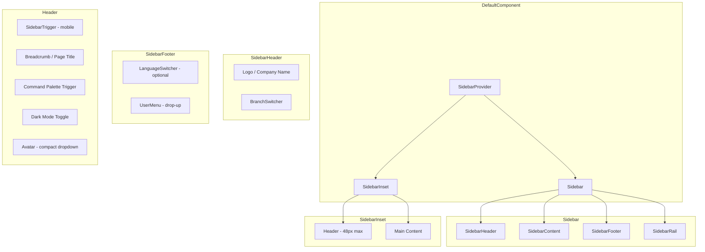

# Design Document: Admin Shell Overhaul

## Overview

This design describes the visual and structural overhaul of the admin shell to match the shadcn-admin aesthetic. The scope is purely cosmetic and UX — no business logic, permissions, or data flow changes. The overhaul reorganizes the spatial layout: branch switcher moves into the sidebar header, user profile moves to the sidebar footer with a drop-up menu, and the header is stripped to essentials (breadcrumb, search trigger, dark mode toggle, avatar).

The implementation leverages the existing `SidebarProvider > Sidebar + SidebarInset` pattern and all available shadcn-vue primitives (DropdownMenu, Popover, Tooltip, Sheet, Button). The sidebar already supports collapsed/expanded states via `globalStateService` (Pinia-backed), mobile Sheet overlay, and slot-based header/footer composition.

### Key Design Decisions

1. **In-place refactor over new components**: The existing `BackendNavbarComponent` and `BackendMenuComponent` are refactored rather than replaced, preserving all existing data fetching, permission checks, and notification logic.
2. **Slot composition preserved**: The Sidebar's `#header`, `#default`, and `#footer` slots remain the extension points — `BackendMenuComponent` fills them with the new branch switcher and user menu.
3. **CSS variables for dimensions**: Sidebar widths remain defined via `--sidebar-width` (16rem), `--sidebar-width-icon` (3.5rem), and `--sidebar-width-mobile` (18rem) on `SidebarProvider`.
4. **No new Pinia stores**: All state (collapsed, mobile open, branch, language) continues to flow through `globalStateService` and existing Vuex getters (auth info, permissions, menus).
5. **Transition via CSS**: Collapse/expand animations use CSS `transition` on the sidebar `<aside>` and `SidebarInset` — no JavaScript animation libraries.

## Architecture



### Layout Flow

1. `DefaultComponent.vue` renders `SidebarProvider` wrapping `BackendMenuComponent` (Sidebar) and `SidebarInset` (containing `BackendNavbarComponent` + `<router-view>`).
2. The header is positioned inside `SidebarInset` as a sticky/fixed bar at the top of the content area, max 48px tall.
3. The sidebar occupies `top: 0` (full height, no longer offset by header height) since the header now lives inside the inset area.

### State Management

- **Sidebar collapse**: `globalState().adminSidebarCollapsed` (boolean, persisted via Pinia `useGlobalStateStore`)
- **Mobile sidebar open**: `globalState().adminMobileSidebarOpen` (boolean)
- **Active branch**: `backendBranchShow()` reactive ref from `backendGlobalStateService`
- **Auth info**: `$store.getters.authInfo` (Pinia store, migrated from Vuex)
- **Permissions**: `$store.getters.authPermission`

## Components and Interfaces

### Modified Components

| Component | Changes |
|---|---|
| `BackendMenuComponent.vue` | Add BranchSwitcher in `#header` slot, replace footer with UserMenu drop-up, add LanguageSwitcher in footer |
| `BackendNavbarComponent.vue` | Strip to: SidebarTrigger, breadcrumb, Command Palette trigger, dark mode toggle, compact avatar dropdown. Remove branch selector, language switcher, attendance pill, POS link. Retain cashier session + order history panels for POS routes only. |
| `Sidebar.vue` | Change `top-16` to `top-0`, update `h-[calc(100svh-4rem)]` to `h-dvh`. Add transition duration class. |
| `SidebarProvider.vue` | Add dark-mode-aware background (`bg-sidebar` or keep `bg-[#f7f7fc] dark:bg-background`) |
| `DefaultComponent.vue` | Move `BackendNavbarComponent` inside `SidebarInset` (before `<main>`), remove top-level header positioning |

### New Sub-Components (extracted for clarity)

| Component | Location | Purpose |
|---|---|---|
| `BranchSwitcher.vue` | `resources/js/components/layouts/backend/BranchSwitcher.vue` | Popover-based branch selector for sidebar header |
| `SidebarUserMenu.vue` | `resources/js/components/layouts/backend/SidebarUserMenu.vue` | Drop-up DropdownMenu with profile actions |
| `HeaderAvatarMenu.vue` | `resources/js/components/layouts/backend/HeaderAvatarMenu.vue` | Compact avatar dropdown (Edit Profile + Logout) |

### BranchSwitcher Interface

```typescript
// Props
interface BranchSwitcherProps {
  collapsed: boolean;        // Whether sidebar is in rail mode
  branches: Branch[];        // Available branches
  currentBranch: Branch;     // Currently active branch
  authBranch: number;        // 0 = multi-branch access
}

// Events
interface BranchSwitcherEmits {
  (e: 'change', branchId: number): void;
}
```

**Behavior:**
- When `authBranch !== 0` (single branch): component renders nothing
- When `collapsed === true`: renders only the branch icon (38×38 button), click opens Popover with full branch list
- When `collapsed === false`: renders icon + branch name + chevron, click opens Popover

### SidebarUserMenu Interface

```typescript
// Props
interface SidebarUserMenuProps {
  collapsed: boolean;
  user: { name: string; email: string; image: string };
}

// Events
interface SidebarUserMenuEmits {
  (e: 'logout'): void;
}
```

**Behavior:**
- Renders avatar + name (or avatar-only when collapsed)
- Click opens a DropdownMenu (side="top") with:
  - Header: user name + email (non-interactive)
  - Separator
  - Edit Profile (router-link)
  - Change Password (router-link)
  - My Attendance (router-link)
  - Separator
  - Logout (button)

### HeaderAvatarMenu Interface

```typescript
// Props
interface HeaderAvatarMenuProps {
  user: { name: string; image: string };
}

// Events
interface HeaderAvatarMenuEmits {
  (e: 'logout'): void;
}
```

**Behavior:**
- Renders a 32px avatar button
- Click opens compact DropdownMenu with Edit Profile + Logout

### Header Layout (BackendNavbarComponent - revised)

```
┌─────────────────────────────────────────────────────────────────┐
│ [≡] │ Admin / Dashboard          │ [⌘K] [🌙] [👤]              │
│ 48px max height                                                  │
└─────────────────────────────────────────────────────────────────┘
```

- Left: SidebarTrigger (visible on mobile `lg:hidden`, or always visible as collapse toggle)
- Center-left: Breadcrumb or page title (text, not interactive)
- Right: Command Palette trigger button, Dark mode toggle, HeaderAvatarMenu

### Contextual Controls (POS routes)

When on POS-related routes (`cashier-session`, `order-history`), the header additionally shows:
- `CashierSessionPanelShadcn`
- `PosOrderHistoryPanelShadcn`

When on `kitchen-display-system` or `order-status-screen`:
- Fullscreen toggle button
- Back-to-admin link

## Data Models

No new data models are introduced. The overhaul is purely presentational. Existing data flows:

| Data | Source | Consumer |
|---|---|---|
| `branches` | `backendBranches()` from `backendGlobalStateService` | BranchSwitcher |
| `currentBranch` | `backendBranchShow()` | BranchSwitcher |
| `authInfo` | `$store.getters.authInfo` (Pinia) | SidebarUserMenu, HeaderAvatarMenu |
| `authBranch` | `$store.getters.authBranchId` | BranchSwitcher visibility |
| `authMenu` | `$store.getters.authMenu` | BackendMenuComponent (unchanged) |
| `authPermission` | `$store.getters.authPermission` | POS link visibility |
| `languages` | `useFrontendLanguageStore().lists` | LanguageSwitcher |
| `adminSidebarCollapsed` | `globalState().adminSidebarCollapsed` | Sidebar, SidebarTrigger |
| `adminMobileSidebarOpen` | `globalState().adminMobileSidebarOpen` | Sidebar Sheet |

### CSS Variable Tokens Used

```css
--sidebar-width: 16rem;          /* Expanded sidebar */
--sidebar-width-icon: 3.5rem;    /* Collapsed rail */
--sidebar-width-mobile: 18rem;   /* Mobile sheet */
--foreground                     /* Primary text */
--muted-foreground               /* Secondary text, labels */
--background                     /* Page background */
--accent / --accent-foreground   /* Hover states */
--border                         /* Dividers, outlines */
--primary / --primary-foreground /* Active indicators */
```


## Correctness Properties

*A property is a characteristic or behavior that should hold true across all valid executions of a system — essentially, a formal statement about what the system should do. Properties serve as the bridge between human-readable specifications and machine-verifiable correctness guarantees.*

### Property 1: Branch list completeness and current indicator

*For any* list of branches and any valid current branch ID, when the BranchSwitcher popover is opened, all branches should appear in the rendered list and exactly one branch (matching the current ID) should be marked as active/selected.

**Validates: Requirements 1.2**

### Property 2: User info rendering in sidebar footer

*For any* user object with a non-empty name and image URL, the sidebar footer should render an `` element with `src` matching the image URL and a text node containing the user's name.

**Validates: Requirements 2.1**

### Property 3: User menu header displays identity

*For any* user object with name and email, the UserMenu dropdown header section should contain both the full name and email as non-interactive text content.

**Validates: Requirements 2.5**

### Property 4: Collapsed menu items show tooltip with label

*For any* sidebar menu item with a label string, when the sidebar is in collapsed state and the item is hovered, a tooltip should appear containing that exact label text.

**Validates: Requirements 4.3**

### Property 5: Menu item dimensional consistency

*For any* sidebar menu item, the icon element should have 16×16px dimensions, and when in collapsed state the overall hit target should be 32×32px with items spaced 4px apart.

**Validates: Requirements 4.2, 5.2**

## Error Handling

This feature is a cosmetic/UX refactor with no new data flows or API calls. Error handling concerns are limited to:

### Graceful Degradation

| Scenario | Handling |
|---|---|
| Branch list fails to load | BranchSwitcher shows current branch name only; popover shows loading skeleton or "Unable to load branches" message |
| User image URL is broken | Avatar falls back to initials or a default placeholder icon (existing behavior preserved) |
| Language list fails to load | LanguageSwitcher hidden; no error shown to user |
| Route navigation fails on branch change | Toast error via existing `alertService`; branch state reverts |

### Existing Error Paths Preserved

- Firebase notification setup failure: already handled with `console.warn`
- Profile image upload failure: already handled with `alertService.error`
- Logout failure: already handled with `.catch(() => {})`
- Default access fetch failure: already handled gracefully

### No New Error States

Since no new API calls or data transformations are introduced, no new error handling is required. All existing error handling in `BackendNavbarComponent` and `BackendMenuComponent` is preserved as-is.

## Testing Strategy

### Approach

This feature is primarily a **UI rendering and layout refactor**. The testing strategy emphasizes:

1. **Component unit tests** (example-based): Verify correct rendering, conditional visibility, and user interactions for each new/modified component
2. **Property-based tests**: Verify data-driven rendering correctness across varied inputs (branch lists, user data, menu items)
3. **Visual regression / snapshot tests**: Catch unintended styling changes
4. **Manual testing**: Dark mode, responsive breakpoints, transition smoothness

### Property-Based Testing

**Library**: [fast-check](https://github.com/dubzzz/fast-check) (already available in the JS ecosystem, pairs with Vitest)

**Configuration**: Minimum 100 iterations per property test.

**Tag format**: `Feature: admin-shell-overhaul, Property {number}: {property_text}`

Each correctness property (1–5) maps to a single property-based test that generates random valid inputs and asserts the universal property holds.

### Unit Tests (Example-Based)

| Test | Validates |
|---|---|
| BranchSwitcher hidden when `authBranch !== 0` | Req 1.5 |
| BranchSwitcher shows icon-only when collapsed | Req 1.4 |
| Branch selection triggers `changeBranch` + navigation | Req 1.3 |
| Header contains only specified elements | Req 3.1 |
| Header does NOT contain removed elements | Req 3.2, 3.3 |
| Header avatar click shows Edit Profile + Logout | Req 3.4 |
| Header height ≤ 48px | Req 3.6 |
| Sidebar transition duration is 150–250ms ease-out | Req 4.1 |
| Main content area transitions with sidebar | Req 4.4 |
| Section labels: muted, uppercase, 11px, 600 weight | Req 5.3 |
| Header controls: 36px buttons, 32px avatar, 8px gaps | Req 5.4 |
| Mobile: sidebar hidden below 1024px | Req 6.1 |
| Mobile: Sheet contains BranchSwitcher + nav + UserMenu | Req 6.2 |
| Mobile: Sheet closes on nav item click | Req 6.3 |
| Mobile: Sheet always shows expanded state | Req 6.4 |
| Language switcher in sidebar footer when enabled | Req 7.1 |
| Attendance pill removed from header | Req 7.2 |
| POS link in sidebar nav (not header) | Req 7.3 |
| Cashier/order panels only on POS routes | Req 7.4 |
| KDS/OSS routes show fullscreen + back link | Req 7.5 |

### Integration Tests

| Test | Validates |
|---|---|
| Branch change persists via `saveOrUpdateDefaultAccess` and navigates | Req 1.3 |
| Command Palette opens on Ctrl+K / click | Req 3.5 |
| Logout clears auth state and redirects | Req 2.3 |

### What's NOT Tested via PBT

- CSS transitions and animations (visual, not data-driven)
- Dark mode token usage (code review / lint concern)
- Responsive breakpoint behavior (viewport-dependent, example-based)
- Navigation side effects (integration concern)
- Font stack and line heights (smoke test / snapshot)
