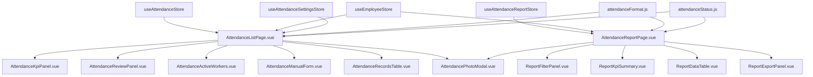
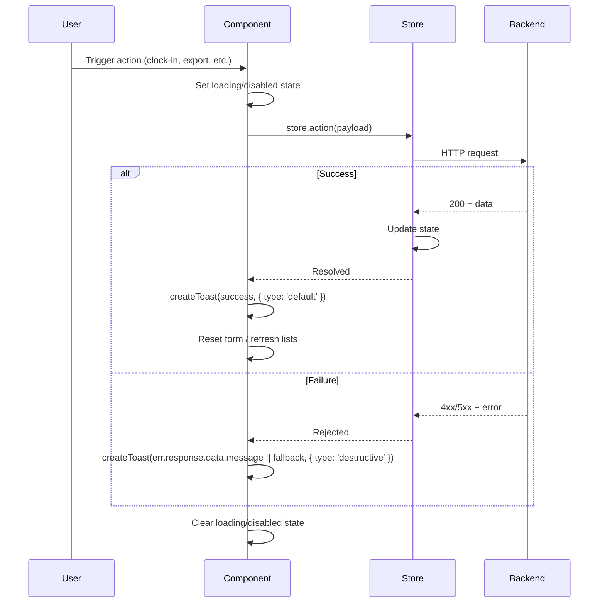

# Design Document

## Overview

This design covers the comprehensive overhaul of the attendance module: fixing the duration formatting bug, migrating the attendance list and report pages from Options API to Composition API (`<script setup>`), migrating the photo modal, establishing a shared status badge utility, and eliminating the service facade layer in favor of direct Pinia store access.

The migration follows established patterns from the `attendance-settings-shadcn` spec: direct store access via `useAttendanceStore()`, `createToast` for notifications, `LoadingOverlay` for loading states, and shadcn-vue primitives imported from `../../ui`.

### Key Design Decisions

1. **Format utility fix** — Replace abbreviated "0j"/"1j 30m" format with full Indonesian words "0 jam"/"1 jam 30 menit". The function remains pure with no dependencies, making it trivially testable via round-trip property.
2. **Component decomposition** — The attendance list page splits into 5 focused sub-components (page shell, KPI panel, review panel, active workers panel, manual form). The report page splits into 4 sub-components (page shell, filter panel, KPI summary, data table). This matches the settings page pattern without over-engineering.
3. **Shared status badge utility** — A single `attendanceStatusBadge(status)` function replaces the current `attendanceStatusClass` that returns incompatible object-style classes. The new function returns a Badge variant name or Tailwind class string directly usable with the shadcn Badge component.
4. **Direct store access** — Components call `useAttendanceStore()` and `useAttendanceReportStore()` directly, eliminating the `attendanceService.js` and `attendanceReportService.js` facade layers. This matches the settings page pattern.
5. **Export blob download** — The report store already returns blob responses via `responseType: 'blob'`. The component uses the existing `downloadService.downloadBlob()` utility to trigger browser downloads with computed filenames.
6. **View mode toggle** — The "By Date" vs "By Employee" toggle uses a `ref('daily')` with two Button components styled as a toggle group, matching the current UX but using shadcn Button primitives.

## Architecture



### Component Hierarchy

```
resources/js/components/admin/attendance/
├── AttendanceListPage.vue              # Page shell: header, loading, orchestration
├── AttendanceReportPage.vue            # Page shell: header, loading, orchestration
├── AttendancePhotoModal.vue            # Migrated photo modal (Composition API)
├── list/
│   ├── AttendanceKpiPanel.vue          # 3-metric summary cards
│   ├── AttendanceReviewPanel.vue       # Missed-checkout review section
│   ├── AttendanceActiveWorkers.vue     # Currently working employees grid
│   ├── AttendanceManualForm.vue        # Manual clock-in form
│   └── AttendanceRecordsTable.vue      # Today's records table
├── report/
│   ├── ReportFilterPanel.vue           # Month/year/employee filter form
│   ├── ReportKpiSummary.vue            # 5-metric summary cards
│   ├── ReportDataTable.vue             # Table with By Date / By Employee toggle
│   └── ReportExportPanel.vue           # Export buttons (XLSX, CSV, PDF)
├── components/                          # (existing, unchanged)
│   ├── AttendanceHeroStatus.vue
│   ├── CameraCapture.vue
│   ├── LocationStatusBadge.vue
│   └── SubmitBar.vue
├── composables/                         # (existing, unchanged)
│   ├── useAttendanceSubmit.js
│   ├── useAttendanceTimer.js
│   ├── useCamera.js
│   ├── useGeolocation.js
│   └── useQuickClock.js
└── settings/                            # (existing, from attendance-settings-shadcn)
```

### Data Flow

1. **Attendance List**: `AttendanceListPage` calls `attendanceStore.fetchLists()`, `attendanceStore.fetchReviews()`, `attendanceStore.fetchActiveWorkers()` on mount. Sub-components read from store via computed getters.
2. **Attendance Report**: `AttendanceReportPage` calls `reportStore.fetchLists(filters)` and `reportStore.fetchOverview(filters)` on mount and filter changes. Sub-components receive data via props from the page shell.
3. **Export**: `ReportExportPanel` emits export events to the page shell, which calls `reportStore.exportXlsx/exportCsv/pdf(payload)` and pipes the blob response to `downloadService.downloadBlob()`.
4. **Photo Modal**: Both pages use the `useAttendancePhotoModal` composable to manage modal state. The modal component receives `visible` and `attendance` as props.

## Components and Interfaces

### AttendanceListPage.vue (Page Shell)

```typescript
// <script setup>
const attendanceStore = useAttendanceStore()
const employeeStore = useEmployeeStore()
const settingsStore = useAttendanceSettingsStore()
const { photoModal, hasAnyPhoto, openPhotoModal, closePhotoModal } = useAttendancePhotoModal()

const loading = ref(true)
const showManualForm = ref(false)

// Computed from store
const attendances = computed(() => attendanceStore.lists)
const reviewItems = computed(() => attendanceStore.reviews)
const activeWorkers = computed(() => attendanceStore.activeWorkers)
const employees = computed(() => employeeStore.lists)
const shifts = computed(() => settingsStore.shifts)

// Derived KPIs
const currentWorkers = computed(() => activeWorkers.value)
const completedToday = computed(() => attendances.value.filter(i => i.status === 'completed'))

onMounted(async () => {
  try {
    await Promise.all([
      attendanceStore.fetchLists(filters),
      attendanceStore.fetchReviews(reviewFilters),
      attendanceStore.fetchActiveWorkers(activeWorkerFilters),
      employeeStore.fetchLists({ paginate: 0, order_column: 'name', order_type: 'asc' }),
      settingsStore.fetchShifts(),
    ])
  } catch (err) {
    createToast(err?.response?.data?.message || 'Failed to load attendance data.', { type: 'destructive' })
  } finally {
    loading.value = false
  }
})
```

### AttendanceKpiPanel.vue

```typescript
interface Props {
  workingCount: number
  completedCount: number
  reviewCount: number
  loading: boolean
}
```

**Template:** 3 Card components in a `grid grid-cols-1 md:grid-cols-3 gap-3` layout. Each card has a distinct background (`bg-sky-50`, `bg-emerald-50`, `bg-amber-50`). When `loading` is true, renders 3 Skeleton placeholders.

### AttendanceReviewPanel.vue

```typescript
interface Props {
  items: AttendanceRecord[]
}

interface Emits {
  (e: 'review-complete', item: AttendanceRecord): void
  (e: 'view-proof', item: AttendanceRecord): void
}
```

### AttendanceActiveWorkers.vue

```typescript
interface Props {
  workers: AttendanceRecord[]
}
```

**Template:** Responsive grid with `grid-cols-[repeat(auto-fit,minmax(220px,1fr))]`. Each worker card shows name, shift, clock-in time, and duration via `formatMinutesToHours`.

### AttendanceManualForm.vue

```typescript
interface Props {
  employees: Employee[]
  shifts: Shift[]
  visible: boolean
}

interface Emits {
  (e: 'submitted'): void
  (e: 'close'): void
}

// Internal state
const form = ref({ user_id: null, shift_setting_id: null, image: null })
const submitting = ref(false)
```

### AttendanceRecordsTable.vue

```typescript
interface Props {
  records: AttendanceRecord[]
}

interface Emits {
  (e: 'view-proof', item: AttendanceRecord): void
  (e: 'clock-out', payload: { id: number, image: File }): void
  (e: 'review-complete', item: AttendanceRecord): void
}
```

### AttendanceReportPage.vue (Page Shell)

```typescript
// <script setup>
const reportStore = useAttendanceReportStore()
const employeeStore = useEmployeeStore()
const { photoModal, hasAnyPhoto, openPhotoModal, closePhotoModal } = useAttendancePhotoModal()

const loading = ref(true)
const reportMode = ref<'daily' | 'employee'>('daily')
const filters = ref({
  paginate: 1, page: 1, per_page: 10,
  month: new Date().getMonth() + 1,
  year: new Date().getFullYear(),
  user_id: null,
  order_column: 'work_date', order_type: 'desc',
})

const lists = computed(() => reportStore.lists)
const overview = computed(() => reportStore.overview)
const page = computed(() => reportStore.page)
const employees = computed(() => employeeStore.lists)

async function fetchReport(pageNum = 1) {
  filters.value.page = pageNum
  loading.value = true
  try {
    await Promise.all([
      reportStore.fetchLists(filters.value),
      reportStore.fetchOverview(filters.value),
    ])
  } catch (err) {
    createToast(err?.response?.data?.message || 'Failed loading report.', { type: 'destructive' })
  } finally {
    loading.value = false
  }
}
```

### ReportFilterPanel.vue

```typescript
interface Props {
  modelValue: ReportFilters
  employees: Employee[]
}

interface Emits {
  (e: 'update:modelValue', value: ReportFilters): void
  (e: 'apply'): void
  (e: 'reset'): void
}
```

**Template:** Responsive grid `grid-cols-1 sm:grid-cols-2 lg:grid-cols-4 gap-3`. Month Select with Indonesian labels, year Input, employee Select, and action buttons.

### ReportKpiSummary.vue

```typescript
interface Props {
  overview: ReportOverview
  loading: boolean
}
```

**Template:** 5 Card components in `grid grid-cols-1 sm:grid-cols-2 xl:grid-cols-5 gap-3`. Duration values use `formatMinutesToHours`, currency values use `formatCurrency`.

### ReportDataTable.vue

```typescript
interface Props {
  records: AttendanceReportRecord[]
  mode: 'daily' | 'employee'
  page: PaginationMeta
}

interface Emits {
  (e: 'page-change', page: number): void
  (e: 'view-proof', item: AttendanceReportRecord): void
}
```

**Template:** Mode toggle using two Button components. "By Date" renders a flat Table with consolidated earnings column + Tooltip breakdown. "By Employee" groups records into Card containers with nested Tables.

### ReportExportPanel.vue

```typescript
interface Props {
  hasSelectedEmployee: boolean
}

interface Emits {
  (e: 'export', payload: { type: 'xlsx' | 'csv' | 'pdf', selectedOnly: boolean }): void
}
```

**Template:** Two groups of Button (variant="outline") components. "Selected Employee" buttons disabled when `!hasSelectedEmployee`.

### AttendancePhotoModal.vue (Migrated)

```typescript
// <script setup>
interface Props {
  visible: boolean
  attendance: AttendanceRecord | null
}

interface Emits {
  (e: 'close'): void
}

const photos = computed(() => {
  const item = props.attendance || {}
  return [
    { key: 'check_in', label: t('attendance.check_in'), time: item.clock_in_at, url: item.check_in_photo },
    { key: 'check_out', label: t('attendance.check_out'), time: item.clock_out_at, url: item.check_out_photo },
  ]
})
```

**Template:** Dialog with DialogContent (max-w-[760px]). Photos in Card containers with `max-h-[420px] object-contain w-full`. Scrollable body with `max-h-[calc(100vh-200px)] overflow-y-auto`. "Open Image" Button (variant="outline") opens URL in new tab.

## Data Models

### Store State (existing — no schema changes)

```typescript
// useAttendanceStore
interface AttendanceState {
  lists: AttendanceRecord[]
  reviews: AttendanceRecord[]
  activeWorkers: AttendanceRecord[]
  page: PaginationMeta
  pagination: any
  show: AttendanceRecord
  current: AttendanceRecord
  history: AttendanceHistory
}

// useAttendanceReportStore
interface AttendanceReportState {
  lists: AttendanceReportRecord[]
  page: ReportPaginationMeta
  pagination: any
  overview: ReportOverview
}
```

### AttendanceRecord

```typescript
interface AttendanceRecord {
  id: number
  user_id: number
  user_name: string
  shift_name: string | null
  work_date: string
  clock_in_at: string | null
  clock_in_time: string | null
  clock_out_at: string | null
  clock_out_time: string | null
  status: 'pending' | 'clocked_in' | 'completed' | 'missed_check_out' | 'attendance_unavailable'
  duration_minutes: number | null
  live_duration_minutes: number | null
  check_in_photo: string | null
  check_out_photo: string | null
}
```

### AttendanceReportRecord (extends AttendanceRecord)

```typescript
interface AttendanceReportRecord extends AttendanceRecord {
  late_minutes: number
  overtime_minutes: number
  hourly_rate_applied: number
  estimated_regular_pay: number
  penalty_amount: number
  overtime_amount: number
  estimated_net_pay: number
}
```

### ReportOverview

```typescript
interface ReportOverview {
  total_records: number
  total_work_minutes: number
  total_overtime_minutes: number
  total_penalty_amount: number
  total_estimated_net_pay: number
}
```

### ReportPaginationMeta

```typescript
interface ReportPaginationMeta {
  current_page: number
  from: number
  last_page: number
  to: number
  total: number
}
```

## Correctness Properties

*A property is a characteristic or behavior that should hold true across all valid executions of a system — essentially, a formal statement about what the system should do. Properties serve as the bridge between human-readable specifications and machine-verifiable correctness guarantees.*

### Property 1: Duration format round-trip

*For any* non-negative integer `n` in the range [0, 999999], formatting `n` with `formatMinutesToHours` and then parsing the resulting string back to minutes SHALL produce the original value `n`. The parse rule is: extract the number before "jam" as hours, extract the number before "menit" as minutes (0 if absent), and compute `hours * 60 + minutes`.

**Validates: Requirements 1.2, 1.3, 1.4, 1.5**

### Property 2: Invalid input safety

*For any* value that is null, undefined, a non-numeric string, a negative number, or NaN, `formatMinutesToHours(value)` SHALL return exactly the string `"0 jam"`.

**Validates: Requirements 1.1, 1.6**

### Property 3: Floor truncation for positive floats

*For any* positive non-integer number `x`, `formatMinutesToHours(x)` SHALL produce the same output as `formatMinutesToHours(Math.floor(x))`.

**Validates: Requirements 1.7**

### Property 4: Export filename pattern

*For any* valid month (1–12), year (2020–2099), and employee name string (or null for all-employees), the generated export filename SHALL match the pattern `attendance-report-{YYYY}-{MM}-{slug}.{ext}` where `YYYY` is the 4-digit year, `MM` is the zero-padded month, `slug` is the slugified employee name (or "semua-karyawan" when null), and `ext` is one of "xlsx", "csv", or "pdf".

**Validates: Requirements 9.4**

### Property 5: Status badge completeness

*For any* string input, `attendanceStatusBadge(status)` SHALL return a non-empty string. For valid statuses ("pending", "clocked_in", "completed", "missed_check_out", "attendance_unavailable"), it SHALL return the specific mapped variant/class. For any other string, it SHALL return `"default"`.

**Validates: Requirements 15.4, 15.5**

## Error Handling

| Scenario | Handling |
|---|---|
| Initial page load fails | `LoadingOverlay` dismissed, error toast with server message or fallback |
| Manual clock-in validation fails (no employee/photo) | Error toast, form preserved, no API call |
| Manual clock-in API fails | Error toast with server message, form preserved, panel stays open |
| Clock-out API fails | Error toast with server message |
| Review complete API fails | Error toast, button re-enabled |
| Report fetch fails | Loading dismissed, error toast, empty state shown |
| Export API fails | Error toast with server message or generic fallback |
| Network timeout | Caught by axios interceptor, generic error toast |

### Error Flow



## Testing Strategy

### Property-Based Tests (Vitest + fast-check)

This feature contains pure utility functions with clear input/output behavior suitable for PBT:

1. **`formatMinutesToHours` round-trip** — Generate random integers [0, 999999], format, parse back, verify equality. Min 100 iterations.
   - Tag: `Feature: attendance-module-overhaul, Property 1: Duration format round-trip`

2. **`formatMinutesToHours` invalid input safety** — Generate random invalid values (null, undefined, strings, negatives, NaN), verify output is "0 jam". Min 100 iterations.
   - Tag: `Feature: attendance-module-overhaul, Property 2: Invalid input safety`

3. **`formatMinutesToHours` floor truncation** — Generate random positive floats, verify `f(x) === f(Math.floor(x))`. Min 100 iterations.
   - Tag: `Feature: attendance-module-overhaul, Property 3: Floor truncation for positive floats`

4. **Export filename generation** — Generate random month/year/name combinations, verify filename matches regex pattern. Min 100 iterations.
   - Tag: `Feature: attendance-module-overhaul, Property 4: Export filename pattern`

5. **`attendanceStatusBadge` completeness** — Generate random strings, verify non-empty return; verify valid statuses map to specific variants; verify invalid statuses return "default". Min 100 iterations.
   - Tag: `Feature: attendance-module-overhaul, Property 5: Status badge completeness`

### Unit / Component Tests (Vitest + Vue Test Utils)

1. **AttendanceKpiPanel** — Verify 3 cards render with correct counts; verify Skeleton renders when loading; verify 0 counts on empty data
2. **AttendanceReviewPanel** — Verify review cards render; verify "Review Done" button calls emit; verify disabled state while saving
3. **AttendanceManualForm** — Verify validation (no employee → error toast, no photo → error toast); verify successful submission resets form
4. **AttendanceRecordsTable** — Verify table renders with correct columns; verify status Badge variants; verify "View Proof" disabled when no photos
5. **ReportFilterPanel** — Verify month Select has 12 Indonesian options; verify reset restores defaults
6. **ReportDataTable** — Verify mode toggle switches views; verify "By Employee" groups records correctly; verify pagination controls
7. **ReportExportPanel** — Verify "Selected Employee" buttons disabled when no employee selected
8. **AttendancePhotoModal** — Verify Dialog opens/closes; verify photo renders with correct max-height; verify placeholder when no photo URL
9. **Earnings column consolidation** — Verify sum of estimated_regular_pay + overtime_amount displays; verify Tooltip shows breakdown

### Integration Tests

1. **Full list page load** — Mount `AttendanceListPage`, mock store responses, verify loading overlay → data renders → KPI counts correct
2. **Manual clock-in flow** — Fill form, submit, verify store action called, verify form resets, verify success toast
3. **Export download flow** — Click export button, verify store action called with correct filters, verify `downloadService.downloadBlob` called with correct filename
4. **Report filter + pagination** — Apply filter, verify store refetched with new params; click next page, verify page param incremented

### Accessibility

1. All Button, Select, and interactive elements have min touch target 44×44px
2. All form inputs have associated Label elements
3. Table uses proper semantic structure (TableHeader, TableBody, TableRow, TableHead, TableCell)
4. Photo modal constrains scroll and traps focus within Dialog
