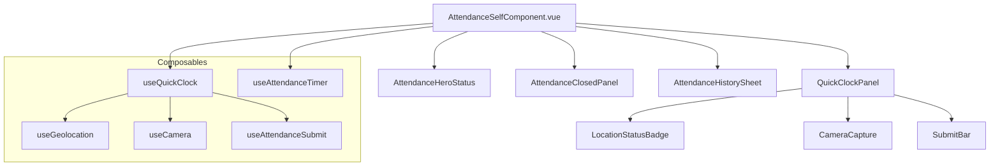
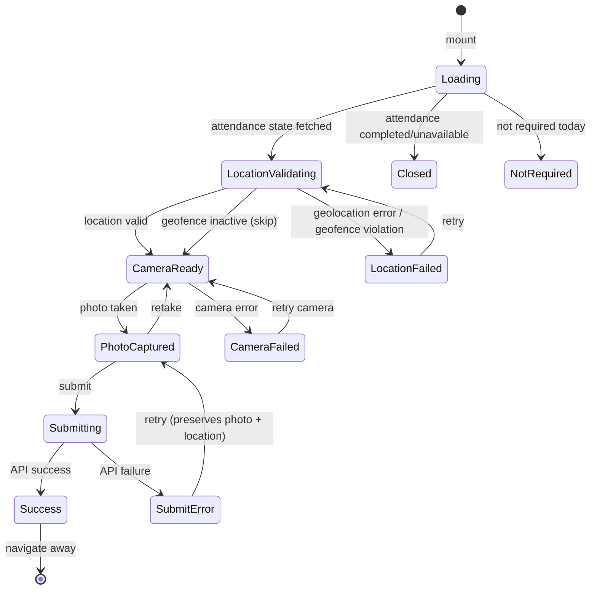

# Design Document: Attendance Quick Clock

## Overview

This feature refactors the existing `AttendanceSelfComponent.vue` (Options API, custom CSS) into a modern Composition API component using `<script setup>`, shadcn-vue primitives, and a composable-driven architecture. The core UX improvement is eliminating the manual "validate location" step — geolocation validation fires automatically on mount, reducing the clock-in/clock-out flow to 1-2 taps: page loads → auto-validate → capture photo → submit.

### Key Design Decisions

1. **Full rewrite over incremental refactor** — The existing component mixes concerns (UI, state, camera, geolocation, history) in a single 700+ line Options API file. A clean Composition API rewrite with extracted composables is more maintainable than patching.
2. **State machine pattern** — The quick clock flow has well-defined states and transitions. A finite state machine prevents invalid state combinations (e.g., submitting without a photo, camera active before location validated).
3. **Composable extraction** — Geolocation, camera, and submission logic become reusable composables that can be tested independently.
4. **shadcn-vue components** — Card, Button, Badge, Skeleton from `resources/js/components/ui/` replace all custom CSS panel/button classes.

## Architecture

### Component Hierarchy



### State Machine

The quick clock flow is modeled as a finite state machine with the following states and transitions:



### State Definitions

| State | `locationState` | `cameraState` | `image` | UI Shown |
|-------|----------------|---------------|---------|----------|
| Loading | `idle` | `idle` | `null` | Skeleton |
| LocationValidating | `loading` | `idle` | `null` | Skeleton + "Validating location..." |
| LocationFailed | `failed` | `idle` | `null` | Error Badge + Retry button |
| CameraReady | `ready` | `ready` | `null` | Video feed + Capture button |
| CameraFailed | `ready` | `failed` | `null` | Camera error + manual Open button |
| PhotoCaptured | `ready` | `captured` | `File` | Photo preview + Submit + Retake |
| Submitting | `ready` | `captured` | `File` | Loading overlay, buttons disabled |
| Success | `ready` | `captured` | `File` | Success message, then navigate |
| SubmitError | `ready` | `captured` | `File` | Error message, Submit re-enabled |

## Components and Interfaces

### 1. `AttendanceSelfComponent.vue` (Refactored Root)

**File:** `resources/js/components/admin/attendance/AttendanceSelfComponent.vue`

```vue
<script setup>
// Composition API with script setup
// Orchestrates composables and renders sub-components
</script>
```

**Responsibilities:**
- Fetch current attendance state on mount via `useAttendanceStore`
- Determine mode (clock-in vs clock-out, closed, not-required)
- Compose `useQuickClock` for the main flow
- Compose `useAttendanceTimer` for live duration
- Render appropriate panel based on state

**Props:** None (page-level component, receives data from store)

### 2. `useQuickClock` Composable

**File:** `resources/js/components/admin/attendance/composables/useQuickClock.js`

```js
export function useQuickClock(options) {
  // options: { isClockOutMode: Ref<boolean>, attendanceId: Ref<number|null> }

  // Composes useGeolocation + useCamera + useAttendanceSubmit
  // Orchestrates the state machine transitions

  return {
    // State
    locationState,      // Ref<'idle'|'loading'|'ready'|'failed'>
    locationError,      // Ref<string|null>
    locationDistance,    // Ref<number|null>
    cameraState,        // Ref<'idle'|'loading'|'ready'|'captured'|'failed'>
    cameraError,        // Ref<string|null>
    image,              // Ref<File|null>
    imagePreview,       // Ref<string|null>
    isSubmitting,       // Ref<boolean>
    submitError,        // Ref<string|null>
    coordinates,        // Ref<{latitude, longitude}|null>

    // Computed
    canSubmit,          // ComputedRef<boolean>
    flowStep,           // ComputedRef<1|2|3>

    // Actions
    startFlow,          // () => Promise<void> — triggers auto-validate
    retryLocation,      // () => Promise<void>
    capturePhoto,       // () => void
    retakePhoto,        // () => void
    submit,             // () => Promise<void>
    cleanup,            // () => void — stops streams, revokes URLs
  }
}
```

### 3. `useGeolocation` Composable

**File:** `resources/js/components/admin/attendance/composables/useGeolocation.js`

```js
export function useGeolocation() {
  return {
    locationState,        // Ref<'idle'|'loading'|'ready'|'failed'>
    coordinates,          // Ref<{latitude, longitude}|null>
    locationError,        // Ref<string|null>
    locationValidation,   // Ref<{enforced, distance_meter, is_valid}|null>

    validateLocation,     // (action: 'clock_in'|'clock_out') => Promise<void>
    retry,                // (action: 'clock_in'|'clock_out') => Promise<void>
    reset,                // () => void
  }
}
```

**Behavior:**
1. Calls `navigator.geolocation.getCurrentPosition` with `{ enableHighAccuracy: true, timeout: 10000 }`
2. On success, sends coordinates to `POST admin/attendance/validate-location` with action type
3. If backend returns `is_valid: true` or `enforced: false` → `locationState = 'ready'`
4. If backend returns geofence violation → `locationState = 'failed'`, stores error message and distance
5. On geolocation API error → maps error code to user-friendly message, sets `locationState = 'failed'`

### 4. `useCamera` Composable

**File:** `resources/js/components/admin/attendance/composables/useCamera.js`

```js
export function useCamera(videoRef) {
  // videoRef: Ref<HTMLVideoElement|null>

  return {
    cameraState,    // Ref<'idle'|'loading'|'ready'|'captured'|'failed'>
    cameraError,    // Ref<string|null>
    image,          // Ref<File|null>
    imagePreview,   // Ref<string|null>
    stream,         // Ref<MediaStream|null>

    startCamera,    // () => Promise<void>
    capturePhoto,   // () => void
    retakePhoto,    // () => void
    stopCamera,     // () => void
    cleanup,        // () => void — stops stream + revokes object URLs
  }
}
```

**Behavior:**
- Requests front-facing camera: `{ video: { facingMode: 'user' }, audio: false }`
- 10-second timeout for stream initialization
- Captures photo to JPEG blob at 0.88 quality
- Manages object URL lifecycle (revoke on retake/cleanup)
- Guards against stream leak if component unmounts during initialization

### 5. `useAttendanceSubmit` Composable

**File:** `resources/js/components/admin/attendance/composables/useAttendanceSubmit.js`

```js
export function useAttendanceSubmit() {
  return {
    isSubmitting,   // Ref<boolean>
    submitError,    // Ref<string|null>

    submitClockIn,  // (payload: ClockInPayload) => Promise<SubmitResult>
    submitClockOut, // (payload: ClockOutPayload) => Promise<SubmitResult>
  }
}
```

**Payload types:**
```ts
interface ClockInPayload {
  image: File
  clock_in_latitude: number
  clock_in_longitude: number
}

interface ClockOutPayload {
  id: number
  image: File
  clock_out_latitude: number
  clock_out_longitude: number
}

interface SubmitResult {
  success: boolean
  message?: string
  stateChanged?: boolean  // true if server state diverged
}
```

### 6. `useAttendanceTimer` Composable

**File:** `resources/js/components/admin/attendance/composables/useAttendanceTimer.js`

```js
export function useAttendanceTimer(clockInAtIso) {
  // clockInAtIso: Ref<string|null>

  return {
    liveDurationLabel,  // ComputedRef<string> — e.g., "2j 15m"
    nowTick,            // Ref<number>
  }
}
```

**Behavior:**
- Ticks every 30 seconds via `setInterval`
- Computes elapsed time from `clockInAtIso` to `nowTick`
- Cleans up interval on scope disposal via `onScopeDispose`

### 7. UI Sub-Components

#### `LocationStatusBadge.vue`

Renders a Badge showing location validation status:
- Loading: Skeleton placeholder
- Valid: `<Badge variant="success">` with distance
- Failed: `<Badge variant="destructive">` with error + retry button

#### `CameraCapture.vue`

Renders the camera viewport area:
- Video feed when `cameraState === 'ready'`
- Photo preview when `image` is set
- Capture/Retake buttons
- Error state with manual "Open Camera" fallback

#### `SubmitBar.vue`

Renders the primary action button:
- Disabled until `canSubmit` is true
- Shows loading spinner during submission
- Label changes based on clock-in vs clock-out mode

### Component Layout (Mobile-First)

```
┌─────────────────────────────────┐
│ [← Back]              [History] │  ← Topbar (Button components)
├─────────────────────────────────┤
│ Today, Senin 15 Januari         │
│ Halo, Ahmad!                    │  ← AttendanceHeroStatus
│ ┌─────┬─────┬─────┐            │
│ │ In  │ Out │ Dur │            │
│ └─────┴─────┴─────┘            │
├─────────────────────────────────┤
│ ┌─ Card ──────────────────────┐ │
│ │ [Badge: Location status]    │ │  ← LocationStatusBadge
│ │                             │ │
│ │ ┌─────────────────────────┐ │ │
│ │ │                         │ │ │
│ │ │    Camera / Preview     │ │ │  ← CameraCapture
│ │ │                         │ │ │
│ │ └─────────────────────────┘ │ │
│ │                             │ │
│ │ [  Clock In / Clock Out  ]  │ │  ← SubmitBar (Button)
│ └─────────────────────────────┘ │
└─────────────────────────────────┘
```

## Data Models

### Attendance State (from Pinia store)

```ts
interface AttendanceCurrent {
  required: boolean
  status: 'active' | 'completed' | 'missed_check_out' | 'attendance_unavailable'
  can_clock_out: boolean
  attendance: {
    id: number
    clock_in_time: string | null    // "08:00"
    clock_in_date: string | null    // "15 Jan 2025"
    clock_in_at_iso: string | null  // "2025-01-15T08:00:00+07:00"
    clock_out_time: string | null
    clock_out_date: string | null
    duration_minutes: number | null
    shift_name: string | null
  } | null
}
```

### Location Validation Response

```ts
interface LocationValidationResponse {
  data: {
    is_valid: boolean
    enforced: boolean
    is_active: boolean
    distance_meter: number | null
    message: string | null
  }
}
```

### Geolocation Error Mapping

| Error Code | `navigator.geolocation` | User Message Key |
|-----------|------------------------|-----------------|
| 1 | `PERMISSION_DENIED` | `attendance.location_permission_denied` |
| 2 | `POSITION_UNAVAILABLE` | `attendance.location_unavailable` |
| 3 | `TIMEOUT` | `attendance.location_timeout` |
| — | API not supported | `attendance.location_not_supported` |
| — | Network error (backend) | `attendance.location_network_error` |

### Quick Clock Flow State

```ts
interface QuickClockState {
  // Location
  locationState: 'idle' | 'loading' | 'ready' | 'failed'
  coordinates: { latitude: number; longitude: number } | null
  locationError: string | null
  locationDistance: number | null  // meters, for display

  // Camera
  cameraState: 'idle' | 'loading' | 'ready' | 'captured' | 'failed'
  cameraError: string | null
  image: File | null
  imagePreview: string | null  // object URL

  // Submission
  isSubmitting: boolean
  submitError: string | null
}
```


## Correctness Properties

*A property is a characteristic or behavior that should hold true across all valid executions of a system — essentially, a formal statement about what the system should do. Properties serve as the bridge between human-readable specifications and machine-verifiable correctness guarantees.*

### Property 1: Location validation payload correctness

*For any* action mode (clock_in or clock_out) and any valid GPS coordinates (latitude in [-90, 90], longitude in [-180, 180]), the `useGeolocation` composable SHALL send a validation request containing exactly the provided action, latitude, and longitude values.

**Validates: Requirements 1.2, 7.1**

### Property 2: Valid location response transitions state to ready

*For any* location validation response where `is_valid` is true OR `enforced` is false, the `useGeolocation` composable SHALL transition `locationState` to "ready" and store the coordinates.

**Validates: Requirements 1.4, 2.4**

### Property 3: Geolocation error transitions state to failed with message

*For any* geolocation error (PERMISSION_DENIED, POSITION_UNAVAILABLE, TIMEOUT, or unsupported), the `useGeolocation` composable SHALL transition `locationState` to "failed" and set `locationError` to a non-empty string describing the failure.

**Validates: Requirements 1.5, 3.1, 3.2, 3.3, 3.4**

### Property 4: canSubmit invariant

*For any* combination of `locationState` and `image` values, `canSubmit` SHALL be true if and only if `locationState` is "ready" AND `image` is not null. In all other combinations, `canSubmit` SHALL be false.

**Validates: Requirements 5.1, 1.6, 2.2**

### Property 5: Distance formatting uses Indonesian locale

*For any* non-negative integer distance in meters, the formatted distance string SHALL equal `Number(distance).toLocaleString("id-ID")` followed by " m" (e.g., 1250 → "1.250 m", 0 → "0 m").

**Validates: Requirements 2.1**

### Property 6: Errors preserve previously captured state

*For any* quick clock state where `image` is not null and/or `coordinates` are set, a subsequent location validation error or submission error SHALL NOT modify `image`, `imagePreview`, or `coordinates`.

**Validates: Requirements 3.5, 3.6, 5.5**

### Property 7: Correct API endpoint selection based on mode

*For any* submission with `isClockOutMode` being true or false, the composable SHALL call `clockOutAttendance` when `isClockOutMode` is true (with the attendance ID, image, and clock_out coordinates), and SHALL call `clockInAttendance` when `isClockOutMode` is false (with image and clock_in coordinates).

**Validates: Requirements 5.2**

### Property 8: Post-submission navigation target based on permissions

*For any* set of user permissions, after successful submission the navigation target SHALL be the admin dashboard route if the permissions array contains an entry with `name === "dashboard"` and `access === true`, and SHALL be the home route otherwise.

**Validates: Requirements 5.4**

### Property 9: Badge variant mapping from location state

*For any* `locationState` value, the Badge variant SHALL be: "default" when idle, no Badge when loading (Skeleton shown instead), "success" when ready, and "destructive" when failed.

**Validates: Requirements 6.3**

## Error Handling

### Geolocation Errors

| Scenario | Detection | User Feedback | Recovery |
|----------|-----------|---------------|----------|
| Browser unsupported | `!navigator.geolocation` | Error message + disabled submit | None (device limitation) |
| Permission denied | Error code 1 | Instructions to enable in settings | Manual retry after enabling |
| Position unavailable | Error code 2 | "Cannot determine location" | Retry button |
| Timeout (10s) | Error code 3 | "Location request timed out" | Retry button |
| Network error (backend) | Axios error without response | "Connection error" | Retry with preserved coordinates |
| Geofence violation | `is_valid: false` + `enforced: true` | Distance from allowed area | Retry (move closer) |

### Camera Errors

| Scenario | Detection | User Feedback | Recovery |
|----------|-----------|---------------|----------|
| Camera unsupported | `!navigator.mediaDevices?.getUserMedia` | Error notification | None |
| Permission denied | getUserMedia rejection | Error notification | Manual "Open Camera" button |
| Stream timeout (10s) | Custom timeout wrapper | Error notification | Manual "Open Camera" button |
| Unmount during init | `_isMounted` check / `onScopeDispose` | None (cleanup only) | N/A |

### Submission Errors

| Scenario | Detection | User Feedback | Recovery |
|----------|-----------|---------------|----------|
| Network error | Axios error | Error message | Retry (photo + location preserved) |
| Server rejection (422) | Response status 422 | Backend error message | Retry or state refresh |
| State changed (clock-out) | Specific 422 messages | "Shift state changed" | Auto-refresh state |
| Invalid attendance ID | Pre-submission check | "Invalid shift, reload" | Auto-refresh state |

### Error State Preservation Rules

1. **Location error** → Preserve `image` and `imagePreview` (user doesn't retake photo)
2. **Submit error** → Preserve `image`, `imagePreview`, and `coordinates` (user just retaps submit)
3. **Camera error** → Preserve `coordinates` and `locationState` (location stays valid)
4. **Component unmount** → Stop all streams, revoke all object URLs, clear intervals

## Testing Strategy

### Property-Based Tests (Vitest + fast-check)

The project uses Vitest with jsdom environment. Property-based tests will use `fast-check` for input generation.

**Configuration:**
- Library: `fast-check` (npm package)
- Runner: Vitest
- Minimum iterations: 100 per property
- Tag format: `Feature: attendance-quick-clock, Property {N}: {title}`

**Test file:** `resources/js/components/admin/attendance/__tests__/quickClock.property.test.js`

Each correctness property (1-9) maps to a single property-based test that generates random inputs and verifies the invariant holds across all generated cases.

### Unit Tests (Example-Based)

**Test file:** `resources/js/components/admin/attendance/__tests__/quickClock.test.js`

| Test | Validates |
|------|-----------|
| Auto-validate triggers on mount | Req 1.1 |
| Skeleton shown during loading state | Req 1.3 |
| Retry button visible when failed | Req 1.7 |
| Retry transitions to loading | Req 2.3 |
| Geofence inactive skips validation | Req 2.5 |
| Camera auto-starts after location ready | Req 4.1 |
| Capture button shown when camera ready | Req 4.2 |
| Photo preview shown after capture | Req 4.3 |
| Front-facing camera requested | Req 4.4 |
| All buttons disabled during submission | Req 5.3 |
| State refresh on stale clock-out | Req 5.6 |
| Live duration shown in clock-out mode | Req 7.2 |
| Success message includes duration | Req 7.3 |
| Pre-submission state re-fetch for clock-out | Req 7.4 |

### Edge Case Tests

| Test | Validates |
|------|-----------|
| Camera permission denied after auto-init | Req 4.5 |
| Camera stream timeout (10s) | Req 4.6 |
| Clock-out state changed during submission | Req 7.5 |
| Geolocation unsupported browser | Req 3.1 |
| Permission denied with instructions | Req 3.2 |

### Integration Tests

Not applicable for this feature — all logic is client-side with mocked API calls. The backend endpoints (`validate-location`, `clock-in`, `clock-out`) are tested separately in Laravel PHPUnit tests.
