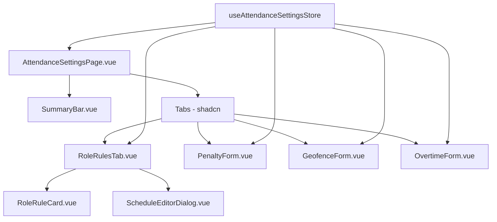
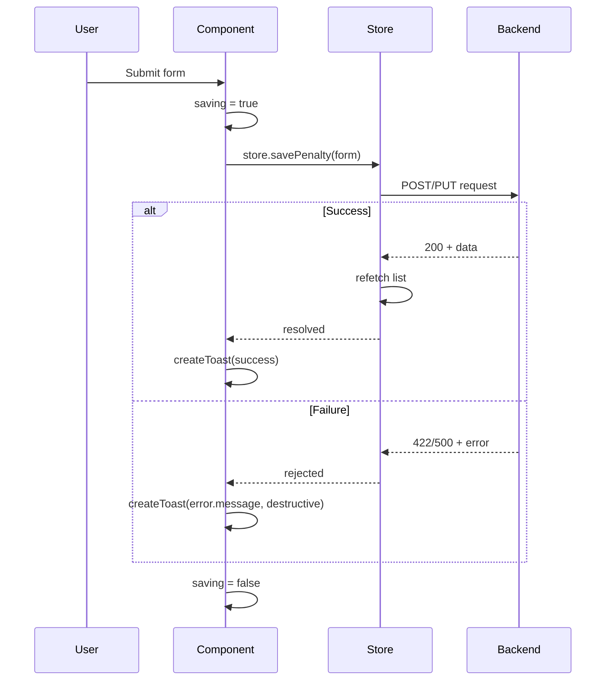

# Design Document

## Overview

This design covers the migration of `AttendanceSettingsComponent.vue` from Options API with custom scoped CSS to Composition API (`<script setup>`) using shadcn-vue primitives and Tailwind CSS utilities. The existing monolithic ~977-line component will be decomposed into focused sub-components while preserving all current functionality.

The migration follows the project's established patterns: Pinia for state management, `createToast` for notifications, `LoadingOverlay` for loading states, and the `../../ui` barrel import for all shadcn-vue primitives.

### Key Design Decisions

1. **Sub-component decomposition** — The monolithic component splits into 6 focused components (page shell, summary bar, role card, schedule editor, penalty form, geofence form, overtime form). This improves readability and testability without over-engineering.
2. **Direct store access** — Components call `useAttendanceSettingsStore()` directly instead of going through the `attendanceSettingsService.js` facade. The service layer adds indirection without value in Composition API.
3. **Local form state with `ref()`** — Each form sub-component maintains its own local copy of store data via `watch()`, submitting back through store actions. This prevents partial edits from corrupting shared state.
4. **Toast replaces alertService** — The existing `alertService` is replaced with `createToast()` from the shadcn-vue toast system, consistent with other migrated admin components.

## Architecture



### Component Hierarchy

```
resources/js/components/admin/attendance/
├── AttendanceSettingsPage.vue        # Page shell: header, tabs, loading overlay
├── settings/
│   ├── SummaryBar.vue                # 4-metric summary cards with skeleton loading
│   ├── RoleRulesTab.vue              # Role grid + empty state + opens dialog
│   ├── RoleRuleCard.vue              # Single role card display
│   ├── ScheduleEditorDialog.vue      # Dialog for editing role schedule
│   ├── PenaltyForm.vue              # Late penalty configuration form
│   ├── GeofenceForm.vue             # Location enforcement form
│   └── OvertimeForm.vue             # Overtime rules form
```

### Data Flow

1. `AttendanceSettingsPage` calls `store.fetchAll()` on mount
2. Store populates `roleRules`, `penalties`, `overtimes`, `geofenceSetting`
3. Sub-components read from store via computed getters
4. Form components clone store data into local `ref()` state via `watch()`
5. On submit, form components call store actions → API → refetch → toast

## Components and Interfaces

### AttendanceSettingsPage.vue (Page Shell)

```typescript
// Props: none (top-level page component)
// Emits: none

// Internal state
const store = useAttendanceSettingsStore()
const loading = ref(true)
const activeTab = ref('roles')

// Lifecycle
onMounted(() => {
  store.fetchAll().finally(() => { loading.value = false })
})
```

**Template structure:**
- `LoadingOverlay` bound to `loading`
- Page header (static text with i18n)
- `SummaryBar` component
- `Tabs` with 4 `TabsContent` panels

### SummaryBar.vue

```typescript
interface Props {
  loading: boolean
}

// Reads from store
const store = useAttendanceSettingsStore()
const requiredRoleCount = computed(() => store.roleRules.filter(r => r.is_required && r.is_active).length)
const activeScheduleCount = computed(() => store.roleRules.reduce((sum, r) => sum + (r.schedules || []).filter(s => s.is_active).length, 0))
const penaltyActive = computed(() => store.penalties.some(p => p.is_active))
const geofenceActive = computed(() => store.geofenceSetting?.is_active ?? false)
```

**Template:** 4 `Card` components in a responsive grid. When `loading` is true, renders `Skeleton` placeholders instead of values.

### RoleRulesTab.vue

```typescript
// Emits: none (manages dialog internally)

const store = useAttendanceSettingsStore()
const roleRules = computed(() => store.roleRules)
const dialogOpen = ref(false)
const selectedRule = ref(null)

function openEditor(rule) {
  selectedRule.value = JSON.parse(JSON.stringify(rule))
  dialogOpen.value = true
}
```

### RoleRuleCard.vue

```typescript
interface Props {
  rule: RoleRule
}

interface Emits {
  (e: 'edit', rule: RoleRule): void
}
```

**Template:** `Card` with role name, `Badge` for status, facts grid (hourly rate, today's schedule, active days), and edit `Button`.

### ScheduleEditorDialog.vue

```typescript
interface Props {
  open: boolean
  rule: RoleRule | null
}

interface Emits {
  (e: 'update:open', value: boolean): void
  (e: 'saved'): void
}

// Local form state cloned from props.rule
const form = ref(null)
watch(() => props.rule, (val) => {
  form.value = val ? JSON.parse(JSON.stringify(val)) : null
}, { immediate: true })
```

**Bulk actions:** `copyMondayToWeekdays()`, `copyMondayToAll()`, `disableWeekend()` — same logic as current component.

### PenaltyForm.vue / GeofenceForm.vue / OvertimeForm.vue

Each follows the same pattern:
```typescript
const store = useAttendanceSettingsStore()
const form = ref({ /* defaults */ })
const saving = ref(false)

// Sync from store
watch(() => store.penalties, (val) => { /* merge into form */ }, { immediate: true })

async function submit() {
  saving.value = true
  try {
    await store.savePenalty(form.value)
    createToast(t('attendance.late_penalty_saved'), { type: 'default' })
  } catch (err) {
    createToast(err?.response?.data?.message || t('attendance.late_penalty_save_failed'), { type: 'destructive' })
  } finally {
    saving.value = false
  }
}
```

## Data Models

### Store State (existing — no changes needed)

```typescript
interface AttendanceSettingsState {
  roleRules: RoleRule[]
  shifts: Shift[]
  penalties: Penalty[]
  overtimes: Overtime[]
  rates: Rate[]
  mandatoryRules: MandatoryRule[]
  geofenceSetting: GeofenceSetting | null
}
```

### RoleRule

```typescript
interface RoleRule {
  role_id: number
  role_name: string
  is_required: boolean
  is_active: boolean
  rate_per_hour: number
  schedules: DaySchedule[]
}

interface DaySchedule {
  day_of_week: number  // 1=Monday ... 7=Sunday
  day_name: string
  is_active: boolean
  start_time: string   // "HH:mm"
  end_time: string     // "HH:mm"
  grace_minutes: number
}
```

### Penalty

```typescript
interface Penalty {
  id: number | null
  name: string
  late_after_minutes: number
  penalty_amount: number
  cap_after_minutes: number | null
  cap_penalty_amount: number | null
  effective_from: string | null
  is_active: boolean
}
```

### Overtime

```typescript
interface Overtime {
  id: number | null
  name: string
  start_after_minutes: number
  multiplier: number
  effective_from: string | null
  is_active: boolean
}
```

### GeofenceSetting

```typescript
interface GeofenceSetting {
  radius_meter: number
  enforce_clock_in: boolean
  enforce_clock_out: boolean
  is_active: boolean
}
```

## shadcn-vue Component Mapping

| Current Element | shadcn-vue Replacement | Notes |
|---|---|---|
| `<LoadingComponent :props="loading">` | `<LoadingOverlay :active="loading">` | Use shadcn LoadingOverlay with `active` boolean prop |
| `.attendance-summary article` | `<Card>` + `<CardContent>` | Each metric in its own Card |
| `<Tabs>` (already shadcn) | `<Tabs>` | Keep as-is, remove custom CSS classes |
| `.attendance-tab-trigger` | `<TabsTrigger>` with Tailwind classes | Replace custom CSS with utility classes |
| `.role-card` | `<Card>` with hover utilities | `hover:border-primary/30 hover:shadow-md transition` |
| `.status-pill.on/.off` | `<Badge variant="default">` / `<Badge variant="secondary">` | Use Badge component |
| `<button class="outline-action">` | `<Button variant="outline" size="sm">` | shadcn Button |
| `<button class="primary-action">` | `<Button>` (default variant) | shadcn Button |
| `<button class="secondary-action">` | `<Button variant="outline">` | shadcn Button |
| `<Input>` (already shadcn) | `<Input>` | Keep, remove wrapper CSS |
| `<Switch>` (already shadcn) | `<Switch>` | Keep, remove wrapper CSS |
| `<Label>` (already shadcn) | `<Label>` | Keep |
| `<Dialog>` (already shadcn) | `<Dialog>` | Keep, remove custom CSS |
| `<input type="checkbox">` (day toggle) | `<Checkbox>` | Replace native checkbox |
| `alertService.success/error` | `createToast(msg, { type })` | Use shadcn toast system |
| `.empty-state` div | `<Card>` with centered content | Tailwind flex/grid centering |
| Skeleton loading (new) | `<Skeleton>` | For summary bar loading state |

## Tailwind Layout Strategy

### Summary Bar Grid
```html
<div class="grid grid-cols-1 sm:grid-cols-2 lg:grid-cols-4 gap-3">
```

### Role Rules Grid
```html
<div class="grid grid-cols-1 md:grid-cols-2 lg:grid-cols-3 gap-4">
```

### Tabs Trigger Grid
```html
<TabsList class="grid h-auto grid-cols-2 gap-2 bg-transparent p-0 md:grid-cols-4">
```

### Form Two-Column Layout
```html
<div class="grid grid-cols-1 md:grid-cols-2 gap-4">
```

### Schedule Editor Row (responsive)
```html
<!-- Desktop: horizontal row -->
<div class="flex flex-col gap-2 sm:flex-row sm:items-center sm:gap-3">
```

### Mobile Button Stacking
```html
<div class="flex flex-col gap-2 sm:flex-row sm:justify-end">
```

## Correctness Properties

*A property is a characteristic or behavior that should hold true across all valid executions of a system — essentially, a formal statement about what the system should do. Properties serve as the bridge between human-readable specifications and machine-verifiable correctness guarantees.*

This feature is primarily a UI component migration. Most acceptance criteria test rendering, code structure, and styling — none of which are suitable for property-based testing. However, the summary bar metric calculations and the schedule bulk-copy logic are pure data transformations with clear input/output behavior that benefit from PBT.

### Property 1: Summary bar metrics are correctly derived from store state

*For any* array of RoleRule objects with varying `is_required`, `is_active` flags and nested `schedules` arrays, the `requiredRoleCount` computed value SHALL equal the count of rules where both `is_required` and `is_active` are true, and the `activeScheduleCount` SHALL equal the total number of schedules across all rules where `schedule.is_active` is true.

**Validates: Requirements 4.1, 5.4**

### Property 2: Copy Monday to weekdays preserves Monday and weekend, overwrites Tue–Fri

*For any* valid 7-day schedule array (days 1–7), applying `copyMondayToWeekdays` SHALL result in days 2–5 (Tue–Fri) having identical `start_time`, `end_time`, `grace_minutes`, and `is_active` values to day 1 (Monday), while days 6–7 (Sat–Sun) and day 1 itself remain unchanged.

**Validates: Requirements 6.2**

### Property 3: Disable weekend sets Saturday and Sunday to inactive without affecting weekdays

*For any* valid 7-day schedule array, applying `disableWeekend` SHALL set days 6 and 7 to `is_active = false` while leaving days 1–5 completely unchanged.

**Validates: Requirements 6.2**

## Error Handling

| Scenario | Handling |
|---|---|
| Initial fetch fails | `LoadingOverlay` dismissed, error toast shown, empty state displayed |
| Save operation fails | `createToast(err.response.data.message, { type: 'destructive' })` |
| Save operation succeeds | `createToast(successMessage, { type: 'default' })`, store auto-refetches |
| Network timeout | Caught by axios interceptor, generic error toast |
| Validation error (server) | Server returns 422 with message, displayed in error toast |

### Error Flow



## Testing Strategy

### Why Property-Based Testing Does Not Apply

This feature is a UI component migration — refactoring code structure, replacing CSS with Tailwind utilities, and adopting shadcn-vue primitives. The acceptance criteria test:
- Which UI components are rendered (rendering assertions)
- Code structure conventions (Composition API patterns)
- Styling approach (Tailwind vs custom CSS)
- Form submit → API → toast flow (integration behavior)

There are no pure functions with universal properties, no data transformations, and no algorithmic logic that would benefit from property-based testing. The appropriate testing strategies are component tests and integration tests.

### Unit / Component Tests

Using Vitest + Vue Test Utils:

1. **SummaryBar rendering** — Verify 4 metric cards render with correct values from store mock; verify Skeleton renders when `loading=true`
2. **RoleRuleCard display** — Verify role name, Badge variant, hourly rate, schedule text render correctly for given props
3. **ScheduleEditorDialog bulk actions** — Verify `copyMondayToWeekdays` copies Monday schedule to Tue–Fri; verify `disableWeekend` sets Sat/Sun to inactive
4. **Form submission flow** — Verify each form (Penalty, Geofence, Overtime) calls the correct store action on submit and shows appropriate toast
5. **Empty state** — Verify empty state Card renders when `roleRules` is empty
6. **Tab navigation** — Verify clicking tab triggers shows correct content panel

### Integration Tests

1. **Full page load** — Mount `AttendanceSettingsPage`, mock API responses, verify loading overlay appears then disappears, all tabs render
2. **Save round-trip** — Fill form, submit, verify API called with correct payload, verify success toast
3. **Error handling** — Mock API failure, submit form, verify error toast with server message

### Accessibility Tests

1. **Touch targets** — Assert all Button, Switch, Checkbox, TabsTrigger elements have min-height 44px (via computed styles or class assertions)
2. **Label associations** — Assert all Input elements have associated Label or aria-label
3. **Tab order** — Verify logical focus progression through form elements
