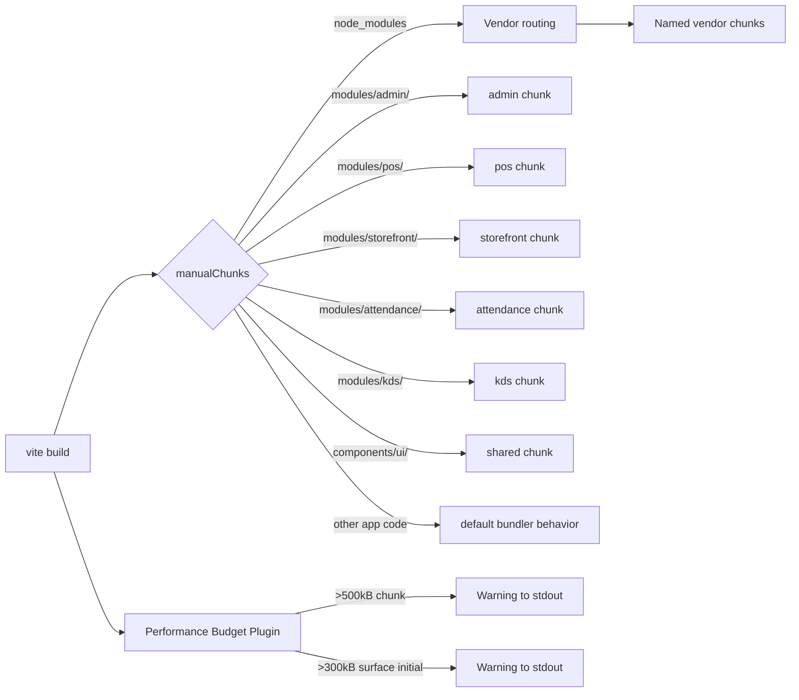

# Design Document: Bundle Code Splitting

## Overview

This design addresses the Vite build warning about oversized chunks by introducing surface-based code splitting, optimized vendor chunking, lazy-loaded heavy components, shared module deduplication, CSS consolidation, and performance budget enforcement.

The current state has route-level component lazy loading and a basic `manualChunks` function that groups vendor libraries. However, application code is not split by surface boundary — all stores, services, and utilities are bundled together regardless of which surface uses them. The ~100 Pinia stores and ~100 services are eagerly available to all surfaces.

**Key design decisions:**

1. A single `manualChunks` function handles both vendor grouping and surface isolation via path-based detection
2. Surface isolation operates on the `resources/js/modules/` directory convention (requires migrating components/stores/services into module directories)
3. Heavy components use `defineAsyncComponent()` with dynamic `import()` to defer third-party library loading
4. A Vite plugin handles performance budget warnings without failing the build
5. CSS remains consolidated in a single shared stylesheet with surface-specific overrides limited to context-specific constraints

## Architecture

```mermaid
graph TD
    subgraph "Entry Point"
        APP[app.js]
    end

    subgraph "Vendor Chunks"
        VUE[vue-vendor<br/>vue, vue-router, pinia, vue-i18n]
        RADIX[radix<br/>radix-vue, cva, clsx, tailwind-merge]
        VENDOR[vendor<br/>remaining node_modules]
    end

    subgraph "Lazy Vendor Chunks"
        CHARTS[charts<br/>apexcharts, vue3-apexcharts, @unovis]
        EDITOR[editor<br/>@tiptap/*, prosemirror-*]
        MAPS[google-maps<br/>@googlemaps/js-api-loader]
        SWIPER[swiper<br/>swiper]
        FIREBASE[firebase<br/>firebase/*]
    end

    subgraph "Surface Route Chunks"
        ADMIN[admin chunk]
        POS[pos chunk]
        STOREFRONT[storefront chunk]
        ATTENDANCE[attendance chunk]
        KDS[kds chunk]
    end

    subgraph "Shared Application Code"
        SHARED[shared chunk<br/>components/ui, cross-surface utils]
    end

    APP --> VUE
    APP --> RADIX
    APP --> SHARED
    ADMIN --> VENDOR
    ADMIN -.-> CHARTS
    ADMIN -.-> EDITOR
    ADMIN -.-> MAPS
    POS -.-> SWIPER
    STOREFRONT -.-> SWIPER
    STOREFRONT -.-> MAPS
    STOREFRONT -.-> FIREBASE
```

### Build Flow



## Components and Interfaces

### 1. `manualChunks` Function

The central chunk-routing function in `vite.config.js`. It receives a module ID (absolute file path) and returns a chunk name or `undefined` (let bundler decide).

```javascript
// vite.config.js — manualChunks function signature
function manualChunks(id: string): string | undefined
```

**Routing priority (evaluated top-to-bottom):**

1. Vendor library rules (node_modules path matching)
2. Shared UI library (`components/ui/`) → `"shared"`
3. Surface module isolation (`modules/{surface}/`) → surface name
4. Cross-surface shared code (imported by 2+ surfaces) → `"shared"`
5. Everything else → `undefined` (bundler default)

### 2. Surface Directory Convention

Each surface owns a directory under `resources/js/modules/`:

| Surface | Directory | Chunk Name |
|---------|-----------|------------|
| Admin | `modules/admin/` | `admin` |
| POS | `modules/pos/` | `pos` |
| Storefront | `modules/storefront/` | `storefront` |
| Attendance | `modules/attendance/` | `attendance` |
| KDS | `modules/kds/` | `kds` |

Files within a surface directory (components, stores, services, routes) are assigned to that surface's chunk. The `manualChunks` function detects surface membership by checking if the resolved module path contains the surface directory prefix.

### 3. Vendor Chunk Groups

| Chunk Name | Packages | Rationale |
|------------|----------|-----------|
| `vue-vendor` | vue, vue-router, pinia, vue-i18n | Core framework — changes rarely |
| `radix` | radix-vue, class-variance-authority, clsx, tailwind-merge | UI primitive layer — shared by all surfaces |
| `charts` | apexcharts, vue3-apexcharts, @unovis/ts, @unovis/vue | Heavy charting — only admin dashboard |
| `editor` | @tiptap/*, prosemirror-* | Rich text — only admin settings |
| `google-maps` | @googlemaps/js-api-loader | Maps — admin branches + storefront |
| `swiper` | swiper | Carousel — POS + storefront + KDS |
| `firebase` | firebase/* | Push notifications — loaded on demand |
| `vendor` | All remaining node_modules | Catch-all for smaller deps |

### 4. Performance Budget Plugin

A custom Vite plugin that runs in the `generateBundle` hook:

```javascript
// Plugin interface
interface BudgetConfig {
  chunkSizeLimit: number;       // per-chunk max in kB (default: 500)
  surfaceInitialLimit: number;  // per-surface initial bundle max in kB (default: 300)
  surfaces: string[];           // surface names to track
}
```

The plugin:
- Iterates over all generated chunks
- Measures minified size (before gzip)
- Emits warnings to stdout for violations
- Never fails the build (exit code 0)

### 5. Cross-Surface Contamination Guard

A build-time validation (part of the `manualChunks` logic or a separate plugin) that detects when a single chunk contains modules from multiple surface directories. If detected during production build, it emits a build error with a message identifying the contaminated surfaces.

```
ERROR: Chunk "admin-AbC123.js" contains modules from multiple surfaces: admin, pos
  - resources/js/modules/admin/components/Dashboard.vue
  - resources/js/modules/pos/stores/usePosCartStore.js
```

## Data Models

### Chunk Assignment Map (Conceptual)

```typescript
// Internal model used by manualChunks to route modules
interface ChunkAssignment {
  // Vendor chunk rules — order matters (first match wins)
  vendorRules: Array<{
    name: string;           // chunk output name
    test: (id: string) => boolean;  // path matcher
  }>;

  // Surface isolation rules
  surfaces: Array<{
    name: string;           // chunk output name (e.g., "admin")
    pathPrefix: string;     // directory prefix (e.g., "modules/admin/")
  }>;

  // Shared module paths (always extracted)
  sharedPaths: string[];    // e.g., ["components/ui/"]
}
```

### Performance Budget Report (stdout output)

```
⚠ Bundle size warning:
  Chunk "vendor-abc123.js" exceeds 500 kB limit (actual: 523 kB)
  Surface "admin" initial bundle exceeds 300 kB limit (actual: 312 kB)
```

### Surface Module Directory Structure (Target State)

```
resources/js/modules/
├── admin/
│   ├── routes.js
│   ├── components/       ← migrated from components/admin/
│   ├── stores/           ← migrated from stores/useAdmin*.js, useDashboard*.js, etc.
│   └── services/         ← migrated from services/admin*.js, dashboard*.js, etc.
├── pos/
│   ├── routes.js
│   ├── components/       ← migrated from components/admin/pos/
│   ├── stores/           ← migrated from stores/usePos*.js, useCashierSession*.js
│   └── services/         ← migrated from services/pos*.js, cashierSession*.js
├── storefront/
│   ├── routes.js
│   ├── components/       ← migrated from components/frontend/
│   ├── stores/           ← migrated from stores/useFrontend*.js
│   └── services/         ← migrated from services/frontend*.js
├── attendance/
│   ├── routes.js
│   ├── components/       ← migrated from components/admin/attendance/
│   ├── stores/           ← migrated from stores/useAttendance*.js
│   └── services/         ← migrated from services/attendance*.js
└── kds/
    ├── routes.js
    ├── components/       ← migrated from components/admin/kitchenDisplaySystem/
    ├── stores/           ← migrated from stores/useKitchenDisplaySystem*.js
    └── services/         ← migrated from services/kitchenDisplaySystem*.js
```


## Correctness Properties

*A property is a characteristic or behavior that should hold true across all valid executions of a system — essentially, a formal statement about what the system should do. Properties serve as the bridge between human-readable specifications and machine-verifiable correctness guarantees.*

### Property 1: Surface Isolation

*For any* module path that resides under `resources/js/modules/{surface}/` where surface is one of [admin, pos, storefront, attendance, kds], the `manualChunks` function SHALL return that surface's chunk name and never the chunk name of a different surface.

**Validates: Requirements 1.1, 1.2, 1.3, 1.4**

### Property 2: Vendor Routing Correctness

*For any* module path within `node_modules/` that matches a named vendor group rule (vue ecosystem → "vue-vendor", radix ecosystem → "radix", charting → "charts", editor → "editor", maps → "google-maps", carousel → "swiper", firebase → "firebase"), the `manualChunks` function SHALL return the correct named chunk. For any `node_modules/` path not matching a named rule, it SHALL return "vendor".

**Validates: Requirements 3.1, 3.2, 3.3, 3.4**

### Property 3: Vendor Assignment Determinism

*For any* module path within `node_modules/`, calling `manualChunks` multiple times with the same path SHALL always return the same chunk name string (never undefined), ensuring each dependency is assigned to exactly one chunk with no duplication.

**Validates: Requirements 3.7**

### Property 4: Shared UI Extraction

*For any* module path containing `components/ui/`, the `manualChunks` function SHALL return "shared", regardless of which surface imports it.

**Validates: Requirements 5.2, 8.1**

### Property 5: Fallthrough Behavior

*For any* module path that is NOT under `node_modules/`, NOT under `resources/js/modules/{surface}/` for any known surface, and NOT under `components/ui/`, the `manualChunks` function SHALL return `undefined` (delegating to the bundler's default behavior).

**Validates: Requirements 6.3**

### Property 6: Cross-Surface Contamination Detection

*For any* set of module paths where at least two paths belong to different surface directories, if those paths are assigned to the same output chunk, the contamination guard SHALL detect the violation and produce an error message identifying both surface names.

**Validates: Requirements 1.6**

### Property 7: Per-Chunk Budget Warning

*For any* chunk whose minified size exceeds the configured `chunkSizeLimit` (default 500 kB), the performance budget checker SHALL produce a warning string that contains the chunk filename and its actual size in kB. For chunks at or below the limit, no warning SHALL be produced.

**Validates: Requirements 4.1, 4.3**

### Property 8: Per-Surface Initial Bundle Warning

*For any* surface whose combined initial chunk sizes exceed the configured `surfaceInitialLimit` (default 300 kB), the performance budget checker SHALL produce a warning string identifying the surface and its actual combined size. For surfaces at or below the limit, no warning SHALL be produced.

**Validates: Requirements 4.2**

## Error Handling

### Build-Time Errors

| Scenario | Behavior | Exit Code |
|----------|----------|-----------|
| Cross-surface contamination detected | Build fails with error listing contaminated surfaces and offending modules | Non-zero |
| Chunk exceeds performance budget | Warning emitted to stdout; build completes | 0 |
| Surface initial bundle exceeds budget | Warning emitted to stdout; build completes | 0 |
| Unknown module path (no surface match, not vendor) | Silently falls through to bundler default | 0 |
| Circular dependency between surfaces | Vite/Rolldown handles natively; no custom handling needed | 0 |

### Runtime Errors

| Scenario | Behavior |
|----------|----------|
| Lazy chunk fails to load (network error) | Vue Router's default error handling; component shows loading/error state |
| Shared chunk unavailable | Browser blocks surface chunk execution; page shows loading state |
| Heavy component chunk timeout | `defineAsyncComponent` error component renders with retry option |

### Development Mode

- `manualChunks` is not applied — no chunk-related errors possible
- HMR continues to work normally regardless of production chunk boundaries
- No performance budget warnings in development

## Testing Strategy

### Property-Based Tests (fast-check)

The `manualChunks` function and performance budget logic are pure functions with clear input/output behavior, making them ideal for property-based testing.

**Library:** fast-check (already in devDependencies)
**Minimum iterations:** 100 per property
**Tag format:** `Feature: bundle-code-splitting, Property {N}: {title}`

Each correctness property (1–8) maps to a single property-based test that generates random module paths and verifies the function's behavior across the input space.

**Generators needed:**
- Random surface module paths: `modules/{surface}/{component|store|service}/{name}.{js|vue|ts}`
- Random vendor paths: `node_modules/{package}/{subpath}`
- Random shared UI paths: `components/ui/{component}/{file}.{vue|ts}`
- Random non-matching paths: paths that don't fit any category
- Random chunk sizes (for budget tests): positive numbers in kB

### Unit Tests (vitest)

- Specific examples for each vendor group (exact package paths)
- Edge cases: paths with similar prefixes (e.g., `modules/admin-tools/` should NOT match `admin`)
- Edge cases: nested node_modules paths
- Edge cases: scoped packages (`@tiptap/vue-3`)
- Budget plugin: warning message format verification
- Budget plugin: no-throw guarantee (always returns, never throws)
- Development mode: manualChunks not applied when `command === 'serve'`

### Integration Tests

- Run `npm run build` and verify:
  - Each surface has its own chunk file
  - Heavy vendor chunks exist as separate files (charts, editor, etc.)
  - No surface chunk exceeds 300 KB gzipped
  - Single shared CSS output file
  - Entry bundle does not contain heavy libraries
  - `components/ui/` code appears in shared chunk only

### Manual Verification

- Load each surface in browser, verify Network tab shows only relevant chunks
- Navigate between surfaces, verify shared chunk is cached and reused
- HMR in development mode remains fast after config changes
