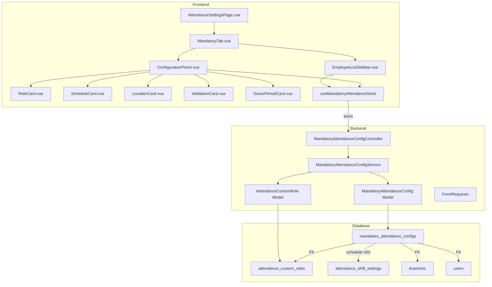

# Design Document: Mandatory Attendance Config

## Overview

This feature adds a per-employee attendance configuration system to the existing Attendance Settings page. It introduces a new "Karyawan Wajib Absen" tab with a master-detail layout: an employee list sidebar on the left and a flow-based card configuration panel on the right. Each employee can be assigned a custom role, weekly shift schedule, geofence location, validation method, grace period, and optional custom hourly rate.

The design extends the existing `AttendanceSettingController` route group and `useAttendanceSettingsStore` Pinia store, adding a dedicated sub-controller and a new Pinia store for the mandatory config domain. Custom roles are stored in a new `attendance_custom_roles` table and integrated with the existing Role Rules system.

### Key Design Decisions

1. **Separate controller** (`MandatoryAttendanceConfigController`) rather than adding more methods to the already-large `AttendanceSettingController` — keeps single responsibility.
2. **New Pinia store** (`useMandatoryAttendanceStore`) for the mandatory tab state — avoids bloating the existing settings store.
3. **Native HTML `<select>`** for shift dropdowns in the Schedule Card — per steering rule 08, operational forms use native selects for reliability.
4. **Single save endpoint** — the entire employee config (role, schedule, location, validation, grace period, hourly rate) is persisted atomically in one POST/PUT request.
5. **`attendance_custom_roles` table** separate from Spatie's `roles` table — custom roles are attendance-specific labels, not system permission roles.

## Architecture



## Components and Interfaces

### Backend Components

#### 1. MandatoryAttendanceConfigController

Location: `app/Http/Controllers/Admin/MandatoryAttendanceConfigController.php`

```php
class MandatoryAttendanceConfigController extends AdminController
{
    // Middleware: permission:attendance-settings (all methods)

    public function employeeList(): JsonResponse;          // GET  /admin/attendance-setting/mandatory-config/employees
    public function show(User $employee): JsonResponse;    // GET  /admin/attendance-setting/mandatory-config/{employee}
    public function store(MandatoryAttendanceConfigRequest $request): JsonResponse;  // POST /admin/attendance-setting/mandatory-config
    public function roles(): JsonResponse;                 // GET  /admin/attendance-setting/mandatory-config/roles
    public function storeCustomRole(CustomRoleRequest $request): JsonResponse;       // POST /admin/attendance-setting/mandatory-config/custom-role
    public function destroyCustomRole(AttendanceCustomRole $role): JsonResponse;     // DELETE /admin/attendance-setting/mandatory-config/custom-role/{role}
    public function branches(): JsonResponse;              // GET  /admin/attendance-setting/mandatory-config/branches
}
```

#### 2. MandatoryAttendanceConfigService

Location: `app/Services/MandatoryAttendanceConfigService.php`

Responsibilities:
- Query active employees (status active, role_id != 2, is_guest = 0) with `has_config` flag
- Retrieve/create/update `MandatoryAttendanceConfig` records
- Manage `AttendanceCustomRole` CRUD with uniqueness validation
- Handle custom role deletion with cascade (nullify role assignment on affected configs)
- Return branches with GPS coordinates for geofence selection

#### 3. Form Requests

| Request Class | Location | Purpose |
|---|---|---|
| `MandatoryAttendanceConfigRequest` | `app/Http/Requests/` | Validates the full config payload |
| `CustomRoleRequest` | `app/Http/Requests/` | Validates custom role creation |

**MandatoryAttendanceConfigRequest rules:**
```php
[
    'employee_id'       => ['required', 'integer', 'exists:users,id'],
    'custom_role_id'    => ['required', 'integer', 'exists:attendance_custom_roles,id'],
    'schedule'          => ['required', 'array', 'size:7'],
    'schedule.*.day'    => ['required', 'integer', 'between:1,7'],
    'schedule.*.shift_setting_id' => ['nullable', 'integer', 'exists:attendance_shift_settings,id'],
    'geofence_mode'     => ['required', 'string', 'in:all_branches,specific_outlet,free_gps'],
    'branch_id'         => ['nullable', 'required_if:geofence_mode,specific_outlet', 'integer', 'exists:branches,id'],
    'radius_meter'      => ['nullable', 'required_if:geofence_mode,specific_outlet', 'integer', 'between:50,5000'],
    'validation_method' => ['required', 'string', 'in:selfie_gps,pin'],
    'grace_period'      => ['required', 'integer', 'between:0,120'],
    'custom_hourly_rate'=> ['nullable', 'numeric', 'between:0.01,999999999.99'],
]
```

**CustomRoleRequest rules:**
```php
[
    'name' => ['required', 'string', 'max:50', 'unique:attendance_custom_roles,name'],
]
```

#### 4. API Resource

`MandatoryAttendanceConfigResource` — transforms the config model into the JSON response shape expected by the frontend.

### Frontend Components

#### Component Tree

```
AttendanceSettingsPage.vue (modified — add MandatoryTab trigger)
└── MandatoryTab.vue (new)
    ├── EmployeeListSidebar.vue (new)
    └── ConfigurationPanel.vue (new)
        ├── FlowCard.vue (new — reusable wrapper with step number + connector)
        ├── RoleCard.vue (new)
        ├── ScheduleCard.vue (new)
        ├── LocationCard.vue (new)
        ├── ValidationCard.vue (new)
        └── GracePeriodCard.vue (new)
```

All new components use `<script setup>` with Composition API.

#### Pinia Store: `useMandatoryAttendanceStore`

Location: `resources/js/stores/useMandatoryAttendanceStore.js`

```js
export const useMandatoryAttendanceStore = defineStore('mandatoryAttendance', {
  state: () => ({
    employees: [],           // { id, name, avatar, has_config }
    loadingEmployees: false,
    selectedEmployeeId: null,
    config: null,            // current employee's MandatoryAttendanceConfig
    loadingConfig: false,
    roles: [],               // combined standard + custom roles
    shifts: [],              // from existing attendance_shift_settings
    branches: [],            // branches with GPS coordinates
    saving: false,
  }),

  getters: {
    selectedEmployee: (state) => state.employees.find(e => e.id === state.selectedEmployeeId),
    filteredEmployees: (state) => (search) => { /* case-insensitive filter */ },
  },

  actions: {
    fetchEmployees(),
    fetchConfig(employeeId),
    saveConfig(payload),
    fetchRoles(),
    createCustomRole(name),
    deleteCustomRole(roleId),
    fetchBranches(),
  },
})
```

#### Component Responsibilities

| Component | Responsibility | Size Estimate |
|---|---|---|
| `MandatoryTab.vue` | Layout orchestrator: sidebar + panel in flex row | ~60 lines |
| `EmployeeListSidebar.vue` | Search input, scrollable employee list, selection state | ~120 lines |
| `ConfigurationPanel.vue` | Renders 5 FlowCards or placeholder; save button | ~100 lines |
| `FlowCard.vue` | Reusable card wrapper with step number circle + connector line | ~50 lines |
| `RoleCard.vue` | Role dropdown + inline custom role creation | ~130 lines |
| `ScheduleCard.vue` | 7-row grid with native `<select>` for shifts | ~120 lines |
| `LocationCard.vue` | Geofence mode selector + conditional branch/radius inputs | ~110 lines |
| `ValidationCard.vue` | Radio group for validation method | ~60 lines |
| `GracePeriodCard.vue` | Preset buttons + custom input for grace period | ~90 lines |

## Data Models

### New Table: `mandatory_attendance_configs`

```sql
CREATE TABLE mandatory_attendance_configs (
    id BIGINT UNSIGNED AUTO_INCREMENT PRIMARY KEY,
    employee_id BIGINT UNSIGNED NOT NULL,
    custom_role_id BIGINT UNSIGNED NULL,
    schedule JSON NOT NULL,                    -- [{day:1, shift_setting_id: 3}, ..., {day:7, shift_setting_id: null}]
    geofence_mode VARCHAR(20) NOT NULL DEFAULT 'all_branches',  -- all_branches | specific_outlet | free_gps
    branch_id BIGINT UNSIGNED NULL,
    radius_meter INT UNSIGNED NULL,
    validation_method VARCHAR(20) NOT NULL DEFAULT 'selfie_gps', -- selfie_gps | pin
    grace_period INT UNSIGNED NOT NULL DEFAULT 0,
    custom_hourly_rate DECIMAL(12,2) NULL,
    created_at TIMESTAMP NULL,
    updated_at TIMESTAMP NULL,

    CONSTRAINT fk_mac_employee FOREIGN KEY (employee_id) REFERENCES users(id) ON DELETE CASCADE,
    CONSTRAINT fk_mac_custom_role FOREIGN KEY (custom_role_id) REFERENCES attendance_custom_roles(id) ON DELETE SET NULL,
    CONSTRAINT fk_mac_branch FOREIGN KEY (branch_id) REFERENCES branches(id) ON DELETE SET NULL,
    UNIQUE INDEX uq_mac_employee (employee_id)
);
```

**Design rationale:**
- `employee_id` is unique — one config per employee.
- `schedule` is stored as JSON array of 7 objects (day 1=Monday through 7=Sunday). Each object has `day` (int) and `shift_setting_id` (nullable int, null = off/libur).
- `custom_role_id` references the new custom roles table, not Spatie's `roles` table.
- `branch_id` and `radius_meter` are only meaningful when `geofence_mode = 'specific_outlet'`.
- `custom_hourly_rate` is nullable — when null, the system falls back to the role-level rate.

### New Table: `attendance_custom_roles`

```sql
CREATE TABLE attendance_custom_roles (
    id BIGINT UNSIGNED AUTO_INCREMENT PRIMARY KEY,
    name VARCHAR(50) NOT NULL,
    created_at TIMESTAMP NULL,
    updated_at TIMESTAMP NULL,

    UNIQUE INDEX uq_acr_name (name)
);
```

**Design rationale:**
- Separate from Spatie's `roles` table because custom roles are attendance-specific labels (e.g., "Senior Baker"), not system permission roles.
- The `name` column has a unique index for case-insensitive duplicate prevention (MySQL default collation is case-insensitive).
- Kept minimal — hourly rates and schedules for custom roles are managed through the existing Role Rules system by referencing `custom_role_id` in the role rules UI.

### Eloquent Models

**MandatoryAttendanceConfig:**
```php
class MandatoryAttendanceConfig extends Model
{
    protected $fillable = [
        'employee_id', 'custom_role_id', 'schedule',
        'geofence_mode', 'branch_id', 'radius_meter',
        'validation_method', 'grace_period', 'custom_hourly_rate',
    ];

    protected $casts = [
        'employee_id' => 'integer',
        'custom_role_id' => 'integer',
        'schedule' => 'array',
        'branch_id' => 'integer',
        'radius_meter' => 'integer',
        'grace_period' => 'integer',
        'custom_hourly_rate' => 'decimal:2',
    ];

    public function employee(): BelongsTo { return $this->belongsTo(User::class, 'employee_id'); }
    public function customRole(): BelongsTo { return $this->belongsTo(AttendanceCustomRole::class); }
    public function branch(): BelongsTo { return $this->belongsTo(Branch::class); }
}
```

**AttendanceCustomRole:**
```php
class AttendanceCustomRole extends Model
{
    protected $fillable = ['name'];

    protected $casts = ['id' => 'integer', 'name' => 'string'];

    public function configs(): HasMany { return $this->hasMany(MandatoryAttendanceConfig::class, 'custom_role_id'); }
}
```

### API Response Shapes

**GET /admin/attendance-setting/mandatory-config/employees**
```json
{
  "data": [
    { "id": 5, "name": "Ahmad Fauzi", "avatar": "/storage/5/avatar.jpg", "has_config": true },
    { "id": 8, "name": "Siti Rahayu", "avatar": null, "has_config": false }
  ]
}
```

**GET /admin/attendance-setting/mandatory-config/{employee}**
```json
{
  "data": {
    "id": 1,
    "employee_id": 5,
    "custom_role_id": 2,
    "custom_role_name": "Senior Baker",
    "schedule": [
      { "day": 1, "shift_setting_id": 1 },
      { "day": 2, "shift_setting_id": 1 },
      { "day": 3, "shift_setting_id": 1 },
      { "day": 4, "shift_setting_id": 1 },
      { "day": 5, "shift_setting_id": 1 },
      { "day": 6, "shift_setting_id": 3 },
      { "day": 7, "shift_setting_id": null }
    ],
    "geofence_mode": "specific_outlet",
    "branch_id": 1,
    "branch_name": "Main Test Branch",
    "radius_meter": 150,
    "validation_method": "selfie_gps",
    "grace_period": 15,
    "custom_hourly_rate": "25000.00"
  }
}
```

**GET /admin/attendance-setting/mandatory-config/roles**
```json
{
  "data": [
    { "id": 1, "name": "Baker", "type": "custom" },
    { "id": 2, "name": "Senior Baker", "type": "custom" },
    { "id": 3, "name": "Barista", "type": "custom" }
  ]
}
```

**POST /admin/attendance-setting/mandatory-config** (save config)
```json
{
  "employee_id": 5,
  "custom_role_id": 2,
  "schedule": [
    { "day": 1, "shift_setting_id": 1 },
    { "day": 2, "shift_setting_id": 1 },
    { "day": 3, "shift_setting_id": 1 },
    { "day": 4, "shift_setting_id": 1 },
    { "day": 5, "shift_setting_id": 1 },
    { "day": 6, "shift_setting_id": 3 },
    { "day": 7, "shift_setting_id": null }
  ],
  "geofence_mode": "specific_outlet",
  "branch_id": 1,
  "radius_meter": 150,
  "validation_method": "selfie_gps",
  "grace_period": 15,
  "custom_hourly_rate": 25000.00
}
```

### Route Registration

Added under the existing `attendance-setting` prefix group in `routes/api.php`:

```php
Route::prefix('mandatory-config')->group(function () {
    Route::get('/employees', [MandatoryAttendanceConfigController::class, 'employeeList']);
    Route::get('/roles', [MandatoryAttendanceConfigController::class, 'roles']);
    Route::post('/custom-role', [MandatoryAttendanceConfigController::class, 'storeCustomRole']);
    Route::delete('/custom-role/{role}', [MandatoryAttendanceConfigController::class, 'destroyCustomRole']);
    Route::get('/branches', [MandatoryAttendanceConfigController::class, 'branches']);
    Route::get('/{employee}', [MandatoryAttendanceConfigController::class, 'show']);
    Route::post('/', [MandatoryAttendanceConfigController::class, 'store']);
});
```

## Correctness Properties

*A property is a characteristic or behavior that should hold true across all valid executions of a system — essentially, a formal statement about what the system should do. Properties serve as the bridge between human-readable specifications and machine-verifiable correctness guarantees.*

### Property 1: Employee filter correctness

*For any* set of user records in the database, the employee list endpoint SHALL return only users where status is active AND role_id ≠ 2 AND is_guest = 0. No user violating any of these three conditions shall appear in the result.

**Validates: Requirements 2.1, 12.3**

### Property 2: Employee initials derivation

*For any* employee full name string, the derived initials SHALL equal the uppercase first character of the first word concatenated with the uppercase first character of the last word. For single-word names, the initial SHALL be the first character only.

**Validates: Requirements 2.2**

### Property 3: Case-insensitive search filter

*For any* employee list and any search string, the filtered result SHALL contain exactly those employees whose full name contains the search string when both are compared case-insensitively. Every included employee's name contains the search string; every excluded employee's name does not.

**Validates: Requirements 2.3**

### Property 4: Custom role name validation

*For any* string submitted as a custom role name: if the trimmed string is empty, exceeds 50 characters, or matches an existing role name (case-insensitive), validation SHALL reject it. For any trimmed non-empty string of ≤50 characters that does not match an existing name, validation SHALL accept it.

**Validates: Requirements 4.4, 12.4**

### Property 5: Radius validation

*For any* integer value submitted as a geofence radius: if the value is in the range [50, 5000], validation SHALL accept it. For any value outside that range or any non-integer value, validation SHALL reject it.

**Validates: Requirements 6.3**

### Property 6: Grace period validation

*For any* value submitted as a grace period: if the value is a non-negative integer in the range [0, 120], validation SHALL accept it. For any value that is negative, exceeds 120, or is not an integer, validation SHALL reject it.

**Validates: Requirements 8.3**

### Property 7: Rate resolution precedence

*For any* employee with a mandatory attendance config: if `custom_hourly_rate` is non-null and > 0, the effective hourly rate SHALL equal the custom rate. If `custom_hourly_rate` is null, the effective hourly rate SHALL equal the role-level rate from the Role Rules configuration.

**Validates: Requirements 9.3, 9.4**

### Property 8: Custom hourly rate validation

*For any* numeric value submitted as a custom hourly rate: if the value is in the range [0.01, 999999999.99] with at most 2 decimal places, validation SHALL accept it. For any value of 0, negative values, values exceeding the maximum, or values with more than 2 decimal places, validation SHALL reject it.

**Validates: Requirements 9.5**

### Property 9: Atomic save (all-or-nothing persistence)

*For any* valid configuration payload, after a successful save, ALL fields (role, schedule, geofence_mode, branch_id, radius, validation_method, grace_period, custom_hourly_rate) SHALL be persisted. For any payload that fails validation on any field, NO fields SHALL be persisted (the database state remains unchanged).

**Validates: Requirements 10.1**

### Property 10: Upsert idempotence

*For any* employee, regardless of how many times the save endpoint is called with valid payloads, there SHALL exist exactly one `mandatory_attendance_configs` record for that employee. The record's values SHALL match the most recent successful save payload.

**Validates: Requirements 10.7**

### Property 11: Role deletion preserves config integrity

*For any* custom role that is deleted, all `mandatory_attendance_configs` records that referenced that role SHALL have their `custom_role_id` set to NULL, while ALL other fields (schedule, geofence_mode, branch_id, radius_meter, validation_method, grace_period, custom_hourly_rate) SHALL remain unchanged.

**Validates: Requirements 11.5, 11.6**

### Property 12: Seeder idempotence

*For any* number of executions of the shift preset seeder (1, 2, or N times), the count of shift preset records with the seeded names SHALL equal exactly 6 (one per preset). No duplicates shall be created.

**Validates: Requirements 13.2**

### Property 13: Shift preset deletion protection

*For any* shift preset, if it is referenced by one or more attendance records via `shift_setting_id`, deletion SHALL be rejected. If it is not referenced by any attendance record, deletion SHALL succeed.

**Validates: Requirements 13.3, 13.4**

## Error Handling

### Backend Error Handling

| Scenario | HTTP Status | Response Shape |
|---|---|---|
| Validation failure (any field) | 422 | `{ "message": "...", "errors": { "field": ["error"] } }` |
| Employee not found / inactive | 422 | `{ "status": false, "message": "Employee not found" }` |
| Unauthorized (no permission) | 403 | `{ "message": "Forbidden" }` |
| Custom role name duplicate | 422 | `{ "message": "...", "errors": { "name": ["already exists"] } }` |
| Shift preset in use (cannot delete) | 422 | `{ "status": false, "message": "Shift preset is in use" }` |
| Custom role in use (delete confirmation required) | 200 | `{ "data": { "affected_count": 3, "requires_confirmation": true } }` |
| Server error | 500 | `{ "status": false, "message": "..." }` |

### Frontend Error Handling

| Scenario | Behavior |
|---|---|
| Employee list fetch fails | Show error message in sidebar with retry button |
| Config fetch fails | Show error in config panel with retry |
| Save fails (server error) | Error toast via `createToast()`, retain form values |
| Save fails (validation) | Display field-level errors inline on the relevant card |
| Custom role creation fails | Show error below the inline input field |
| Network timeout | Error toast with generic message |

### Client-Side Validation (pre-submit)

The frontend validates before sending the API request:
- Role assignment is required (non-null `custom_role_id`)
- Schedule has exactly 7 entries
- Radius is integer 50–5000 (only when geofence_mode = specific_outlet)
- Grace period is integer 0–120
- Custom hourly rate (if provided) is numeric 0.01–999999999.99 with ≤2 decimals

If client-side validation fails, the save button action is blocked and inline errors are shown on the relevant card. No API call is made.

## Testing Strategy

### Unit Tests (Example-Based)

Focus on specific scenarios and edge cases:

- **Component rendering**: Tab order, FlowCard structure, connector lines, step numbers
- **Default states**: No employee selected → placeholder; new employee → defaults (Libur/Off, selfie_gps, 0 grace)
- **UI interactions**: Select employee → config loads; select role → state updates; switch geofence mode → fields clear
- **Error states**: API failure → error message + retry; empty search → no results message
- **Authorization**: Endpoints return 403 without `attendance-settings` permission

### Property-Based Tests

Library: **pest-plugin-quickcheck** (PHP) for backend validation and business logic.

Each property test runs a minimum of **100 iterations** with randomly generated inputs.

| Property | Test File | What's Generated |
|---|---|---|
| P1: Employee filter | `tests/Property/MandatoryAttendance/EmployeeFilterTest.php` | Random user records with varying status/role_id/is_guest |
| P2: Initials derivation | `tests/Property/MandatoryAttendance/InitialsTest.php` | Random name strings (1-word, 2-word, multi-word) |
| P3: Search filter | `tests/Property/MandatoryAttendance/SearchFilterTest.php` | Random employee lists + random search strings |
| P4: Role name validation | `tests/Property/MandatoryAttendance/RoleNameValidationTest.php` | Random strings (empty, whitespace, long, duplicates) |
| P5: Radius validation | `tests/Property/MandatoryAttendance/RadiusValidationTest.php` | Random integers (negative, 0-49, 50-5000, 5001+) |
| P6: Grace period validation | `tests/Property/MandatoryAttendance/GracePeriodValidationTest.php` | Random values (negative, floats, 0-120, 121+) |
| P7: Rate resolution | `tests/Property/MandatoryAttendance/RateResolutionTest.php` | Random configs with/without custom rates + role rates |
| P8: Hourly rate validation | `tests/Property/MandatoryAttendance/HourlyRateValidationTest.php` | Random decimals (0, negative, valid range, too many decimals) |
| P9: Atomic save | `tests/Property/MandatoryAttendance/AtomicSaveTest.php` | Random valid/invalid payloads, verify DB state |
| P10: Upsert idempotence | `tests/Property/MandatoryAttendance/UpsertTest.php` | Random employees, multiple saves, verify single record |
| P11: Role deletion cascade | `tests/Property/MandatoryAttendance/RoleDeletionTest.php` | Random configs assigned to a role, delete role, verify |
| P12: Seeder idempotence | `tests/Property/MandatoryAttendance/SeederIdempotenceTest.php` | Run seeder N times, verify count = 6 |
| P13: Shift deletion protection | `tests/Property/MandatoryAttendance/ShiftDeletionTest.php` | Random presets with/without attendance refs |

Each test is tagged with:
```php
// Feature: mandatory-attendance-config, Property {N}: {property_text}
```

### Integration Tests

- Full save flow: create employee → save config → retrieve config → verify all fields match
- Custom role lifecycle: create → assign to employee → delete → verify cascade
- Permission enforcement: all endpoints return 403 without correct permission
- Cross-tab reactivity: custom role created in mandatory tab appears in role rules data

### Frontend Tests (Vitest)

- Component mount tests for each card component
- Pinia store action tests (mock axios)
- Validation composable unit tests
- Search filter utility tests
