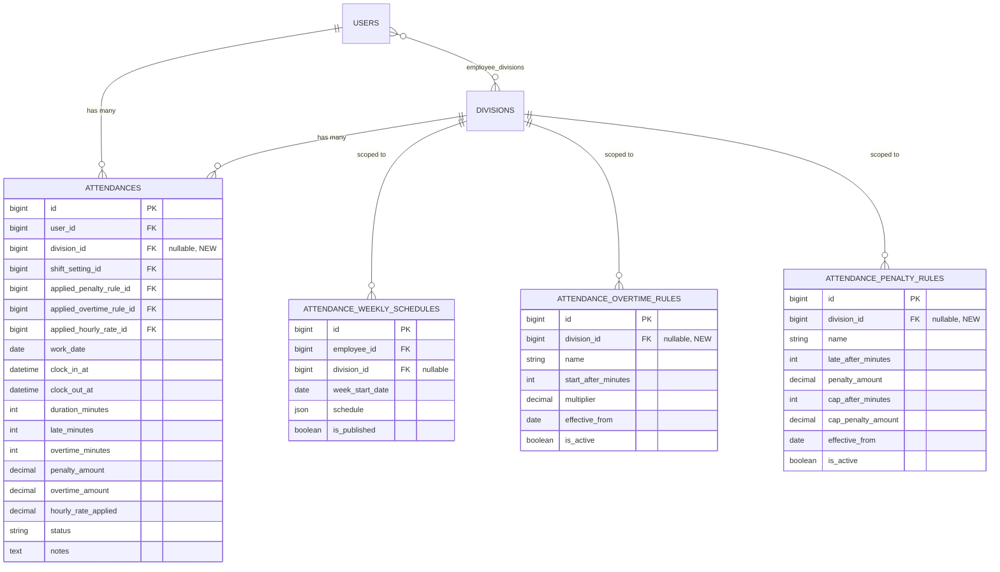

# Technical Design: Multi-Division Shift Support

## Overview

This design enables employees to work multiple shifts across different divisions on the same day ("double desk" / "double division"). The current system enforces a single attendance record per employee per day via a `unique(user_id, work_date)` constraint on the `attendances` table. This feature lifts that restriction to allow up to 2 attendance records per day (one per division), with each record independently governed by the rules of its respective division.

### Key Design Decisions

1. **Additive schema change**: A nullable `division_id` FK is added to the `attendances` table. NULL values represent legacy records created before this feature, preserving backward compatibility.
2. **Unique constraint replacement**: The existing `unique(user_id, work_date)` is replaced with a partial unique index on `(user_id, work_date, division_id)` for non-NULL division_id values. A check constraint enforces the max-2-per-day rule.
3. **Division auto-detection**: The `AttendanceClockService` resolves the target division from the employee's published weekly schedule, eliminating manual division selection for most clock-in scenarios.
4. **Policy resolver extension**: `AttendancePolicyResolver::resolve()` gains an optional `$divisionId` parameter, allowing callers to override the division derivation chain.
5. **Division-scoped rules**: Overtime and penalty rule models gain a nullable `division_id` FK. Resolution logic uses division-scoped rules first, falling back to global rules.
6. **Independent payroll per record**: Each attendance record is calculated using its own `division_id` for all rule resolution, ensuring two records on the same day can apply different rates, penalties, and overtime rules.

## Architecture

```mermaid
flowchart TD
    subgraph "Clock-In Flow"
        A[Employee Clock-In Request] --> B[AttendanceClockService]
        B --> C{Division Auto-Detection}
        C -->|Schedule Match| D[DivisionResolver]
        C -->|No Schedule| E[Primary Division Fallback]
        D --> F[Validation Gates]
        E --> F
        F -->|Open session check| G{Pass?}
        F -->|Daily limit check| G
        F -->|Same-division duplicate| G
        G -->|Yes| H[Create Attendance Record with division_id]
        G -->|No| I[Reject with error]
    end

    subgraph "Clock-Out / Payroll Flow"
        J[Clock-Out Request] --> K[AttendancePayrollService]
        K --> L[Resolve Policy with division_id]
        L --> M[Resolve Hourly Rate by division]
        L --> N[Resolve Shift Setting by division]
        K --> O[Resolve Penalty Rule by division]
        K --> P[Resolve Overtime Rule by division]
        M & N & O & P --> Q[Calculate Payroll Amounts]
        Q --> R[Store on Attendance Record]
    end

    subgraph "Policy Resolution"
        S[AttendancePolicyResolver::resolve]
        S -->|division_id provided| T[Use provided division_id]
        S -->|division_id null| U[Derive: config → user → primary pivot → first pivot]
        T --> V[Resolve shift, rate, grace by division]
        U --> V
    end
```



### Component Interaction

The three core services interact as follows:

1. **AttendanceClockService** orchestrates clock-in/clock-out. At clock-in, it now resolves the target division via a new `DivisionResolver` helper, validates concurrent session rules, and stores `division_id` on the attendance record.
2. **AttendancePolicyResolver** accepts an optional `$divisionId` parameter. When provided, it skips the division derivation chain and uses the given division for all resolution steps.
3. **AttendancePayrollService** reads `division_id` from the attendance record and passes it to the policy resolver and rule resolution methods, ensuring each record is calculated independently.

## Components and Interfaces

### 1. DivisionResolver (New Service)

A focused helper class responsible for determining the target division at clock-in time.

```php
namespace App\Modules\Attendance\Services;

class AttendanceDivisionResolver
{
    /**
     * Resolve the target division for a clock-in attempt.
     *
     * @param int $userId
     * @param Carbon $clockInTime
     * @param Carbon $workDate
     * @return int  The resolved division_id
     * @throws Exception  When no division can be determined
     */
    public function resolve(int $userId, Carbon $clockInTime, Carbon $workDate): int;
}
```

**Resolution algorithm:**
1. Query published `attendance_weekly_schedules` for the employee on the current day-of-week, where the associated shift's `start_time` is within ±120 minutes of `$clockInTime`.
2. If exactly one division matches → return that division_id.
3. If multiple divisions match → filter to those without a completed attendance record for today. If exactly one remains → return it. If multiple remain → pick the one whose shift start_time is closest to current time.
4. If no schedule matches → fall back to the employee's primary division (`employee_divisions.is_primary = true`).
5. If no primary division → throw an exception with a descriptive error.

### 2. AttendanceClockService (Modified)

New responsibilities:
- Inject `AttendanceDivisionResolver`
- Call `DivisionResolver::resolve()` at clock-in to determine `division_id`
- Replace `firstOrNew` with explicit creation logic that respects multi-record-per-day
- Add validation gates in this order:
  1. Open session check (any `clocked_in` record for a different division)
  2. Daily limit check (2 records already exist for the work_date)
  3. Same-division duplicate check (terminal record exists for the same division)

```php
// Modified signature (internal behavior change, no public API change)
public function clockIn(AttendanceClockInRequest $request): Attendance;
```

The `ensureNoOpenAttendance()` method is replaced with `validateClockInEligibility()` which implements the ordered validation gates.

### 3. AttendancePolicyResolver (Modified)

```php
// Updated signature
public function resolve(int|User $user, ?Carbon $date = null, ?int $divisionId = null): array;
```

When `$divisionId` is non-null:
- Skip the division derivation chain (`config → user → primary pivot → first pivot`)
- Use the provided `$divisionId` for shift, rate, grace, and `has_fixed_hours_shift` resolution
- Still resolve weekly schedule by `employee_id` + `week_start_date` (schedule-assigned shift takes priority)
- If the provided `$divisionId` doesn't exist as a Division record, treat as absent and fall back to standard derivation

### 4. AttendancePayrollService (Modified)

```php
// Updated internal methods
private function resolvePenaltyRuleByDate(Carbon $workDate, ?int $divisionId = null): ?AttendancePenaltyRule;
private function resolveOvertimeRuleByDate(Carbon $workDate, ?int $divisionId = null): ?AttendanceOvertimeRule;
```

The `calculate()` method reads `$attendance->division_id` and passes it to:
- `AttendancePolicyResolver::resolve($userId, $workDate, $divisionId)` for hourly rate and shift resolution
- `resolvePenaltyRuleByDate($workDate, $divisionId)` for penalty rule
- `resolveOvertimeRuleByDate($workDate, $divisionId)` for overtime rule

When `$attendance->division_id` is NULL (legacy records), the payroll service derives the division from the employee's primary division, matching current behavior.

### 5. Attendance Model (Modified)

```php
// New fillable field
'division_id',

// New relationship
public function division(): BelongsTo
{
    return $this->belongsTo(Division::class);
}
```

### 6. AttendanceOvertimeRule Model (Modified)

```php
// New fillable field
'division_id',

// New relationship
public function division(): BelongsTo
{
    return $this->belongsTo(Division::class);
}
```

### 7. AttendancePenaltyRule Model (Modified)

```php
// New fillable field
'division_id',

// New relationship
public function division(): BelongsTo
{
    return $this->belongsTo(Division::class);
}
```

## Data Models

### Schema Changes

#### `attendances` table

| Column | Type | Change |
|--------|------|--------|
| `division_id` | `unsignedBigInteger`, nullable | **ADD** — FK to `divisions.id`, `SET NULL` on delete |

**Index changes:**
- **DROP**: `unique(user_id, work_date)`
- **ADD**: `unique(user_id, work_date, division_id)` — named `uq_attendances_user_date_division`. Standard SQL NULL handling means NULL division_id values are excluded from uniqueness enforcement, preserving legacy record compatibility.
- **ADD**: `index(user_id, work_date, status)` — named `idx_attendances_user_date_status` for efficient daily limit and open session queries.

#### `attendance_overtime_rules` table

| Column | Type | Change |
|--------|------|--------|
| `division_id` | `unsignedBigInteger`, nullable | **ADD** — FK to `divisions.id`, `SET NULL` on delete |

**Index changes:**
- **ADD**: `index(division_id, is_active, effective_from)` — named `idx_overtime_rules_division_active_effective`

#### `attendance_penalty_rules` table

| Column | Type | Change |
|--------|------|--------|
| `division_id` | `unsignedBigInteger`, nullable | **ADD** — FK to `divisions.id`, `SET NULL` on delete |

**Index changes:**
- **ADD**: `index(division_id, is_active, effective_from)` — named `idx_penalty_rules_division_active_effective`

### Migration Strategy

Three separate migrations (one logical change per migration):

1. **`add_division_id_to_attendances_table`** — Adds `division_id` FK, drops old unique constraint, adds new unique constraint and composite index.
2. **`add_division_id_to_attendance_overtime_rules`** — Adds `division_id` FK and index.
3. **`add_division_id_to_attendance_penalty_rules`** — Adds `division_id` FK and index.

All migrations include proper `down()` methods. Existing records retain `division_id = NULL` (no backfill required — legacy records continue to work via the NULL-aware fallback in payroll calculation).

### Entity Relationship Diagram




## Correctness Properties

*A property is a characteristic or behavior that should hold true across all valid executions of a system — essentially, a formal statement about what the system should do. Properties serve as the bridge between human-readable specifications and machine-verifiable correctness guarantees.*

### Property 1: Daily limit enforcement

*For any* employee and any work_date, if 2 Attendance_Records already exist for that employee on that date (in any status, any division), then any self-service clock-in attempt SHALL be rejected and the total record count SHALL remain 2.

**Validates: Requirements 1.3, 3.4, 8.1, 8.2, 8.3, 8.4**

### Property 2: Division auto-detection from schedule

*For any* employee with published weekly schedules, when the employee clocks in at a time within ±120 minutes of exactly one scheduled shift's start_time for the current day-of-week, the resolved division_id SHALL equal the division_id of that matching schedule entry.

**Validates: Requirements 2.1, 2.2**

### Property 3: Division disambiguation by attendance state

*For any* employee with published weekly schedule entries in multiple divisions for the current day, if exactly one of those divisions has no completed or missed_check_out attendance record for today, the resolved division_id SHALL be that unattended division.

**Validates: Requirements 2.3**

### Property 4: Division disambiguation by closest time

*For any* employee with published weekly schedule entries in multiple divisions for the current day where more than one division has no completed attendance record, the resolved division_id SHALL be the division whose shift start_time has the smallest absolute difference from the current clock-in time.

**Validates: Requirements 2.4**

### Property 5: Primary division fallback

*For any* employee with no published weekly schedule entry matching the current day and ±120 minute time window, the resolved division_id SHALL equal the employee's primary division (the division with `is_primary = true` in `employee_divisions`).

**Validates: Requirements 2.5**

### Property 6: Open session blocks new clock-in

*For any* employee who has an open Attendance_Record (status `clocked_in`) for division A, any clock-in attempt targeting a different division B SHALL be rejected with an error indicating the employee must clock out first.

**Validates: Requirements 3.1**

### Property 7: Completed session allows new division clock-in

*For any* employee whose existing Attendance_Records for the same work_date all have terminal status (`completed` or `missed_check_out`) and belong to a different division, a clock-in attempt for a new division SHALL succeed and create a new Attendance_Record.

**Validates: Requirements 3.2**

### Property 8: Same-division duplicate rejection

*For any* employee who has a terminal Attendance_Record (status `completed` or `missed_check_out`) for division A on a given work_date, any clock-in attempt targeting the same division A SHALL be rejected with an error indicating attendance for this division has already been recorded.

**Validates: Requirements 3.3**

### Property 9: Validation priority ordering

*For any* clock-in attempt where multiple rejection conditions apply simultaneously, the Clock_Service SHALL return the error corresponding to the first matching condition in this order: (1) open session check, (2) daily limit check, (3) same-division duplicate check.

**Validates: Requirements 3.5**

### Property 10: Rejection is side-effect-free

*For any* clock-in attempt that is rejected by the Clock_Service (due to open session, daily limit, or same-division duplicate), the total count of Attendance_Records in the database SHALL remain unchanged after the rejection.

**Validates: Requirements 3.6**

### Property 11: Division-scoped rule resolution with global fallback

*For any* Attendance_Record with a non-null division_id, when resolving overtime or penalty rules, the Payroll_Service SHALL select the active rule scoped to that division_id (with effective_from ≤ work_date, ordered by most recent effective_from). If no division-scoped rule exists, it SHALL fall back to the active global rule (division_id IS NULL) using the same ordering.

**Validates: Requirements 4.2, 4.3, 5.2, 5.3**

### Property 12: Independent rule resolution per attendance record

*For any* two Attendance_Records belonging to the same employee on the same work_date but with different division_ids, the Payroll_Service SHALL resolve overtime rules, penalty rules, and hourly rates independently for each record, potentially applying different rules to each.

**Validates: Requirements 4.5, 5.5**

### Property 13: Policy resolver respects explicit division_id

*For any* call to `AttendancePolicyResolver::resolve()` with a non-null `$divisionId` parameter, the resolver SHALL use that division_id for all division-dependent resolution steps (shift, grace period, hourly rate, has_fixed_hours_shift). When `$divisionId` is null or omitted, the resolver SHALL derive the division using the existing chain (config → user → primary pivot → first pivot).

**Validates: Requirements 6.2, 6.4, 6.6**

### Property 14: Schedule-assigned shift overrides division shift

*For any* call to `AttendancePolicyResolver::resolve()` with a non-null `$divisionId`, if the employee's published weekly schedule assigns a specific `shift_setting_id` for the given date, that schedule-assigned shift SHALL take priority over the division-level shift lookup.

**Validates: Requirements 6.3**

### Property 15: Payroll calculation uses record's division_id

*For any* Attendance_Record with a non-null division_id, the Payroll_Service SHALL resolve the hourly rate, shift setting (for lateness/overtime thresholds), and has_fixed_hours_shift flag using that record's division_id — not the employee's current primary division.

**Validates: Requirements 7.1, 7.2, 7.3, 7.8**

### Property 16: Rule snapshot IDs stored after calculation

*For any* Attendance_Record after payroll calculation completes, if applicable rules exist, the record SHALL have non-null values for `applied_penalty_rule_id`, `applied_overtime_rule_id`, and `applied_hourly_rate_id` corresponding to the rules that were used in the calculation.

**Validates: Requirements 7.6**

### Property 17: Legacy NULL division_id uses primary division

*For any* Attendance_Record where division_id is NULL, the Payroll_Service SHALL resolve all rules (hourly rate, shift, penalty, overtime) using the employee's primary division_id (from MandatoryAttendanceConfig or User model). If the primary division is also NULL, global rules SHALL be used.

**Validates: Requirements 7.7**

## Error Handling

### Clock-In Errors

| Condition | Error Message | HTTP Code |
|-----------|--------------|-----------|
| Open session exists in another division | "Anda masih memiliki sesi absensi terbuka di divisi {division_name}. Silakan clock out terlebih dahulu." | 422 |
| Daily limit reached (2 records) | "Batas maksimal 2 shift per hari telah tercapai." | 422 |
| Same-division duplicate | "Absensi untuk divisi {division_name} pada tanggal ini sudah tercatat." | 422 |
| No division determinable | "Tidak ditemukan jadwal shift untuk waktu ini. Silakan hubungi admin." | 422 |
| Employee not in any division | "Karyawan belum ditugaskan ke divisi manapun." | 422 |

### Payroll Calculation Edge Cases

| Condition | Behavior |
|-----------|----------|
| No division-scoped overtime rule, no global rule | `overtime_amount = 0` |
| No division-scoped penalty rule, no global rule | `penalty_amount = 0` |
| Attendance record has NULL division_id | Use employee's primary division for all resolution |
| Primary division also NULL | Use global rules only |
| Division record deleted (FK SET NULL) | Treat as NULL division_id, use primary division fallback |

### Policy Resolver Edge Cases

| Condition | Behavior |
|-----------|----------|
| Provided division_id doesn't exist in DB | Treat as absent, fall back to standard derivation chain |
| Division exists but has no specific shift/rate config | Fall back through role → global without re-deriving division |
| Weekly schedule assigns shift but division_id is also provided | Schedule-assigned shift takes priority |

## Testing Strategy

### Testing Framework

- **PHPUnit 11.5** (already configured in the project)
- **Property-based testing**: Use `phpunit-quickcheck` (or implement via PHPUnit data providers with randomized generators) for property tests
- **Database**: SQLite in-memory with `RefreshDatabase` trait for isolation

### Unit Tests (Example-Based)

Focus on specific scenarios and edge cases:

1. **Manager override**: Manager with `attendance` permission can create a 3rd record bypassing daily limit
2. **Legacy record compatibility**: Records with NULL division_id continue to work with existing payroll logic
3. **Division deletion**: When a division is deleted, attendance records retain NULL division_id and fall back gracefully
4. **Auto-close interaction**: Auto-close service correctly handles multi-division records
5. **PIN validation**: PIN validation still works correctly in multi-division context

### Property Tests

Each property from the Correctness Properties section is implemented as a property-based test with minimum 100 iterations:

- **Tag format**: `Feature: multi-division-shift-support, Property {N}: {title}`
- **Generator strategy**: Use factories to generate random employees, divisions, schedules, rules, and attendance records
- **Isolation**: Each iteration uses a fresh database state via transactions

Key generators needed:
- `EmployeeWithDivisionsGenerator` — random employee with 1-3 divisions
- `WeeklyScheduleGenerator` — random published schedules with valid shift times
- `AttendanceRecordGenerator` — random records in various statuses
- `OvertimeRuleSetGenerator` — random division-scoped and global rules
- `PenaltyRuleSetGenerator` — random division-scoped and global rules

### Integration Tests

1. **Full clock-in → clock-out → second clock-in → clock-out flow**: End-to-end test of the double-shift workflow
2. **Payroll calculation with real rule resolution**: Verify amounts are correct with actual division-scoped rules
3. **Concurrent request handling**: Verify race conditions are handled by the unique constraint

### Test Organization

```
tests/
├── Feature/
│   ├── AttendanceMultiDivisionClockInTest.php
│   ├── AttendanceMultiDivisionPayrollTest.php
│   └── AttendanceDivisionResolverTest.php
└── Unit/
    ├── AttendanceDivisionResolverUnitTest.php
    ├── AttendancePolicyResolverDivisionTest.php
    ├── AttendancePayrollDivisionScopedTest.php
    └── Properties/
        ├── DailyLimitPropertyTest.php
        ├── DivisionAutoDetectionPropertyTest.php
        ├── ClockInValidationPropertyTest.php
        ├── RuleResolutionPropertyTest.php
        └── PayrollIndependencePropertyTest.php
```
