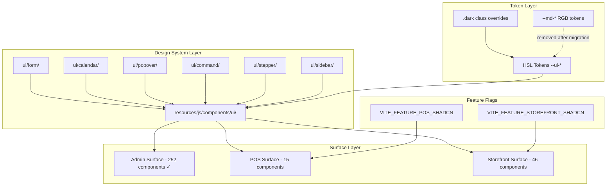

# Design Document: shadcn-migration-completion

## Overview

This design covers the remaining shadcn-vue migration work across nine areas: form validation wrappers, custom sidebar, date picker replacement, command palette, dark mode tokens, POS surface migration, storefront surface migration, CSS token cleanup, and an order status stepper.

The admin surface primitive migration is complete (252 components). The existing infrastructure — `cn()` utility, HSL token bridge (`--ui-*` variables), `components.json`, and the `resources/js/components/ui/` directory — provides the foundation for all remaining work.

**Key design decisions:**
- All new components follow shadcn-vue conventions: scaffolded into `resources/js/components/ui/`, re-exported from `index.ts`, styled with Tailwind + `cn()`
- POS and storefront migrations are feature-flagged for instant rollback
- Dark mode uses a CSS class toggle (`.dark` on `<html>`) with no rebuild required
- The `@vuepic/vue-datepicker` dependency is replaced by Calendar + Popover primitives from shadcn-vue
- Token cleanup is the final step, gated on all three surfaces being fully migrated

## Architecture



**Migration sequence:**
1. Scaffold new primitives (Form, Calendar, Popover, Command, Sidebar, Stepper)
2. Build dark mode token set
3. Migrate POS surface (feature-flagged)
4. Migrate storefront surface (feature-flagged)
5. Token cleanup (remove `--md-*` variables)

## Components and Interfaces

### 1. Form Validation Wrappers

**Location:** `resources/js/components/ui/form/`

```
form/
├── FormField.vue       # Slot wrapper providing field context (name, errors)
├── FormItem.vue        # Layout container (flex-col gap)
├── FormLabel.vue       # Label with error-state styling
├── FormControl.vue     # Slot wrapper injecting aria attributes
├── FormMessage.vue     # Error message display
└── index.ts            # Re-exports
```

**Props interface:**

```typescript
// FormField.vue
interface FormFieldProps {
  name: string;              // Field name matching Laravel error key
  errors?: Record<string, string[]>;  // Laravel validation errors object
}

// FormLabel.vue
interface FormLabelProps {
  for?: string;              // Input ID (auto-generated if omitted)
  class?: string;
}

// FormMessage.vue — no props, reads from FormField context via provide/inject
```

**Provide/Inject pattern:**
- `FormField` provides `{ fieldName, fieldErrors, fieldId }` via Vue's `provide()`
- `FormControl` injects context and applies `aria-invalid`, `aria-describedby` to its slot child
- `FormMessage` injects context and renders the first error message

**Usage example:**
```vue
<FormField name="email" :errors="form.errors">
  <FormItem>
    <FormLabel>Email</FormLabel>
    <FormControl>
      <Input v-model="form.email" />
    </FormControl>
    <FormMessage />
  </FormItem>
</FormField>
```

### 2. Custom Sidebar Component

**Location:** `resources/js/components/ui/sidebar/`

```
sidebar/
├── Sidebar.vue              # Root: responsive switch (fixed panel vs Sheet)
├── SidebarContent.vue       # Scrollable nav content
├── SidebarGroup.vue         # Menu group with optional label
├── SidebarItem.vue          # Individual nav item (icon + label + active state)
├── SidebarToggle.vue        # Collapse/expand trigger button
└── index.ts
```

**Behavior:**
- `>= 768px`: Fixed left panel, collapsible to 64px icon-only rail
- `< 768px`: Hidden by default, triggered via hamburger → Sheet slide-in from left
- Collapsed state persisted in `localStorage` key `sidebar-collapsed`
- Active item determined by matching `vue-router` current route against item `to` prop

**Integration:**
- Replaces `BackendMenuComponent.vue` in the admin layout
- Consumes the same menu data structure (parent items, children, icons, labels)
- Uses `Sheet` from `resources/js/components/ui/sheet/` for mobile drawer
- Hides entirely when route matches `/admin/pos` or `/admin/kds`

### 3. Date Picker (Calendar + Popover)

**Location:** `resources/js/components/ui/calendar/` and `resources/js/components/ui/popover/`

**Additional wrapper:** `resources/js/components/ui/date-picker/DatePicker.vue`

```typescript
interface DatePickerProps {
  modelValue: string | [string, string] | null;  // ISO 8601 date or range
  mode?: 'single' | 'range';                     // Default: 'single'
  presets?: DatePreset[];                         // Shortcut buttons
  locale?: string;                               // date-fns locale key
  placeholder?: string;
  disabled?: boolean;
}

interface DatePreset {
  label: string;
  getValue: () => Date | [Date, Date];
}
```

**Implementation approach:**
- Scaffold `Calendar` (uses `radix-vue` Calendar primitive) and `Popover` via shadcn-vue CLI
- Build `DatePicker.vue` wrapper composing Calendar inside Popover with trigger button
- Date formatting uses `date-fns` (already a dependency) with locale support
- RTL support via `dir` attribute propagation from the app's language setting
- Emits ISO 8601 strings for compatibility with existing filter components

**Default presets:**
```typescript
const defaultPresets: DatePreset[] = [
  { label: 'Today', getValue: () => new Date() },
  { label: 'This Week', getValue: () => [startOfWeek(new Date()), endOfWeek(new Date())] },
  { label: 'This Month', getValue: () => [startOfMonth(new Date()), endOfMonth(new Date())] },
  { label: 'Last Month', getValue: () => [startOfMonth(subMonths(new Date(), 1)), endOfMonth(subMonths(new Date(), 1))] },
  { label: 'This Year', getValue: () => [startOfYear(new Date()), endOfYear(new Date())] },
  { label: 'Last Year', getValue: () => [startOfYear(subYears(new Date(), 1)), endOfYear(subYears(new Date(), 1))] },
];
```

### 4. Command Palette

**Location:** `resources/js/components/ui/command/`

**Additional integration:** `resources/js/components/admin/components/CommandPaletteComponent.vue`

```typescript
interface CommandItem {
  id: string;
  label: string;
  category: 'pages' | 'settings' | 'entities';
  icon?: string;
  route: RouteLocationRaw;
  keywords?: string[];  // Additional search terms
}
```

**Architecture:**
- Scaffold `Command` primitives via shadcn-vue CLI (uses `cmdk-vue` under the hood via Radix)
- `CommandPaletteComponent` is the app-level integration that:
  - Registers `Ctrl+K` / `Cmd+K` global keyboard shortcut
  - Populates items from the admin menu structure + entity search API
  - Handles navigation on selection via `vue-router`
- Filtering is client-side for navigation items (instant), with optional debounced API call for entity search

**Keyboard handling:**
- `Ctrl+K` / `Cmd+K`: Open
- `Escape`: Close
- `ArrowUp` / `ArrowDown`: Navigate items
- `Enter`: Select current item
- Click outside: Close

### 5. Dark Mode Token Set

**Location:** Added to `resources/css/theme-variables.css` (or a dedicated `resources/css/dark-mode.css` imported in `app.css`)

```css
.dark {
  --ui-background: 240 10% 4%;
  --ui-foreground: 0 0% 98%;
  --ui-card: 240 10% 6%;
  --ui-card-foreground: 0 0% 98%;
  --ui-popover: 240 10% 6%;
  --ui-popover-foreground: 0 0% 98%;
  --ui-primary: 15 39% 55%;
  --ui-primary-foreground: 240 6% 10%;
  --ui-primary-light: 15 20% 15%;
  --ui-secondary: 45 30% 50%;
  --ui-secondary-foreground: 45 10% 10%;
  --ui-muted: 240 10% 14%;
  --ui-muted-foreground: 240 5% 65%;
  --ui-accent: 240 10% 14%;
  --ui-accent-foreground: 0 0% 98%;
  --ui-destructive: 0 63% 50%;
  --ui-destructive-foreground: 0 0% 98%;
  --ui-destructive-light: 0 50% 15%;
  --ui-border: 240 10% 18%;
  --ui-input: 240 10% 18%;
  --ui-ring: 15 39% 55%;
}
```

**Toggle mechanism:**
- Pinia store `resources/js/stores/useDarkModeStore.ts` manages state
- On boot: check `ThemeResource` response for `dark_mode` setting; if absent, check `prefers-color-scheme`
- Toggle adds/removes `.dark` class on `document.documentElement`
- Persists preference via existing ThemeService API (`PUT /api/admin/setting/theme`)

### 6. POS Surface Migration

**Strategy:** Wrap each POS component in a feature-flag conditional:

```vue
<template>
  <PosComponentShadcn v-if="featureFlags.posShadcn" v-bind="$attrs" />
  <PosComponentLegacy v-else v-bind="$attrs" />
</template>
```

**Feature flag:** `VITE_FEATURE_POS_SHADCN` environment variable, read via `import.meta.env.VITE_FEATURE_POS_SHADCN`

**Components to migrate (15):**
1. `PosComponent.vue` — Main layout shell
2. `PosCatalogPanel.vue` — Item grid/list
3. `PosCartPanel.vue` — Cart sidebar
4. `ItemComponent.vue` — Individual item card
5. `ItemInfoModalComponent.vue` — Item detail dialog
6. `PaymentComponent.vue` — Payment flow
7. `PosAddCustomerModalComponent.vue` — Customer creation dialog
8. `PosCheckoutIdentityModal.vue` — Checkout identity selection
9. `ReceiptComponent.vue` — Receipt display/print
10. `CashierSessionPanel.vue` — Session management
11. `CashierSessionReportComponent.vue` — Session report
12. `PosOrderHistoryPanel.vue` — Order history
13. `PosShiftGateCard.vue` — Shift gate
14. `PosOfflineBanner.vue` — Offline indicator
15. `CreateCustomerAddressComponent.vue` — Address form

**Primitives used:** Button, Dialog, Input, Select, Card, Sheet, DropdownMenu, RadioGroup, Checkbox, Table, Badge

### 7. Storefront Surface Migration

**Feature flag:** `VITE_FEATURE_STOREFRONT_SHADCN` environment variable

**Component groups (46 total):**
- `frontend/home/` — Landing page components
- `frontend/menu/` — Product browsing, category navigation
- `frontend/checkout/` — Cart, payment, address selection
- `frontend/account/` — Profile, order history, addresses
- `frontend/auth/` — Login, signup, OTP
- `frontend/components/` — Shared components (navbar, footer, order status, etc.)
- `frontend/offers/` — Offer/coupon display
- `frontend/search/` — Search results
- `frontend/page/` — Static pages

**Constraints:**
- Must preserve responsive behavior at 320px / 768px / 1280px
- Must preserve SEO markup (semantic headings, structured data, meta tags)
- LCP must not increase by more than 200ms (measured via Lighthouse on 4G throttle)
- Product card grid and chat components remain as Tailwind utility classes (no shadcn equivalent)

### 8. Token Cleanup

**Precondition:** All three surfaces fully migrated and feature flags enabled in production.

**Steps:**
1. Remove all `--md-*` variable definitions from `resources/css/theme-variables.css`
2. Remove all `rgb(var(--md-*))` patterns from Vue templates and CSS
3. Rename `--ui-*` tokens to final shadcn names (drop `ui-` prefix): `--ui-primary` → `--primary`, etc.
4. Update Tailwind config to reference final token names
5. Update `ThemeResource.php` to output HSL-format color values
6. Update theme settings panel to consume HSL values
7. Verify `npm run build` produces zero CSS variable warnings
8. Document any third-party compatibility mappings

### 9. Order Status Stepper

**Location:** `resources/js/components/ui/stepper/`

```
stepper/
├── Stepper.vue          # Root container (horizontal/vertical responsive)
├── StepperItem.vue      # Individual step (icon + label + connector line)
└── index.ts
```

```typescript
interface StepperProps {
  steps: StepDefinition[];
  currentStep: number;       // Enum value from orderStatusEnum
  orientation?: 'horizontal' | 'vertical';  // Auto-switches at 480px
}

interface StepDefinition {
  value: number;             // orderStatusEnum value
  label: string;             // Translated label
}
```

**Visual states per step:**
- **Completed:** Filled circle (bg-primary), checkmark icon, solid connector line
- **Active:** Ring highlight (ring-primary), pulse animation, partial connector
- **Pending:** Muted circle (bg-muted, border-border), no connector fill

**Replaces:** `.db-order-status` CSS pattern in both `admin/components/OrderStatusComponent.vue` and `frontend/components/OrderStatusComponent.vue`

## Data Models

### Feature Flag Configuration

```typescript
// resources/js/composables/useFeatureFlags.ts
interface FeatureFlags {
  posShadcn: boolean;         // VITE_FEATURE_POS_SHADCN
  storefrontShadcn: boolean;  // VITE_FEATURE_STOREFRONT_SHADCN
}

export function useFeatureFlags(): FeatureFlags {
  return {
    posShadcn: import.meta.env.VITE_FEATURE_POS_SHADCN === 'true',
    storefrontShadcn: import.meta.env.VITE_FEATURE_STOREFRONT_SHADCN === 'true',
  };
}
```

### Dark Mode Store

```typescript
// resources/js/stores/useDarkModeStore.ts
import { defineStore } from 'pinia';

export const useDarkModeStore = defineStore('darkMode', {
  state: () => ({
    enabled: false,
    source: 'system' as 'system' | 'user',
  }),
  actions: {
    initialize(themePreference?: string) { /* ... */ },
    toggle() { /* ... */ },
    applyToDocument() { /* ... */ },
  },
});
```

### Form Errors Shape (Laravel)

```typescript
// Standard Laravel validation error response
interface LaravelValidationErrors {
  [field: string]: string[];
}

// Example:
// { "email": ["The email field is required."], "name": ["The name must be at least 3 characters."] }
```

### Command Palette Items

```typescript
interface CommandCategory {
  id: string;
  label: string;
  items: CommandItem[];
}

interface CommandItem {
  id: string;
  label: string;
  category: 'pages' | 'settings' | 'entities';
  icon?: string;
  route: RouteLocationRaw;
  keywords?: string[];
}
```

### Order Stepper Data

```typescript
// Delivery sequence
const deliverySteps: StepDefinition[] = [
  { value: orderStatusEnum.PENDING, label: t('label.pending') },
  { value: orderStatusEnum.ACCEPT, label: t('label.accept') },
  { value: orderStatusEnum.PREPARING, label: t('label.preparing') },
  { value: orderStatusEnum.OUT_FOR_DELIVERY, label: t('label.out_for_delivery') },
  { value: orderStatusEnum.DELIVERED, label: t('label.delivered') },
];

// Takeaway sequence
const takeawaySteps: StepDefinition[] = [
  { value: orderStatusEnum.PENDING, label: t('label.pending') },
  { value: orderStatusEnum.ACCEPT, label: t('label.accept') },
  { value: orderStatusEnum.PREPARING, label: t('label.preparing') },
  { value: orderStatusEnum.PREPARED, label: t('label.prepared') },
];
```

## Correctness Properties

*A property is a characteristic or behavior that should hold true across all valid executions of a system — essentially, a formal statement about what the system should do. Properties serve as the bridge between human-readable specifications and machine-verifiable correctness guarantees.*

### Property 1: Form error display and styling

*For any* Laravel validation errors object and any field name present in that object, the FormField/FormMessage combination SHALL render the first error message for that field AND the associated input SHALL have `aria-invalid="true"` and a visual error indicator class.

**Validates: Requirements 1.2, 1.3**

### Property 2: Form accessibility wiring

*For any* form field rendered with a name and an error message, the input element SHALL have an `aria-describedby` attribute whose value matches the `id` of the rendered FormMessage element.

**Validates: Requirements 1.4**

### Property 3: Form error clearing round-trip

*For any* form field that has an active error state, when the errors object is updated to remove that field's errors, the FormMessage SHALL no longer render and the input SHALL have `aria-invalid="false"` (or the attribute removed).

**Validates: Requirements 1.5**

### Property 4: Sidebar active route highlighting

*For any* route in the admin menu structure, when that route is the current active route, the corresponding SidebarItem SHALL have the active highlight class applied, and no other SidebarItem at the same level SHALL have the active class.

**Validates: Requirements 2.4**

### Property 5: Date picker ISO 8601 emission

*For any* valid date selected in the DatePicker (single or range mode), the emitted `update:modelValue` event SHALL contain a string (or tuple of strings) in ISO 8601 date format (`YYYY-MM-DD`) that is parseable by `date-fns/parseISO`.

**Validates: Requirements 3.4**

### Property 6: Date picker locale formatting

*For any* valid date and any supported application locale, the DatePicker trigger button SHALL display the date formatted according to that locale's conventions using `date-fns` format with the corresponding locale object.

**Validates: Requirements 3.7**

### Property 7: Command palette search filtering

*For any* set of command items and any non-empty search query, the filtered results SHALL only contain items whose `label` or `keywords` include a case-insensitive substring match of the query, and no matching items SHALL be excluded.

**Validates: Requirements 4.3**

### Property 8: Command palette category grouping

*For any* set of filtered command results containing items from multiple categories, the rendered output SHALL group items by their `category` field with a visible section header for each group, and items within a group SHALL appear contiguously.

**Validates: Requirements 4.5**

### Property 9: Dark mode WCAG contrast ratios

*For any* foreground/background token pairing in the `.dark` theme (e.g., `--ui-foreground` on `--ui-background`, `--ui-primary-foreground` on `--ui-primary`), the computed contrast ratio SHALL be at least 4.5:1 for normal text pairings and at least 3:1 for large text pairings.

**Validates: Requirements 5.6**

### Property 10: Order stepper sequence rendering

*For any* order type (delivery or takeaway), the Stepper component SHALL render exactly the steps defined in the corresponding step array (`deliverySteps` or `takeawaySteps`) in the correct sequential order.

**Validates: Requirements 9.1, 9.3**

### Property 11: Order stepper progress marking

*For any* valid current status value within a step sequence, all steps with a value less than or equal to the current status SHALL be marked as completed (filled indicator), the step matching the current status SHALL have the active highlight, and all steps with a value greater than the current status SHALL be in the pending state.

**Validates: Requirements 9.2**

## Error Handling

### Form Validation Wrappers
- If `errors` prop is `undefined` or `null`, FormField renders in a clean state (no errors)
- If a field name is not present in the errors object, no error message is shown for that field
- If the errors array for a field is empty (`[]`), treated as no error

### Date Picker
- Invalid date strings passed as `modelValue` are treated as `null` (empty state)
- If `date-fns` locale is not available for the current language, falls back to `en-US`
- Calendar navigation beyond min/max bounds (if configured) is disabled

### Command Palette
- If the menu data is not yet loaded when `Ctrl+K` is pressed, show a loading skeleton
- API errors during entity search display an inline error message within the command list
- If `vue-router` navigation fails (invalid route), show a toast error and keep the palette open

### Feature Flags
- If `VITE_FEATURE_POS_SHADCN` is not defined in the environment, default to `false` (legacy UI)
- Same for `VITE_FEATURE_STOREFRONT_SHADCN`
- Feature flag values are read once at app boot; changing them requires a page reload

### Dark Mode
- If ThemeService API fails to persist the preference, the toggle still applies locally (optimistic UI)
- If both user preference and system preference are absent, default to light mode
- Invalid HSL values in dark tokens fall back to the light mode value (CSS custom property inheritance)

### Token Cleanup
- If any component still references a removed `--md-*` token, the CSS property resolves to `initial` (transparent/invisible) — this is caught by the build warning check
- Third-party integrations referencing legacy tokens are documented with HSL equivalents in a compatibility note

### Order Stepper
- If `currentStep` value doesn't match any step in the sequence, all steps render as pending
- If `steps` array is empty, the component renders nothing

## Testing Strategy

### Unit Tests (Example-Based)

Unit tests cover specific interactions, edge cases, and integration points:

- **Form wrappers:** Options API vs Composition API registration, empty errors object, missing field name
- **Sidebar:** Desktop/mobile viewport switching, collapse toggle, POS/KDS route hiding
- **Date picker:** Single vs range mode, preset shortcuts, RTL rendering
- **Command palette:** Ctrl+K open/close, Escape dismiss, item selection navigation
- **Dark mode:** Toggle applies .dark class, system preference detection, persistence
- **Feature flags:** Flag enabled/disabled renders correct component variant
- **Order stepper:** Responsive orientation switch at 480px breakpoint

### Property-Based Tests

Property-based tests verify universal correctness properties using generated inputs. The project will use **fast-check** (JavaScript PBT library) integrated with the existing test setup.

**Configuration:**
- Minimum 100 iterations per property test
- Each test tagged with: `Feature: shadcn-migration-completion, Property {N}: {title}`

**Properties to implement:**
1. Form error display and styling (generate random error objects)
2. Form accessibility wiring (generate random field names)
3. Form error clearing round-trip (generate errors, then clear)
4. Sidebar active route highlighting (generate routes from menu)
5. Date picker ISO 8601 emission (generate random dates)
6. Date picker locale formatting (generate dates × locales)
7. Command palette search filtering (generate items + queries)
8. Command palette category grouping (generate categorized items)
9. Dark mode WCAG contrast ratios (compute over all token pairings)
10. Order stepper sequence rendering (generate order types)
11. Order stepper progress marking (generate status values)

### Integration Tests

- **POS migration:** Full flow tests (item browse → cart → payment → receipt) with feature flag enabled
- **Storefront migration:** Product browse → cart → checkout flow with feature flag enabled
- **Token cleanup:** Build produces zero warnings; all surfaces render without visual regression
- **Dark mode persistence:** Toggle → API call → page reload → preference restored

### Performance Tests

- **Storefront LCP:** Lighthouse CI comparison pre/post migration (must not exceed +200ms on 4G)
- **Bundle size:** Vite build output compared against baseline (datepicker chunk removed, command/calendar added)

### Visual Regression (Manual)

- All three surfaces verified in light and dark mode
- POS verified on tablet viewport (primary cashier device)
- Storefront verified at 320px, 768px, 1280px breakpoints
