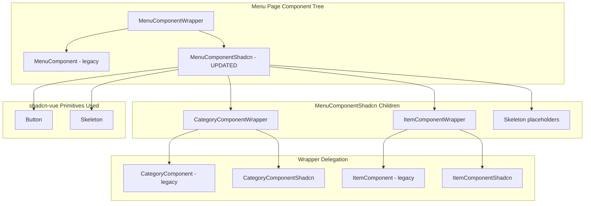

# Design Document: Storefront Menu Page shadcn-vue Migration

## Overview

This design covers the completion of the storefront menu/category listing page migration from legacy CSS to shadcn-vue primitives. The menu page (`MenuComponentShadcn.vue`) already has a partial migration in place — Button primitives are used for item type filters and view toggle controls. The remaining work addresses five gaps:

1. **Wire wrapper components** — Replace bare `CategoryComponent` and `ItemComponent` imports with `CategoryComponentWrapper` and `ItemComponentWrapper` so the menu page delegates to the shadcn versions when the feature flag is active.
2. **Add loading skeleton states** — Replace the opaque `LoadingComponent` overlay with Skeleton placeholders that communicate page structure during data fetches.
3. **Improve empty state styling** — Remove the legacy `text-black` class and use `text-foreground` token; ensure the empty state only shows after loading completes.
4. **Remove remaining legacy CSS classes** — The `menu-swiper` class on the category container is the last legacy class in the shadcn variant.
5. **Ensure route/branch reactivity with loading states** — When the route query `s` or global branch ID changes, show skeleton placeholders (not the overlay spinner) until the fetch resolves.

### Design Decisions

1. **Separate loading states for categories vs. products** — The current implementation uses a single `loading.isActive` boolean for both the category list fetch and the category-show (products) fetch. The redesign introduces two distinct loading flags (`categoryLoading` and `itemsLoading`) so that category skeletons and product skeletons can render independently without blocking each other.

2. **Remove LoadingComponent overlay** — The full-screen overlay spinner (`LoadingComponent`) is replaced entirely by inline Skeleton placeholders. This matches the pattern established in `HomeComponentShadcn.vue` and provides better perceived performance.

3. **Reuse existing wrapper components** — `CategoryComponentWrapper` and `ItemComponentWrapper` already exist in `resources/js/components/frontend/components/`. The menu page simply needs to import them via `defineAsyncComponent` instead of importing the bare components directly.

4. **Keep Options API** — The existing `MenuComponentShadcn.vue` uses Options API with `setup()` for Pinia stores. The redesign maintains this pattern and registers all shadcn primitives in the `components:` option.

5. **Skeleton dimensions match content** — Category skeletons use `w-[5.5rem] sm:w-32 h-[5.5rem] sm:h-32 rounded-2xl` (matching pill dimensions). Product grid skeletons use `h-52 sm:h-64 rounded-xl` in a responsive grid. Product list skeletons use `h-28 sm:h-32 rounded-xl`. These match the dimensions established in the home page migration spec.

## Architecture



### File Changes

```
resources/js/components/frontend/menu/
├── MenuComponentShadcn.vue      # MODIFIED - wire wrappers, add skeletons, fix loading
├── MenuComponentWrapper.vue     # EXISTING - no changes needed
└── MenuComponent.vue            # EXISTING - legacy (unchanged)

resources/js/components/frontend/components/
├── CategoryComponentWrapper.vue # EXISTING - already created in home page spec
├── ItemComponentWrapper.vue     # EXISTING - already created in home page spec
├── CategoryComponentShadcn.vue  # EXISTING - already created in home page spec
└── ItemComponentShadcn.vue      # EXISTING - already created in home page spec
```

### Integration Points

- `MenuComponentShadcn.vue` imports `CategoryComponentWrapper` and `ItemComponentWrapper` via `defineAsyncComponent` instead of bare `CategoryComponent` and `ItemComponent`.
- The wrappers pass all props through via `v-bind="$attrs"` with `inheritAttrs: false`.
- The `Skeleton` primitive is imported from `../../ui` and registered in `components:`.
- The `Button` primitive import (already present) remains unchanged.

## Components and Interfaces

### MenuComponentShadcn (Updated)

The component is restructured to support granular loading states and wrapper delegation.

**Imports changed:**
```js
import { Button, Skeleton } from "../../ui";

const CategoryComponentWrapper = defineAsyncComponent(() => import("../components/CategoryComponentWrapper.vue"));
const ItemComponentWrapper = defineAsyncComponent(() => import("../components/ItemComponentWrapper.vue"));
```

**Component registration:**
```js
components: { Button, Skeleton, CategoryComponentWrapper, ItemComponentWrapper }
```

**Data (updated):**
```js
data() {
    return {
        categoryLoading: false,   // true while fetching category list
        itemsLoading: false,      // true while fetching products for selected category
        itemDesignEnum: itemDesignEnum,
        category: {},
        items: {},
        categoryProps: {
            search: { paginate: 0, order_column: 'sort', order_type: 'asc', status: statusEnum.ACTIVE },
            design: categoryDesignEnum.SECOND
        },
        itemProps: {
            design: itemDesignEnum.LIST,
            type: null
        }
    }
}
```

**Template structure (updated):**

```vue
<template>
    <section class="mb-24 sm:mb-16 mt-4 sm:mt-8">
        <div class="container">
            <!-- Category Skeleton -->
            <div v-if="categoryLoading" class="flex items-center gap-3 sm:gap-4 mb-6 sm:mb-12">
                <Skeleton v-for="n in 6" :key="n" class="w-[5.5rem] sm:w-32 h-[5.5rem] sm:h-32 rounded-2xl" />
            </div>

            <!-- Category Selector (via wrapper) -->
            <div v-else-if="showCategorySelector" class="swiper mb-6 sm:mb-12">
                <CategoryComponentWrapper :categories="categories" :design="categoryProps.design" />
            </div>

            <!-- Item Type Filter (already using Button primitive) -->
            <div v-if="showItemTypeFilter && !itemsLoading" class="flex flex-wrap gap-3 w-full mb-6 sm:mb-12">
                <Button ... />
            </div>

            <!-- Category Header with View Toggle (already using Button primitive) -->
            <div v-if="showCategoryHeader && !itemsLoading" class="flex gap-2 sm:gap-4 ...">
                <h2 class="capitalize text-xl sm:text-2xl font-semibold text-primary">{{ category.name }}</h2>
                <!-- view toggle buttons -->
            </div>

            <!-- Product Skeleton (grid mode) -->
            <div v-if="itemsLoading && itemProps.design === itemDesignEnum.GRID"
                class="grid grid-cols-2 sm:grid-cols-3 md:grid-cols-4 gap-3 lg:gap-6">
                <Skeleton v-for="n in 4" :key="n" class="h-52 sm:h-64 rounded-xl" />
            </div>

            <!-- Product Skeleton (list mode) -->
            <div v-else-if="itemsLoading && itemProps.design === itemDesignEnum.LIST"
                class="grid grid-cols-1 sm:grid-cols-2 lg:grid-cols-3 gap-3 lg:gap-6">
                <Skeleton v-for="n in 3" :key="n" class="h-28 sm:h-32 rounded-xl" />
            </div>

            <!-- Items Grid (via wrapper) -->
            <ItemComponentWrapper v-else-if="hasItems"
                :items="items.items" :type="itemProps.type" :design="itemProps.design" />

            <!-- Empty State -->
            <div v-else class="mt-12">
                <div class="max-w-[250px] mx-auto">
                    
                </div>
                <span class="w-full mb-4 text-center block text-foreground">
                    {{ $t('message.no_data_available') }}
                </span>
            </div>
        </div>
    </section>
</template>
```

**Lifecycle and methods (updated):**

```js
mounted() {
    this.categoryLoading = true;
    this.itemCategoryStore.fetchLists(this.categoryProps.search).then(() => {
        this.categoryLoading = false;
    }).catch(() => {
        this.categoryLoading = false;
    });
    this.itemTypeStore.fetchLists({
        paginate: 0, order_column: 'order', order_type: 'asc', status: statusEnum.ACTIVE
    });
    this.categoryShow();
},
methods: {
    itemTypeSet(e) { this.itemProps.type = e; },
    itemTypeReset() { this.itemProps.type = null; },
    categoryShow() {
        if (typeof this.$route.query.s !== "undefined" && this.$route.query.s !== "") {
            this.itemsLoading = true;
            this.itemCategoryStore.fetchShow({
                slug: this.$route.query.s,
                vuex: false,
                branch_id: globalState().branch_id,
            }).then((res) => {
                this.category = res.data.data;
                this.items = res.data.data;
                this.itemsLoading = false;
            }).catch(() => {
                this.category = {};
                this.items = {};
                this.itemsLoading = false;
            });
        }
    }
},
watch: {
    $route() { this.categoryShow(); },
    currentBranchId() { this.categoryShow(); },
    visibleItemTypes(value) {
        if (this.itemProps.type !== null && !value.some(t => t.value === this.itemProps.type)) {
            this.itemProps.type = null;
        }
    }
}
```

**Computed (updated):**

```js
computed: {
    categories() { return this.itemCategoryStore.lists; },
    itemTypes() { return this.itemTypeStore.lists; },
    visibleItems() { return Array.isArray(this.items?.items) ? this.items.items : []; },
    visibleItemTypes() {
        const availableTypes = new Set(this.visibleItems.map(item => item.item_type));
        return this.itemTypes.filter(t => availableTypes.has(t.value));
    },
    showCategorySelector() { return this.categories.length > 1; },
    showItemTypeFilter() { return this.visibleItemTypes.length > 1; },
    showCategoryHeader() { return Object.keys(this.category).length > 0 && this.category.name; },
    setting() { return frontendSetting(); },
    currentBranchId() { return globalState().branch_id; },
    hasItems() {
        const list = this.items?.items;
        return Array.isArray(list) ? list.length > 0 : !!(list && Object.keys(list).length);
    }
}
```

### Props Pass-Through

The wrappers (`CategoryComponentWrapper`, `ItemComponentWrapper`) use `v-bind="$attrs"` with `inheritAttrs: false` to transparently forward all props:

| Component | Props Forwarded |
|-----------|----------------|
| CategoryComponentWrapper | `categories`, `design` |
| ItemComponentWrapper | `items`, `type`, `design` |

## Data Models

No new data models are introduced. The menu page consumes existing data structures from Pinia stores:

### Category Object (from `useFrontendItemCategoryStore`)
```typescript
interface Category {
    id: number;
    name: string;
    slug: string;
    thumb: string;
}
```

### Category Show Response (items within a category)
```typescript
interface CategoryShowData {
    id: number;
    name: string;
    slug: string;
    items: Item[];
}
```

### Item Object (from category show response)
```typescript
interface Item {
    id: number;
    name: string;
    description: string;
    thumb: string;
    cover: string;
    currency_price: string;
    convert_price: number;
    item_type: number;
    is_out_of_stock: boolean;
    is_low_stock: boolean;
    offer: Offer[];
}
```

### Item Type Object (from `useFrontendItemTypeStore`)
```typescript
interface ItemType {
    id: number;
    name: string;
    value: number;
    thumb: string;
}
```

### Loading State Model (internal)
```typescript
interface MenuLoadingState {
    categoryLoading: boolean;  // category list fetch in progress
    itemsLoading: boolean;     // category products fetch in progress
}
```


## Correctness Properties

*A property is a characteristic or behavior that should hold true across all valid executions of a system — essentially, a formal statement about what the system should do. Properties serve as the bridge between human-readable specifications and machine-verifiable correctness guarantees.*

### Property 1: Wrapper prop pass-through

*For any* set of props (categories array, design value, items array, type value) passed to `CategoryComponentWrapper` or `ItemComponentWrapper` within the menu page, the active child component SHALL receive all those props with identical values.

**Validates: Requirements 2.2, 4.2**

### Property 2: Category section visibility threshold

*For any* category list, the category Swiper section SHALL be visible if and only if the list contains more than one category. A list of length 0 or 1 SHALL result in the section being hidden.

**Validates: Requirements 2.3**

### Property 3: Item type filter visibility

*For any* set of products with `item_type` values and any set of item types from the store, the item type filter section SHALL be visible if and only if more than one distinct `item_type` value exists among the currently visible products.

**Validates: Requirements 3.3**

### Property 4: Item type filter auto-reset invariant

*For any* active item type filter value and any change to the visible products set, if no product in the new set has an `item_type` matching the active filter, the filter SHALL be automatically reset to null.

**Validates: Requirements 3.4**

### Property 5: Filter button content correctness

*For any* item type object with a `thumb` URL and a `name` string, the rendered filter Button SHALL contain an `` with `src` equal to the thumb URL and a text span containing the capitalized name.

**Validates: Requirements 3.5**

### Property 6: Loading state excludes empty state

*For any* combination of `categoryLoading` and `itemsLoading` states, while either loading flag is true, the empty state (illustration + "no data available" message) SHALL NOT be rendered.

**Validates: Requirements 7.3**

### Property 7: Route and branch reactivity triggers fetch with loading

*For any* route query parameter `s` change (to a non-empty slug) or any global branch ID change, the component SHALL set `itemsLoading` to true and call `fetchShow` with the current slug and branch ID values before the fetch resolves.

**Validates: Requirements 8.1, 8.2, 8.3**

### Property 8: Active filter variant mapping

*For any* set of visible item types and any active filter value, the Button for the item type whose value matches the active filter SHALL have `variant="default"`, and all other item type Buttons SHALL have `variant="outline"`.

**Validates: Requirements 10.3**

## Error Handling

| Scenario | Behavior |
|----------|----------|
| Category list fetch fails | `categoryLoading` set to false; category section hidden (empty list → `showCategorySelector` is false) |
| Category show (products) fetch fails | `itemsLoading` set to false; `category` and `items` reset to empty objects; empty state renders |
| Route query `s` is undefined or empty | `categoryShow()` exits early without fetching; no loading state triggered |
| Item type filter references a type no longer in visible products | Watcher on `visibleItemTypes` auto-resets `itemProps.type` to null |
| Feature flag env var missing | `useFeatureFlags()` returns `false` (string !== 'true'); wrapper renders legacy component |
| CategoryComponentWrapper or ItemComponentWrapper fails to load (chunk error) | Vue's `defineAsyncComponent` default behavior — renders nothing; no crash propagation |

## Testing Strategy

### Unit Tests (Example-Based)

Unit tests verify specific rendering scenarios and interactions:

- **Wrapper rendering**: Verify `MenuComponentWrapper` renders `MenuComponentShadcn` when flag is true, `MenuComponent` when false
- **Category skeleton state**: Set `categoryLoading=true`, verify 6 Skeleton elements with `w-[5.5rem] sm:w-32 h-[5.5rem] sm:h-32 rounded-2xl` classes
- **Product skeleton (grid)**: Set `itemsLoading=true` with grid design, verify 4 Skeleton elements in 2/3/4-column grid
- **Product skeleton (list)**: Set `itemsLoading=true` with list design, verify 3 Skeleton elements in 1/2/3-column grid
- **Empty state rendering**: Set items to empty with loading false, verify illustration and message render with `text-foreground`
- **Empty state hidden during loading**: Set `itemsLoading=true` with empty items, verify empty state is NOT rendered
- **View toggle active state**: Set design to LIST, verify list icon has `text-primary` and grid icon has `text-muted-foreground`
- **Item type filter toggle**: Click active filter, verify `itemProps.type` resets to null
- **Error recovery**: Mock `fetchShow` to reject, verify `itemsLoading` becomes false and empty state shows
- **No legacy CSS classes**: Verify rendered output contains no instances of `veg-active`, `veg-navs`, `hover:shadow-filter`, `bg-surface-variant`, `fs-body-sm`, `fs-title-lg`, `text-heading`, `text-placeholder`, `text-black`

### Property-Based Tests

Property-based testing is appropriate for this feature because the menu page contains logic functions with universal properties: conditional visibility rules, filter auto-reset behavior, prop forwarding, and state machine invariants (loading vs. empty exclusivity).

**Library:** [fast-check](https://github.com/dubzzz/fast-check) (works with Vitest)

**Configuration:**
- Minimum 100 iterations per property test
- Each test tagged with: `Feature: storefront-menu-shadcn-migration, Property {N}: {title}`

**Properties to implement:**
1. Wrapper prop pass-through (Property 1)
2. Category section visibility threshold (Property 2)
3. Item type filter visibility (Property 3)
4. Item type filter auto-reset invariant (Property 4)
5. Filter button content correctness (Property 5)
6. Loading state excludes empty state (Property 6)
7. Route and branch reactivity triggers fetch with loading (Property 7)
8. Active filter variant mapping (Property 8)

### Integration Tests

- Full menu page render with mocked Pinia stores verifying category → product flow
- Route navigation between categories verifying skeleton → content transitions
- Branch switch verifying re-fetch and loading state cycle
- Feature flag toggle verifying seamless switch between legacy and shadcn versions

### Accessibility Verification

- Verify Button primitives are focusable via Tab (inherent to native `<button>`)
- Verify empty state image has `alt="image_order_not_found"`
- Verify category pills render as `<a>` elements (via router-link) that are natively focusable
