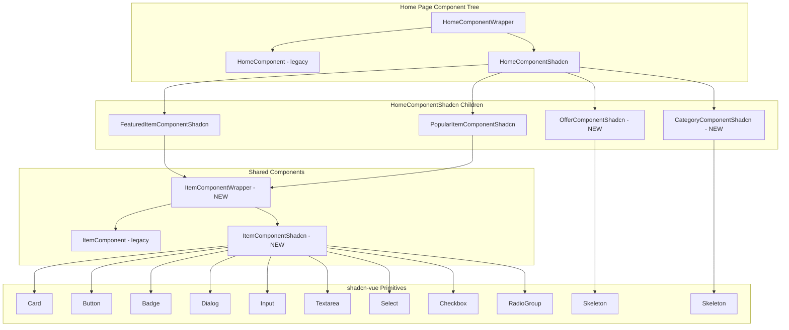

# Design Document: Storefront shadcn-vue Migration

## Overview

This design covers the migration of four storefront home page content components from legacy custom CSS classes to shadcn-vue primitives: product cards (grid and list layouts), category pills, offer images, and the variation/add-to-cart modal. The outer shell (navbar, footer, mobile nav) is already migrated.

The migration follows the established wrapper pattern: each component gets a `*Shadcn.vue` sibling and a `*Wrapper.vue` that toggles between legacy and new versions via the `storefrontShadcn` feature flag. Code splitting is achieved through `defineAsyncComponent` so only the active variant loads at runtime.

### Design Decisions

1. **Reuse existing ItemComponent for both layouts** — The current `ItemComponent.vue` handles both grid and list via a `design` prop. The shadcn version (`ItemComponentShadcn.vue`) will maintain this pattern rather than splitting into separate components, preserving the existing API contract.

2. **Keep variation modal inside ItemComponentShadcn** — The modal is tightly coupled to item selection state. Extracting it would require lifting state or introducing a store. Keeping it co-located matches the legacy pattern and avoids unnecessary complexity.

3. **Badge primitive for stock status** — Replace the custom `.stock-status-pill` CSS classes with the shadcn Badge primitive using variant props for the three states (in-stock, low-stock, out-of-stock).

4. **Skeleton-first loading** — The `FeaturedItemComponentShadcn` and `PopularItemComponentShadcn` already implement skeleton loading. The remaining work is adding skeletons to the offer grid and ensuring the category section in `HomeComponentShadcn` has skeleton placeholders.

## Architecture



### File Structure (New Files)

```
resources/js/components/frontend/components/
├── ItemComponentShadcn.vue          # NEW - shadcn product cards + variation modal
├── ItemComponentWrapper.vue         # NEW - feature flag toggle
├── CategoryComponentShadcn.vue      # NEW - shadcn category pills
├── CategoryComponentWrapper.vue     # NEW - feature flag toggle
├── OfferComponentShadcn.vue         # NEW - shadcn offer grid with skeleton
├── OfferComponentWrapper.vue        # NEW - feature flag toggle
├── ItemComponent.vue                # EXISTING - legacy (unchanged)
├── CategoryComponent.vue            # EXISTING - legacy (unchanged)
└── OfferComponent.vue               # EXISTING - legacy (unchanged)
```

### Integration Points

- `HomeComponentShadcn.vue` will import the new wrapper components instead of the legacy components directly.
- `FeaturedItemComponentShadcn.vue` and `PopularItemComponentShadcn.vue` will import `ItemComponentWrapper` instead of `ItemComponent`.
- The wrappers pass all props and events through transparently.

## Components and Interfaces

### ItemComponentWrapper

```vue
<template>
    <ItemComponentShadcn v-if="featureFlags.storefrontShadcn" v-bind="$attrs" />
    <ItemComponent v-else v-bind="$attrs" />
</template>
```

**Props (pass-through):**
| Prop | Type | Description |
|------|------|-------------|
| items | Object/Array | Array of product items |
| design | Number | Layout enum (GRID=1, LIST=2) |
| type | Number | Item type filter |

### ItemComponentShadcn

Replaces legacy CSS classes with shadcn primitives. Maintains identical props interface and behavior.

**Primitives used:**
- `Card`, `CardContent` — card container and content area
- `Button` — add-to-cart action, quantity increment/decrement
- `Badge` — stock status indicator
- `Dialog`, `DialogContent`, `DialogHeader`, `DialogTitle` — variation modal
- `Input` — quantity number input
- `Textarea` — special instructions
- `Select`, `SelectTrigger`, `SelectContent`, `SelectItem` — multi-attribute variation selection
- `RadioGroupItem` — single-attribute variation selection
- `Checkbox` — extras selection
- `Skeleton` — not used directly (parent handles loading)

**Grid card structure:**
```vue
<Card class="relative overflow-hidden" :class="outOfStockClasses">
    
    <Badge :variant="stockVariant" class="absolute top-3 left-3 z-10">
        {{ stockBadgeLabel(item) }}
    </Badge>
    <CardContent class="p-2 sm:py-4 sm:px-3 flex flex-col h-full">
        <h3>{{ textShortener(item.name, 26) }}</h3>
        <p>{{ textShortener(item.description, 50) }}</p>
        <div class="flex items-center justify-between">
            <!-- price group -->
            <Button :disabled="item.is_out_of_stock" size="sm" variant="outline">
                {{ $t('button.add') }}
            </Button>
        </div>
    </CardContent>
</Card>
```

**List card structure:**
```vue
<Card class="relative overflow-hidden flex" :class="outOfStockClasses"
    role="button" tabindex="0"
    @click="handleItemSelect(item)"
    @keydown.enter.prevent="handleItemSelect(item)"
    @keydown.space.prevent="handleItemSelect(item)">
    
    <CardContent class="flex-auto p-3">
        <h3>{{ textShortener(item.name, 25) }}</h3>
        <p>{{ textShortener(item.description, 65) }}</p>
        <Badge :variant="stockVariant">{{ stockBadgeLabel(item) }}</Badge>
        <!-- price + button -->
    </CardContent>
</Card>
```

**Variation modal structure:**
```vue
<Dialog v-model:open="isVariationOpen">
    <DialogContent class="max-w-[647px]">
        <DialogHeader><!-- item info --></DialogHeader>
        <div class="p-4">
            <!-- Quantity section -->
            <h3 class="text-sm font-medium text-foreground">{{ $t('label.quantity') }}:</h3>
            <Button variant="outline" size="icon" @click="quantityDecrement">-</Button>
            <Input type="number" :min="1" :max="100" class="w-12 text-center" v-model="temp.quantity" />
            <Button variant="outline" size="icon" @click="quantityIncrement">+</Button>

            <!-- Variations (Select or RadioGroup) -->
            <!-- Extras (Checkbox) -->
            <!-- Addons (Swiper) -->

            <!-- Special Instructions -->
            <Textarea v-model="temp.instruction" :maxlength="200" />

            <!-- Add to Cart -->
            <Button class="w-full" :disabled="temp.total_price <= 0 || item.is_out_of_stock">
                {{ $t('button.add_to_cart') }} - {{ formattedTotal }}
            </Button>
        </div>
    </DialogContent>
</Dialog>
```

### CategoryComponentShadcn

Replaces legacy tokens (`bg-surface-variant`, `fs-label-sm`, `bg-primary-light`, `menu-category-active`) with shadcn design tokens.

**Props (same as legacy):**
| Prop | Type | Description |
|------|------|-------------|
| categories | Object/Array | Array of category objects |
| design | Number | Category design enum |

**Pill structure:**
```vue
<router-link
    :to="{ name: 'frontend.menu', query: { s: category.slug } }"
    class="w-[5.5rem] sm:w-32 h-[5.5rem] sm:h-32 flex flex-col items-center justify-center
           text-center gap-2 sm:gap-4 px-1.5 sm:p-3 rounded-2xl border-b-2
           border-transparent transition bg-muted text-foreground hover:bg-primary/10"
    :class="isActive(category.slug) ? 'bg-primary/10 border-primary' : ''">
    
    <h3 class="text-xs leading-[14px] sm:leading-4 font-medium">{{ category.name }}</h3>
</router-link>
```

### OfferComponentShadcn

Adds skeleton loading state and uses Tailwind utilities for the image grid.

**Props:**
| Prop | Type | Description |
|------|------|-------------|
| limit | Number | Maximum offers to fetch |

**Template structure:**
```vue
<section class="mb-6 sm:mb-12">
    <div class="container" v-if="loading.isActive">
        <div class="grid grid-cols-1 sm:grid-cols-2 gap-4 md:gap-6">
            <Skeleton v-for="n in 2" :key="n" class="aspect-video rounded-2xl" />
        </div>
    </div>
    <div class="container" v-else-if="offers.length > 0">
        <div class="grid grid-cols-1 sm:grid-cols-2 gap-4 md:gap-6">
            <router-link v-for="offer in offers" :key="offer.id"
                :to="{ name: 'frontend.offers.item', params: { slug: offer.slug } }">
                
            </router-link>
        </div>
    </div>
    <!-- renders nothing on empty or error -->
</section>
```

### CategoryComponentWrapper / OfferComponentWrapper

Follow the same pattern as `HomeComponentWrapper`:

```vue
<template>
    <CategoryComponentShadcn v-if="featureFlags.storefrontShadcn" v-bind="$attrs" />
    <CategoryComponent v-else v-bind="$attrs" />
</template>
```

## Data Models

No new data models are introduced. The migration consumes existing data structures:

### Item Object (from API)
```typescript
interface Item {
    id: number;
    name: string;
    description: string;
    thumb: string;          // thumbnail URL
    cover: string;          // cover image URL
    currency_price: string; // formatted price
    convert_price: number;  // numeric price for calculation
    item_type: number;
    is_out_of_stock: boolean;
    is_low_stock: boolean;
    online_stock_quantity: number;
    stock_quantity: number;
    track_stock: number;
    caution: string | null;
    offer: Offer[];
    itemAttributes: ItemAttribute[];
    variations: Record<number, Variation[]>;
    extras: Extra[];
    addons: Addon[];
}
```

### Offer Object (from Pinia store)
```typescript
interface Offer {
    id: number;
    name: string;
    slug: string;
    image: string;
    currency_price: string;
    convert_price: number;
}
```

### Category Object (from Pinia store)
```typescript
interface Category {
    id: number;
    name: string;
    slug: string;
    thumb: string;
}
```

### Cart Temp State (internal to ItemComponentShadcn)
```typescript
interface CartTemp {
    name: string;
    image: string;
    item_id: number;
    quantity: number;
    discount: number;
    currency_price: string;
    convert_price: number;
    item_variations: {
        variations: Record<number, number>;
        names: Record<string, string>;
    };
    item_extras: {
        extras: number[];
        names: string[];
    };
    item_variation_total: number;
    item_extra_total: number;
    total_price: number;
    instruction: string;
}
```

## Correctness Properties

*A property is a characteristic or behavior that should hold true across all valid executions of a system — essentially, a formal statement about what the system should do. Properties serve as the bridge between human-readable specifications and machine-verifiable correctness guarantees.*

### Property 1: Text truncation invariant

*For any* string input and any positive truncation limit N, `textShortener(text, N)` SHALL produce an output string whose length is at most N characters.

**Validates: Requirements 1.2, 2.2**

### Property 2: Stock badge label determinism

*For any* item object with `is_out_of_stock` and `is_low_stock` boolean flags and an `online_stock_quantity` numeric field, `stockBadgeLabel(item)` SHALL return exactly one of: "Out of stock" when `is_out_of_stock` is true, "{quantity} left" when `is_low_stock` is true and `is_out_of_stock` is false, or "In stock" when both flags are false.

**Validates: Requirements 1.5, 2.2**

### Property 3: Active category matches route query

*For any* list of categories and any route query parameter `s`, exactly the category whose `slug` property equals the query parameter SHALL have the active styling classes applied, and all other categories SHALL have the default styling.

**Validates: Requirements 3.3**

### Property 4: Category router-link correctness

*For any* category object with a `slug` string, the rendered router-link SHALL have its `to` prop set to `{ name: 'frontend.menu', query: { s: category.slug } }`.

**Validates: Requirements 3.5**

### Property 5: Offer router-link correctness

*For any* offer object with a `slug` string, the rendered router-link SHALL have its `to` prop set to `{ name: 'frontend.offers.item', params: { slug: offer.slug } }`.

**Validates: Requirements 4.3**

### Property 6: Image alt text equals entity name

*For any* item or offer object with a `name` string, the rendered `` element SHALL have its `alt` attribute set to that entity's `name` value.

**Validates: Requirements 4.5, 8.2**

### Property 7: Total price calculation

*For any* item with a base price (or offer price if offers exist), any set of selected variation prices, any set of selected extra prices, any set of addon (price × quantity) values, and any quantity ≥ 1, the computed `total_price` SHALL equal `(base_price + sum(variation_prices) + sum(extra_prices)) * quantity + sum(addon_price * addon_quantity)`.

**Validates: Requirements 5.6**

### Property 8: Quantity floor at 1

*For any* numeric value less than 1 (including zero and negative numbers) entered into the quantity Input, the system SHALL reset the quantity to 1 and recalculate the total price accordingly.

**Validates: Requirements 5.8**

### Property 9: Wrapper prop pass-through

*For any* set of props passed to a Wrapper component, the active child component (determined by the feature flag) SHALL receive all those props with identical values.

**Validates: Requirements 6.8**

## Error Handling

| Scenario | Behavior |
|----------|----------|
| Offer data fetch fails | `OfferComponentShadcn` sets `loading.isActive = false` and renders nothing (empty offers array) |
| Featured/Popular items fetch fails | Existing `FeaturedItemComponentShadcn`/`PopularItemComponentShadcn` set loading false, render nothing |
| Category fetch fails | `HomeComponentShadcn` sets loading false, category section hidden via `showCategorySection` computed |
| Item detail fetch fails (variation modal) | Modal does not open; `variationModalShow` catch block prevents state change |
| Quantity input receives non-numeric value | `onlyNumber` method prevents non-numeric keypress; `quantityUp` handler validates and resets |
| Quantity input set below 1 | `quantityUp` handler resets to 1 and recalculates total |
| Instruction exceeds 200 characters | `Textarea` `maxlength` attribute prevents input beyond 200 chars at the HTML level |
| Feature flag undefined/missing | `useFeatureFlags()` returns `false` for missing env var (string !== 'true'), rendering legacy components |

## Testing Strategy

### Unit Tests (Example-Based)

Unit tests verify specific rendering scenarios and interactions:

- **Grid card rendering**: Verify Card/Button primitives render with correct classes when flag enabled
- **List card rendering**: Verify horizontal layout with thumbnail, content, and button
- **Offer pricing display**: Verify strikethrough + offer price when item has active offer
- **Out-of-stock state**: Verify opacity, cursor, disabled button, and event suppression
- **Skeleton loading states**: Verify correct count and dimensions of skeleton placeholders
- **Feature flag toggle**: Verify wrapper renders correct child based on flag value
- **Keyboard accessibility**: Verify Enter/Space activate card click handlers
- **Modal focus trap**: Verify Dialog primitive provides focus containment (integration with Radix Vue)

### Property-Based Tests

Property-based testing is appropriate for this feature because several components contain pure logic functions (text truncation, price calculation, badge label mapping, route generation) that have universal properties across a wide input space.

**Library:** [fast-check](https://github.com/dubzzz/fast-check) (already available in the JS ecosystem, works with Vitest)

**Configuration:**
- Minimum 100 iterations per property test
- Each test tagged with: `Feature: storefront-shadcn-migration, Property {N}: {title}`

**Properties to implement:**
1. Text truncation invariant (Property 1)
2. Stock badge label determinism (Property 2)
3. Active category matches route query (Property 3)
4. Category router-link correctness (Property 4)
5. Offer router-link correctness (Property 5)
6. Image alt text equals entity name (Property 6)
7. Total price calculation (Property 7)
8. Quantity floor at 1 (Property 8)
9. Wrapper prop pass-through (Property 9)

### Visual Regression

- Storybook stories for each component variant (grid card, list card, category pill, offer grid, variation modal)
- Chromatic or Percy snapshots to catch unintended visual changes during migration

### Integration Tests

- Full page render with `HomeComponentShadcn` verifying all sections load and display correctly
- Feature flag toggle verifying seamless switch between legacy and shadcn versions
- CLS measurement via Lighthouse CI to verify skeleton → content transition stays below 0.1
